# AletheiaDB Architecture

This document describes the core architecture principles, design patterns, and system design of AletheiaDB.

## Table of Contents

- [Architecture Principles](#architecture-principles)
- [System Context (C4 Model)](#system-context-c4-model)
- [Design Patterns](#design-patterns)
- [Hybrid Storage Architecture](#hybrid-storage-architecture)
- [Temporal Query Processing](#temporal-query-processing)
- [LLM Integration Patterns](#llm-integration-patterns)

## Architecture Principles

### 1. Performance First

**Current-State Queries Must Be Fast:**
- Current state stored separately from historical data (hybrid storage architecture)
- Zero abstraction overhead for non-temporal queries
- CSR (Compressed Sparse Row) adjacency representation for cache-friendly traversals
- **Target**: <1µs single-hop traversal, <100µs for 3-hop traversal

**Temporal Queries Must Be Efficient:**
- Anchor+delta compression reduces storage 5-6X
- Temporal B-Tree indexes for range queries
- Anchor-based reconstruction skips unnecessary versions
- **Target**: <10ms for point-in-time reconstruction

### 2. Storage Efficiency

**Compression Strategy:**
- Create anchor (full snapshot) every 10 versions (configurable)
- Delta encoding for incremental changes
- Copy-on-write with `Arc<T>` for property deduplication
- String interning for labels and property keys
- **Target**: <2X overhead vs non-temporal storage

**Immutable History:**
- Historical versions are immutable after creation
- Enables aggressive caching and compression
- Safe for concurrent access without locks

### 3. Correctness Guarantees

**Temporal Consistency:**
- Transaction time is monotonically increasing
- Valid time can be retroactive but must be consistent
- No temporal paradoxes (e.g., deleting an entity before it was created)

**ACID Properties:**
- **Atomicity**: WAL ensures atomic commits
- **Consistency**: Invariants checked on write
- **Isolation**: MVCC provides snapshot isolation
- **Durability**: WAL + fsync guarantees

## System Context (C4 Model)

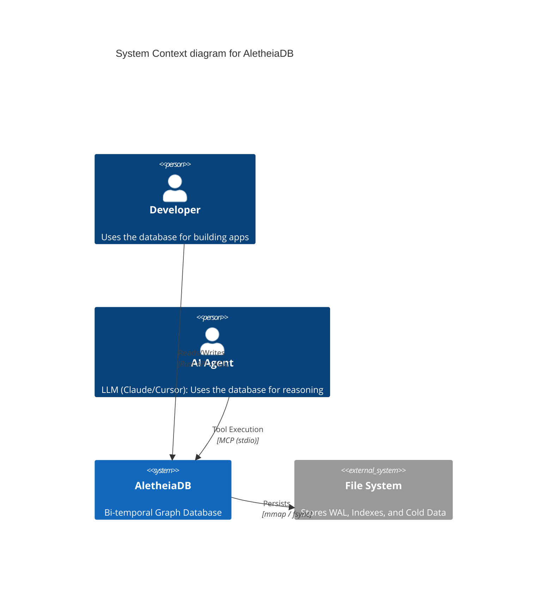
```mermaid
C4Context
  title System Context diagram for AletheiaDB

  Person(developer, "Developer", "Uses the database for building apps")
  Person(agent, "AI Agent", "LLM (Claude/Cursor): Uses the database for reasoning")

  System(aletheiadb, "AletheiaDB", "Bi-temporal Graph Database")
  System_Ext(filesystem, "File System", "Stores WAL, Indexes, and Cold Data")

  Rel(developer, aletheiadb, "Reads/Writes", "Rust API / AQL")
  Rel(agent, aletheiadb, "Tool Execution", "MCP (stdio)")
  Rel(aletheiadb, filesystem, "Persists", "mmap / fsync")
```

## Design Patterns

### Hybrid Storage Architecture

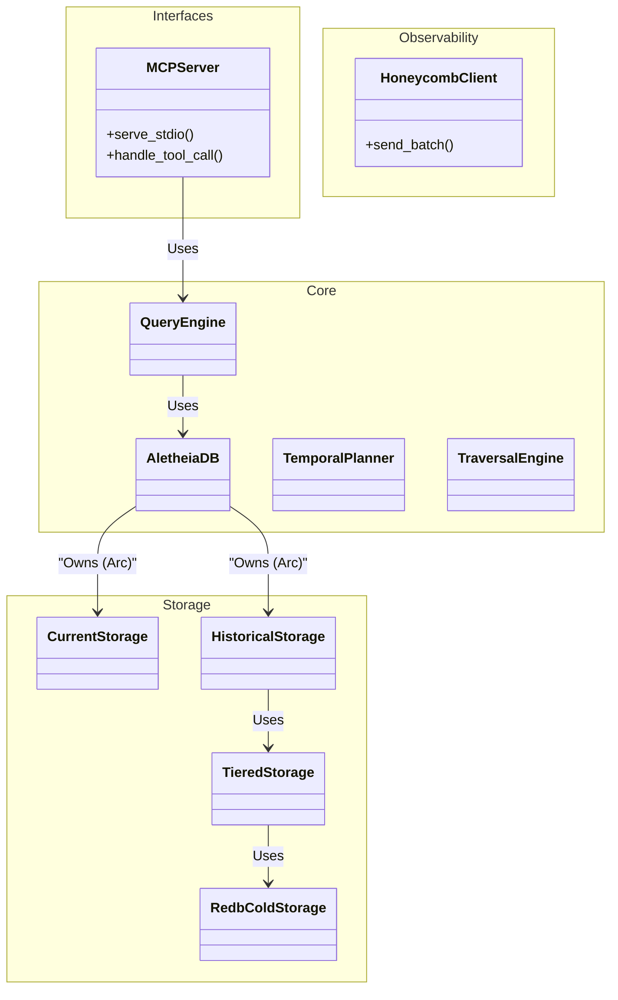
```mermaid
classDiagram
    namespace Interfaces {
        class MCPServer {
            +serve_stdio()
            +handle_tool_call()
        }
    }
    namespace Core {
        class AletheiaDB
        class QueryEngine
        class TemporalPlanner
        class TraversalEngine
    }
    namespace Storage {
        class CurrentStorage
        class HistoricalStorage
        class TieredStorage
        class RedbColdStorage
    }
    namespace Observability {
        class HoneycombClient {
            +send_batch()
        }
    }

    MCPServer --> QueryEngine : Uses
    QueryEngine --> AletheiaDB : Uses
    AletheiaDB --> CurrentStorage : "Owns (Arc)"
    AletheiaDB --> HistoricalStorage : "Owns (Arc<RwLock>)"
    %% Removed the circular dependency arrow
    HistoricalStorage --> TieredStorage : Uses
    TieredStorage --> RedbColdStorage : Uses
```

**When to Use Each:**
- **Current**: All non-temporal queries, latest state access
- **Historical**: Time-travel, audit trails, temporal analysis, LLM reasoning

### Semantic Clustering ("The Cartographer")

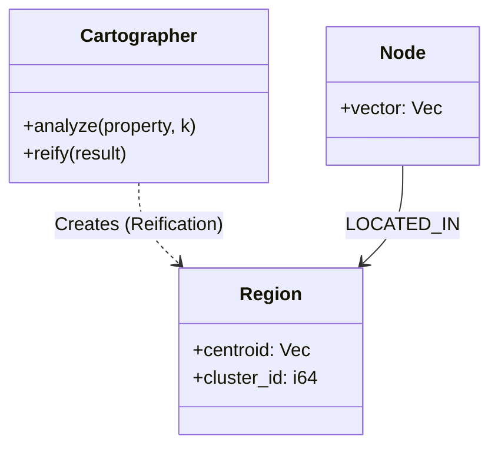
```mermaid
classDiagram
    class Cartographer {
        +analyze(property, k)
        +reify(result)
    }
    class Region {
        +centroid: Vec<f32>
        +cluster_id: i64
    }
    class Node {
        +vector: Vec<f32>
    }

    Cartographer ..> Region : Creates (Reification)
    Node --> Region : LOCATED_IN
```

**Pattern:** Reifying implicit vector similarity into explicit graph structure to enable high-level topological analysis.

### Experimental Features

**Concept Algebra (Semantic Arithmetic)**

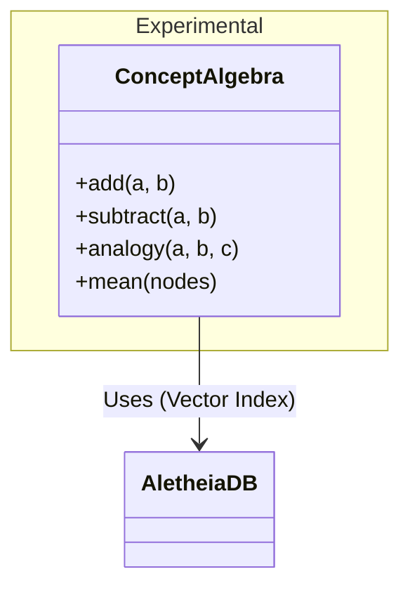
```mermaid
classDiagram
    namespace Experimental {
        class ConceptAlgebra {
            +add(a, b)
            +subtract(a, b)
            +analogy(a, b, c)
            +mean(nodes)
        }
    }
    class AletheiaDB
    ConceptAlgebra --> AletheiaDB : Uses (Vector Index)
```

**Sequence: Concept Analogy**

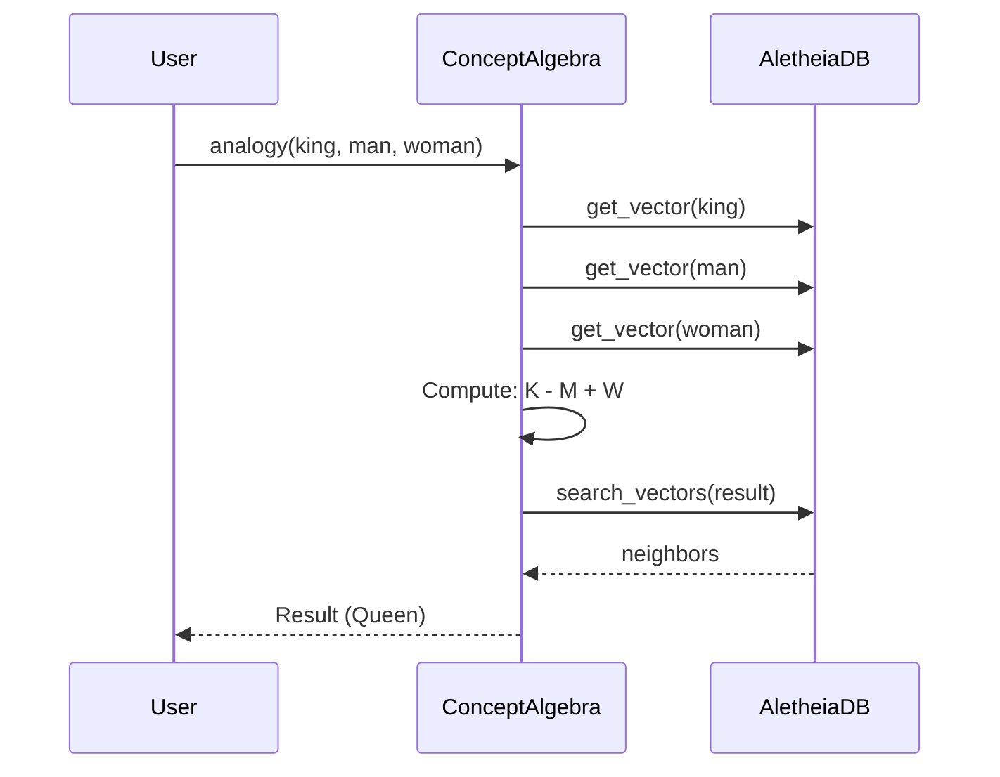
```mermaid
sequenceDiagram
    participant User
    participant CA as ConceptAlgebra
    participant DB as AletheiaDB

    User->>CA: analogy(king, man, woman)
    CA->>DB: get_vector(king)
    CA->>DB: get_vector(man)
    CA->>DB: get_vector(woman)
    CA->>CA: Compute: K - M + W
    CA->>DB: search_vectors(result)
    DB-->>CA: neighbors
    CA-->>User: Result (Queen)
```

**Temporal Resonance (Echo)**

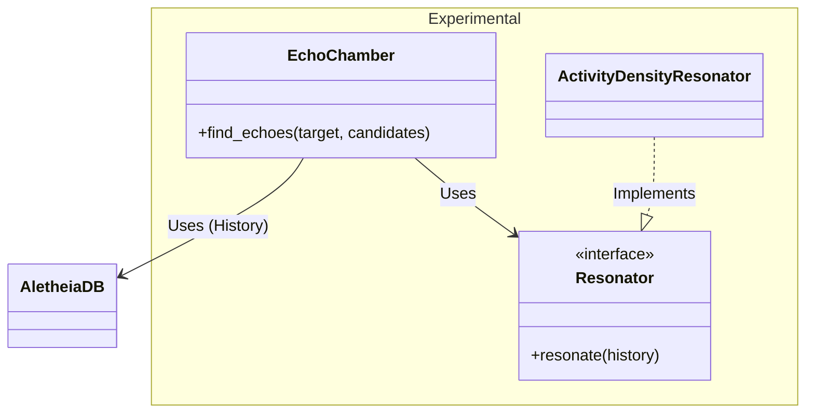
```mermaid
classDiagram
    namespace Experimental {
        class EchoChamber {
            +find_echoes(target, candidates)
        }
        class Resonator {
            <<interface>>
            +resonate(history)
        }
        class ActivityDensityResonator
    }

    EchoChamber --> AletheiaDB : Uses (History)
    EchoChamber --> Resonator : Uses
    ActivityDensityResonator ..|> Resonator : Implements
```

**Sequence: Finding Echoes**

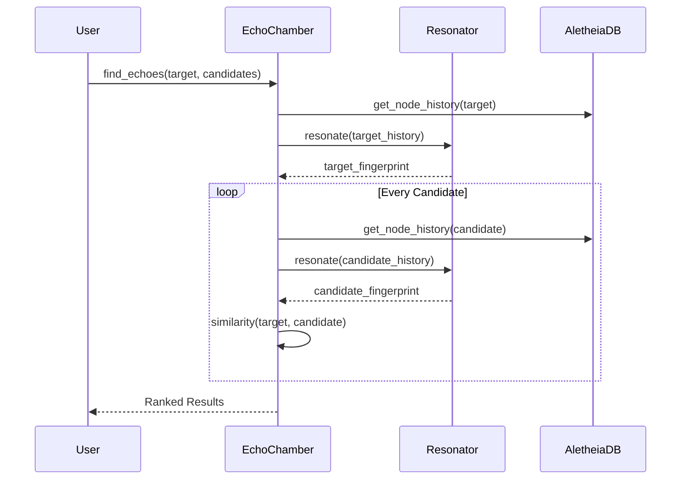
```mermaid
sequenceDiagram
    participant User
    participant Echo as EchoChamber
    participant Res as Resonator
    participant DB as AletheiaDB

    User->>Echo: find_echoes(target, candidates)
    Echo->>DB: get_node_history(target)
    Echo->>Res: resonate(target_history)
    Res-->>Echo: target_fingerprint

    loop Every Candidate
        Echo->>DB: get_node_history(candidate)
        Echo->>Res: resonate(candidate_history)
        Res-->>Echo: candidate_fingerprint
        Echo->>Echo: similarity(target, candidate)
    end

    Echo-->>User: Ranked Results
```

**Semantic Temperature (Thermos)**

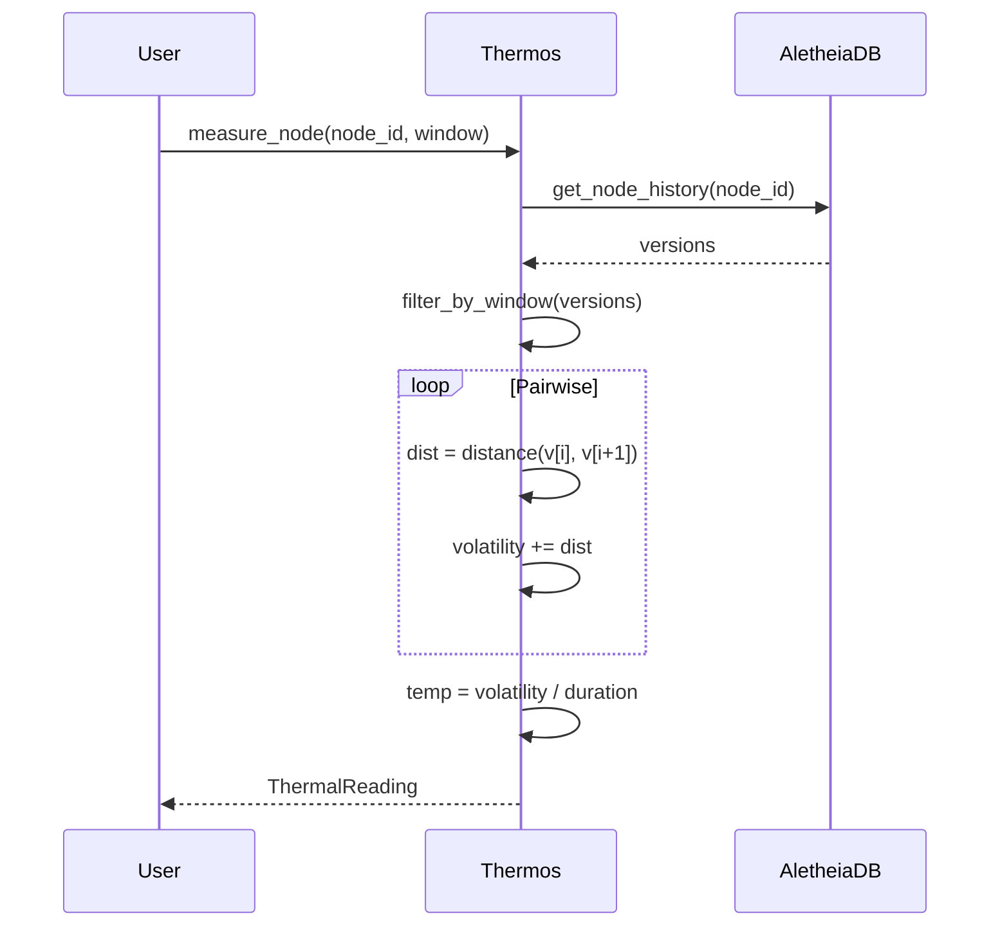
```mermaid
sequenceDiagram
    participant User
    participant Thermos
    participant DB as AletheiaDB

    User->>Thermos: measure_node(node_id, window)
    Thermos->>DB: get_node_history(node_id)
    DB-->>Thermos: versions
    Thermos->>Thermos: filter_by_window(versions)
    loop Pairwise
        Thermos->>Thermos: dist = distance(v[i], v[i+1])
        Thermos->>Thermos: volatility += dist
    end
    Thermos->>Thermos: temp = volatility / duration
    Thermos-->>User: ThermalReading
```

**Semantic Spectroscopy (Prism)**

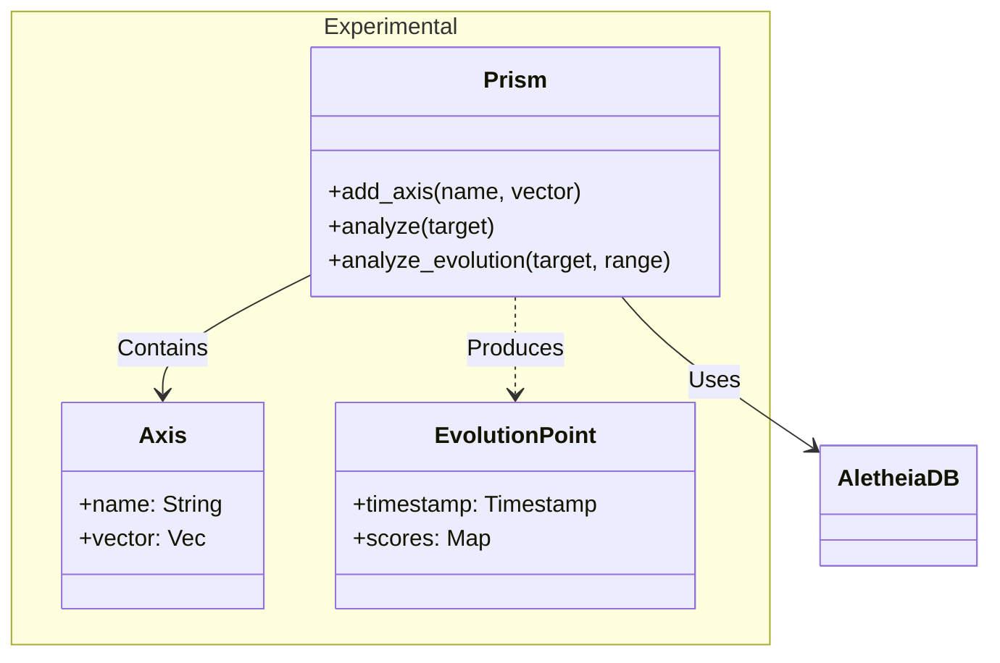
```mermaid
classDiagram
    namespace Experimental {
        class Prism {
            +add_axis(name, vector)
            +analyze(target)
            +analyze_evolution(target, range)
        }
        class Axis {
            +name: String
            +vector: Vec<f32>
        }
        class EvolutionPoint {
            +timestamp: Timestamp
            +scores: Map<String, f32>
        }
    }
    class AletheiaDB
    Prism --> Axis : Contains
    Prism --> AletheiaDB : Uses
    Prism ..> EvolutionPoint : Produces
```

**Counterfactual Graph Analysis (Hindsight)**

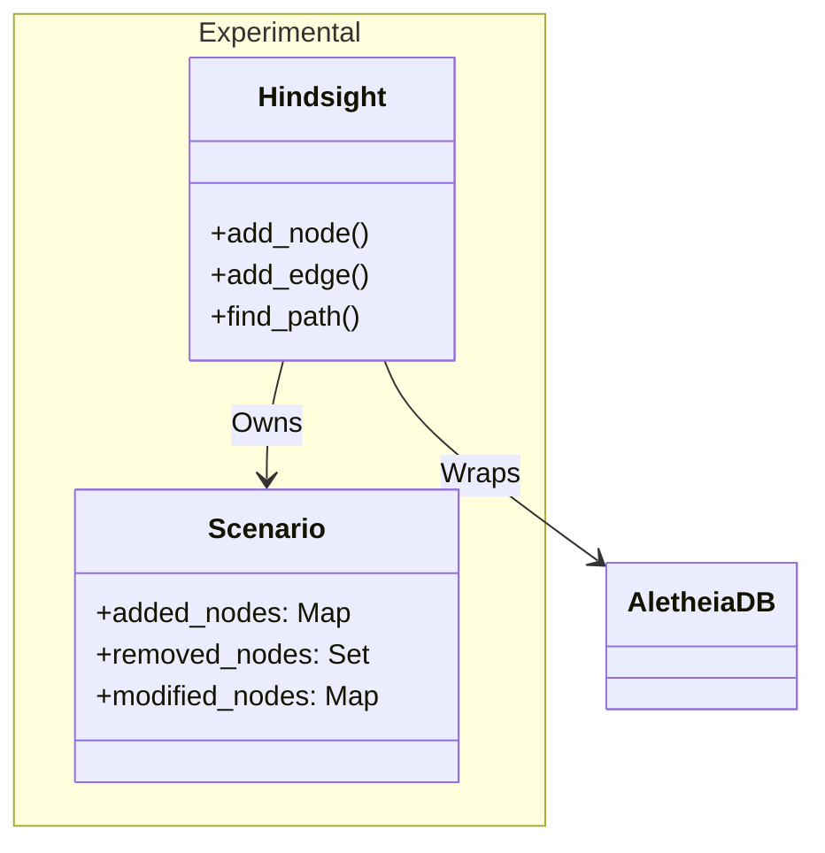
```mermaid
classDiagram
    namespace Experimental {
        class Hindsight {
            +add_node()
            +add_edge()
            +find_path()
        }
        class Scenario {
            +added_nodes: Map<NodeId, Node>
            +removed_nodes: Set<NodeId>
            +modified_nodes: Map<NodeId, Props>
        }
    }
    class AletheiaDB

    Hindsight --> Scenario : Owns
    Hindsight --> AletheiaDB : Wraps
```

**Wormhole (Latent Edge Detection)**

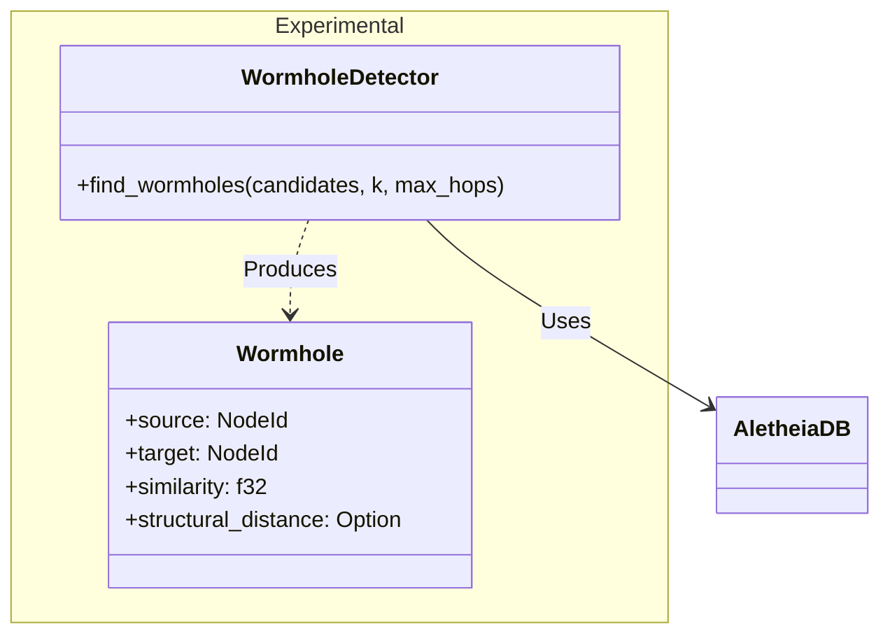
```mermaid
classDiagram
    namespace Experimental {
        class WormholeDetector {
            +find_wormholes(candidates, k, max_hops)
        }
        class Wormhole {
            +source: NodeId
            +target: NodeId
            +similarity: f32
            +structural_distance: Option<usize>
        }
    }
    class AletheiaDB

    WormholeDetector --> AletheiaDB : Uses
    WormholeDetector ..> Wormhole : Produces
```

**Sequence: Detecting Wormholes**

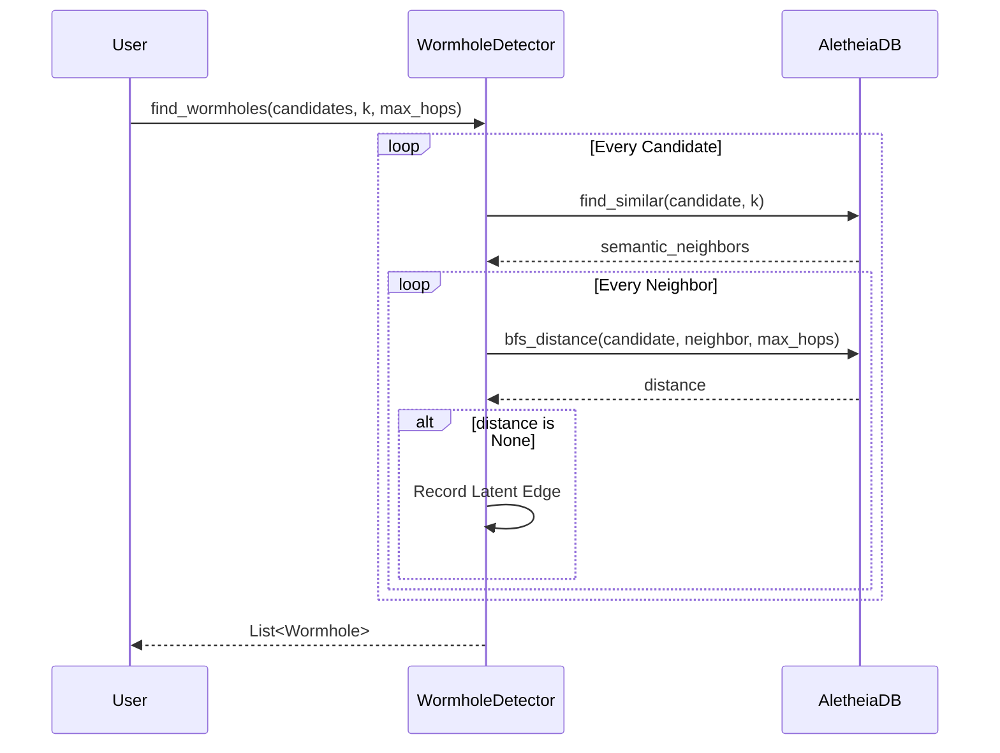
```mermaid
sequenceDiagram
    participant User
    participant Wormhole as WormholeDetector
    participant DB as AletheiaDB

    User->>Wormhole: find_wormholes(candidates, k, max_hops)
    loop Every Candidate
        Wormhole->>DB: find_similar(candidate, k)
        DB-->>Wormhole: semantic_neighbors
        loop Every Neighbor
            Wormhole->>DB: bfs_distance(candidate, neighbor, max_hops)
            DB-->>Wormhole: distance
            alt distance is None
                Wormhole->>Wormhole: Record Latent Edge
            end
        end
    end
    Wormhole-->>User: List<Wormhole>
```

**Sherlock (Temporal Pattern Matching)**

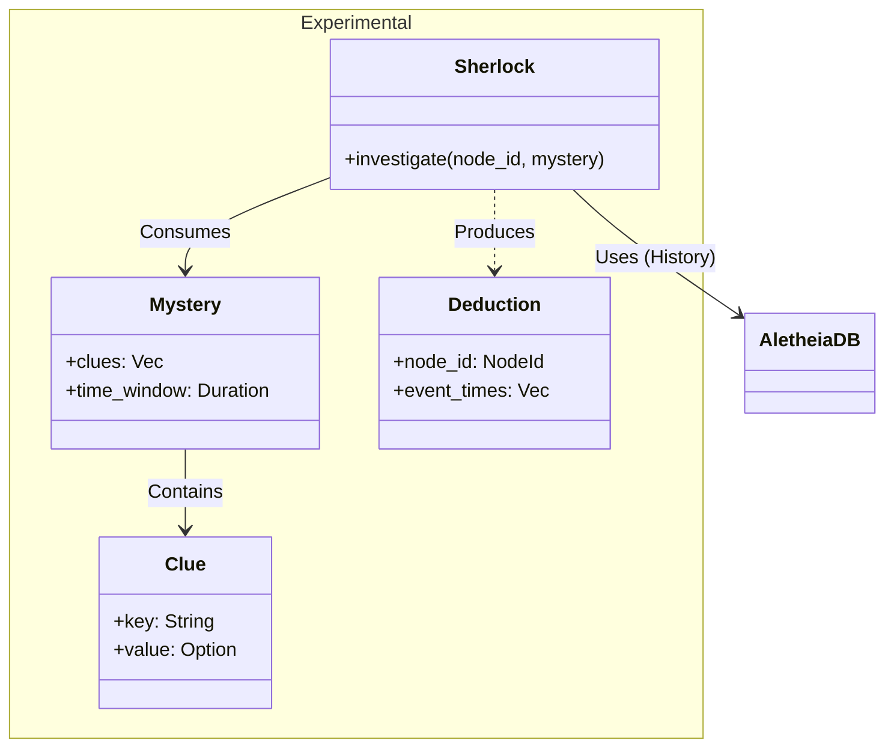
```mermaid
classDiagram
    namespace Experimental {
        class Sherlock {
            +investigate(node_id, mystery)
        }
        class Mystery {
            +clues: Vec<Clue>
            +time_window: Duration
        }
        class Clue {
            +key: String
            +value: Option<PropertyValue>
        }
        class Deduction {
            +node_id: NodeId
            +event_times: Vec<Timestamp>
        }
    }
    class AletheiaDB

    Sherlock --> AletheiaDB : Uses (History)
    Sherlock --> Mystery : Consumes
    Sherlock ..> Deduction : Produces
    Mystery --> Clue : Contains
```

**Sequence: Sherlock Investigation**

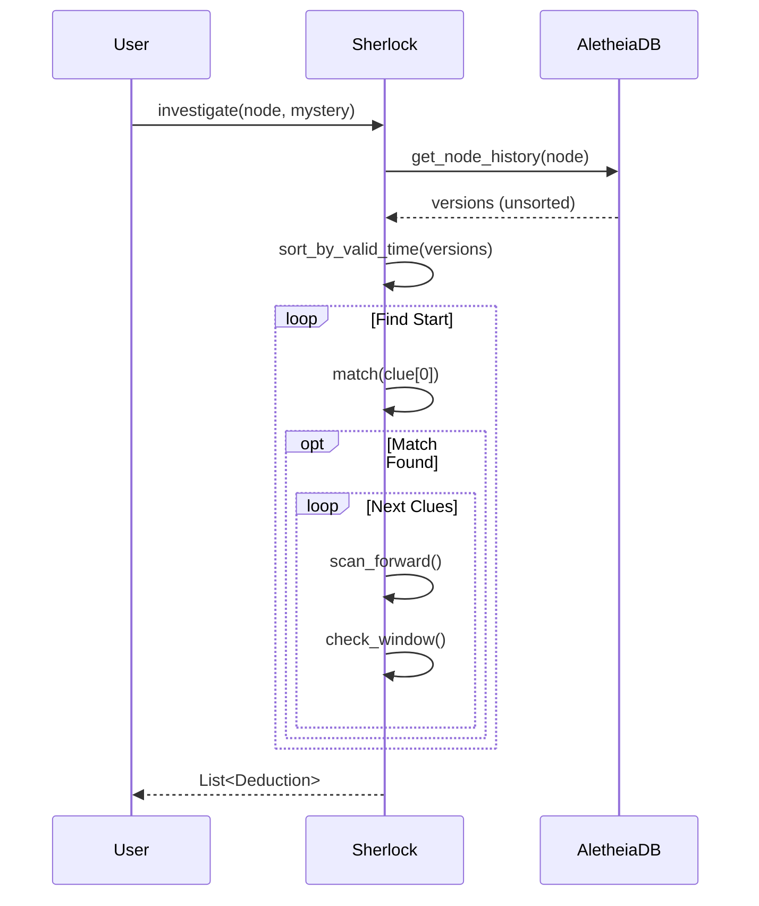
```mermaid
sequenceDiagram
    participant User
    participant Sherlock
    participant DB as AletheiaDB

    User->>Sherlock: investigate(node, mystery)
    Sherlock->>DB: get_node_history(node)
    DB-->>Sherlock: versions (unsorted)
    Sherlock->>Sherlock: sort_by_valid_time(versions)

    loop Find Start
        Sherlock->>Sherlock: match(clue[0])
        opt Match Found
            loop Next Clues
                Sherlock->>Sherlock: scan_forward()
                Sherlock->>Sherlock: check_window()
            end
        end
    end

    Sherlock-->>User: List<Deduction>
```

**Dreamer (Semantic Trajectory)**

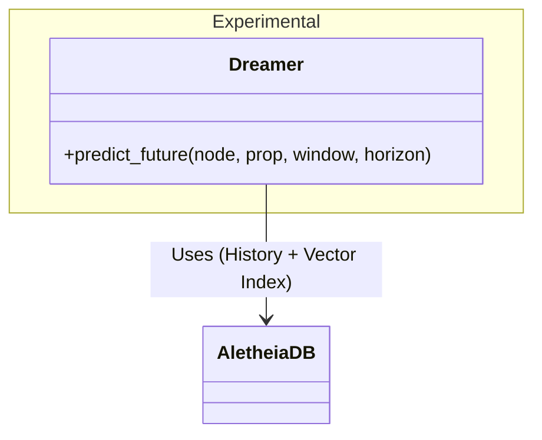
```mermaid
classDiagram
    namespace Experimental {
        class Dreamer {
            +predict_future(node, prop, window, horizon)
        }
    }
    class AletheiaDB

    Dreamer --> AletheiaDB : Uses (History + Vector Index)
```

**Sequence: Dreamer Prediction**

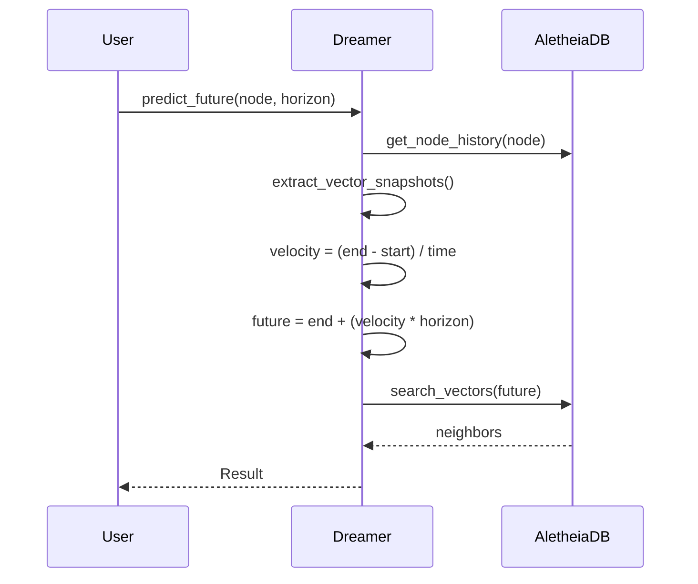
```mermaid
sequenceDiagram
    participant User
    participant Dreamer
    participant DB as AletheiaDB

    User->>Dreamer: predict_future(node, horizon)
    Dreamer->>DB: get_node_history(node)
    Dreamer->>Dreamer: extract_vector_snapshots()
    Dreamer->>Dreamer: velocity = (end - start) / time
    Dreamer->>Dreamer: future = end + (velocity * horizon)
    Dreamer->>DB: search_vectors(future)
    DB-->>Dreamer: neighbors
    Dreamer-->>User: Result
```

**Chronos (Temporal Pathfinding)**

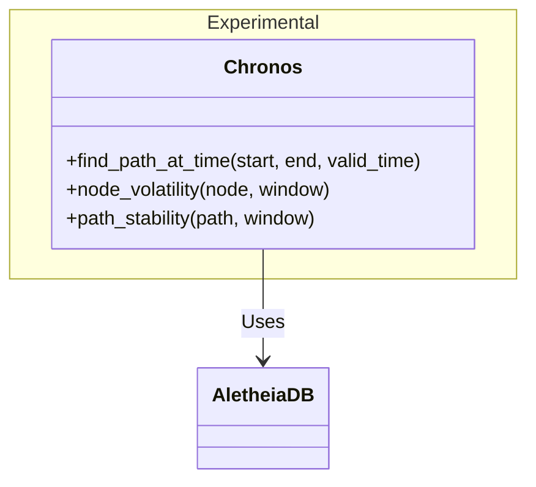
```mermaid
classDiagram
    namespace Experimental {
        class Chronos {
            +find_path_at_time(start, end, valid_time)
            +node_volatility(node, window)
            +path_stability(path, window)
        }
    }
    class AletheiaDB

    Chronos --> AletheiaDB : Uses
```

**Sequence: Snapshot Pathfinding**

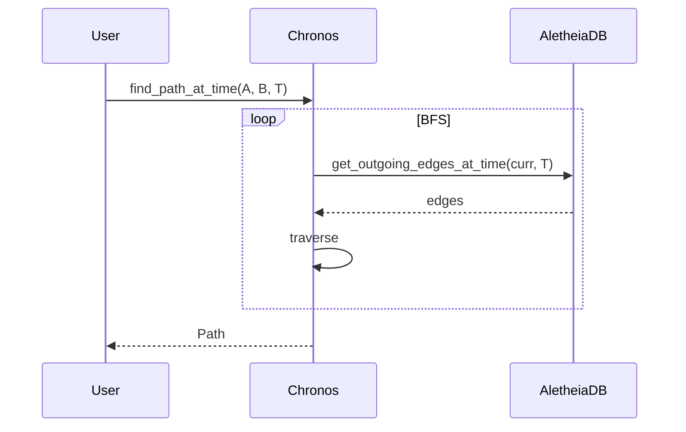
```mermaid
sequenceDiagram
    participant User
    participant Chronos
    participant DB as AletheiaDB

    User->>Chronos: find_path_at_time(A, B, T)
    loop BFS
        Chronos->>DB: get_outgoing_edges_at_time(curr, T)
        DB-->>Chronos: edges
        Chronos->>Chronos: traverse
    end
    Chronos-->>User: Path
```

### Cognitive Architecture

**Ariadne (Semantic Thread Weaver)**

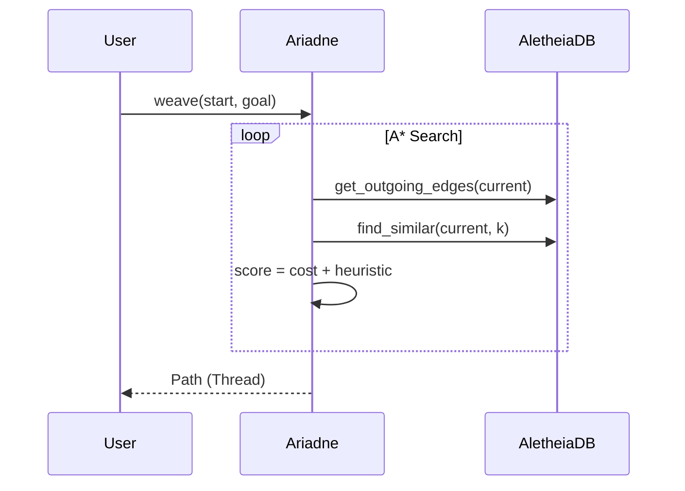
```mermaid
sequenceDiagram
    participant User
    participant Ariadne
    participant DB as AletheiaDB

    User->>Ariadne: weave(start, goal)
    loop A* Search
        Ariadne->>DB: get_outgoing_edges(current)
        Ariadne->>DB: find_similar(current, k)
        Ariadne->>Ariadne: score = cost + heuristic
    end
    Ariadne-->>User: Path (Thread)
```

**Prophet (Link Prediction)**

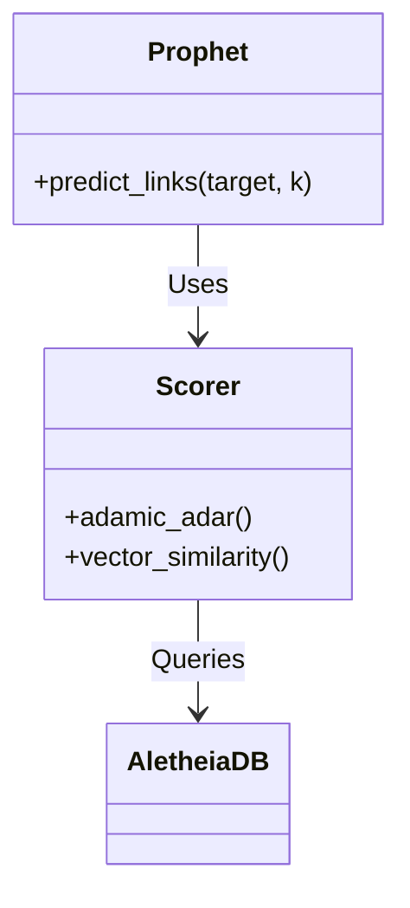
```mermaid
classDiagram
    class Prophet {
        +predict_links(target, k)
    }
    class Scorer {
        +adamic_adar()
        +vector_similarity()
    }
    Prophet --> Scorer : Uses
    Scorer --> AletheiaDB : Queries
```

**Fishing (Associative Retrieval)**

```mermaid
sequenceDiagram
    participant User
    participant Rod as FishingRod
    participant DB as AletheiaDB

    User->>Rod: cast(bait)
    Rod->>DB: find_similar(bait)
    DB-->>Rod: school (vectors)
    loop Spread Net
        Rod->>DB: get_neighbors(fish)
        DB-->>Rod: catch (neighbors)
    end
    Rod-->>User: Result (Catch)
```

**Kaleidoscope (Force-Directed Layout)**

```mermaid
classDiagram
    class LayoutEngine {
        +run()
        +step()
    }
    class Force {
        +repulsion()
        +attraction()
        +gravity(semantic)
    }
    LayoutEngine --> Force : Applies
```

**Semantic Navigator (A* Pathfinder)**

```mermaid
sequenceDiagram
    participant User
    participant Navigator
    participant DB as AletheiaDB

    User->>Navigator: find_path(start, end)
    loop A*
        Navigator->>DB: get_neighbors(current)
        Navigator->>DB: vector_similarity(neighbor, end)
        Navigator->>Navigator: heuristic = 1.0 - similarity
    end
    Navigator-->>User: Semantic Path
```

**Sentinel (Semantic Firewall)**

```mermaid
sequenceDiagram
    participant User
    participant Sentinel
    participant Rule

    User->>Sentinel: validate(props)
    loop Every Rule
        Sentinel->>Rule: check(props)
        alt Violation
            Rule-->>Sentinel: Error
            Sentinel-->>User: Blocked
        end
    end
    Sentinel-->>User: Allowed
```

**Sybil (Memetic Propagation)**

```mermaid
sequenceDiagram
    participant User
    participant Sybil
    participant Model

    User->>Sybil: simulate(prop, steps)
    loop Steps
        Sybil->>Sybil: get_active_nodes()
        loop Every Node
            Sybil->>Model: next_state(current, neighbors)
            Model-->>Sybil: new_state
        end
        Sybil->>Sybil: update_state()
    end
    Sybil-->>User: Final State
```

**Temporal Diff (State Comparator)**

```mermaid
classDiagram
    class TemporalDiff {
        +compute_diff(t1, t2)
    }
    class DiffReport {
        +changes: Vec<Change>
    }
    TemporalDiff ..> DiffReport : Produces
    TemporalDiff --> AletheiaDB : Queries (History)
```

**Narrative Generator (The Scribe)**

```mermaid
classDiagram
    namespace Experimental {
        class NarrativeGenerator {
            +generate_node_narrative(node_id)
        }
        class GraphContextBuilder {
            +with_history_limit(limit)
            +with_neighbor_limit(limit)
            +build()
        }
    }
    GraphContextBuilder --> NarrativeGenerator : Uses
    GraphContextBuilder --> AletheiaDB : Uses
    NarrativeGenerator --> AletheiaDB : Uses
```

```mermaid
sequenceDiagram
    participant User
    participant Scribe as NarrativeGenerator
    participant DB as AletheiaDB

    User->>Scribe: generate_narrative(node_id)
    Scribe->>DB: get_node_history(node_id)
    DB-->>Scribe: versions
    loop Every Version
        Scribe->>Scribe: compute_diff(prev, curr)
        Scribe->>Scribe: format_natural_language()
    end
    Scribe-->>User: List<NarrativeEvent>
```

### Semantic Physics & Pattern Matching

**Semantic Stress (Dissonance)**

```mermaid
classDiagram
    namespace Experimental {
        class DissonanceEngine {
            +calculate_dissonance(node, prop)
        }
    }
    DissonanceEngine --> AletheiaDB : Uses
```

**Semantic Subgraph Matching (Gestalt)**

```mermaid
classDiagram
    namespace Experimental {
        class GestaltMatcher {
            +find_matches(pattern)
        }
        class Pattern {
            +nodes: Vec<PatternNode>
            +edges: Vec<PatternEdge>
        }
        class Match {
            +nodes: Map
            +score: f32
        }
    }
    GestaltMatcher --> Pattern : Consumes
    GestaltMatcher ..> Match : Produces
    GestaltMatcher --> AletheiaDB : Uses
```

**Sequence: Gestalt Matching**

```mermaid
sequenceDiagram
    participant User
    participant Gestalt as GestaltMatcher
    participant DB as AletheiaDB

    User->>Gestalt: find_matches(pattern)
    Gestalt->>Gestalt: select_anchor()
    Gestalt->>DB: search_vectors(anchor_vec)
    DB-->>Gestalt: candidates
    loop Every Candidate
        Gestalt->>Gestalt: backtrack(match)
        alt Match Complete
            Gestalt-->>User: Match Found
        end
    end
```

**Semantic Influence (Gravity)**

```mermaid
classDiagram
    namespace Experimental {
        class GravityWell {
            +analyze_orbit(center, prop, window)
        }
        class OrbitMetrics {
            +velocity: f32
            +start_dist: f32
            +end_dist: f32
        }
    }
    GravityWell --> AletheiaDB : Uses
    GravityWell ..> OrbitMetrics : Produces
```

**Semantic Spreading Activation (Telepathy)**

```mermaid
classDiagram
    namespace Experimental {
        class TelepathyEngine {
            +propagate(seeds)
        }
        class TelepathyConfig {
            +decay: f32
            +threshold: f32
        }
    }
    TelepathyEngine --> AletheiaDB : Uses
    TelepathyEngine --> TelepathyConfig : Uses
```

**Sequence: Spreading Activation**

```mermaid
sequenceDiagram
    participant User
    participant Telepathy
    participant DB as AletheiaDB

    User->>Telepathy: propagate(seeds)
    loop Max Steps
        Telepathy->>DB: get_outgoing_edges(active_nodes)
        DB-->>Telepathy: edges
        loop Every Edge
            Telepathy->>DB: get_vector(target)
            Telepathy->>Telepathy: weight = similarity(source, target)
            Telepathy->>Telepathy: signal = source_strength * weight * decay
            Telepathy->>Telepathy: accumulate(target, signal)
        end
    end
    Telepathy-->>User: Activations
```

**Semantic Graph Alignment (Metaphor)**

```mermaid
classDiagram
    namespace Experimental {
        class Metaphor {
            +align(source, target)
        }
        class Alignment {
            +mappings: Vec<Mapping>
            +score: f32
        }
        class Mapping {
            +source: NodeId
            +target: NodeId
        }
    }
    Metaphor --> AletheiaDB : Uses
    Metaphor ..> Alignment : Produces
    Alignment --> Mapping : Contains
```

**Sequence: Subgraph Alignment**

```mermaid
sequenceDiagram
    participant User
    participant Metaphor
    participant DB as AletheiaDB

    User->>Metaphor: align(source_nodes, target_nodes)
    Metaphor->>DB: fetch_vectors_and_topology()
    Metaphor->>Metaphor: compute_similarity_matrix()

    loop Until All Mapped
        Metaphor->>Metaphor: find_best_pair()
        Metaphor->>Metaphor: record_mapping()
        Metaphor->>Metaphor: boost_neighbors_score()
    end

    Metaphor-->>User: Alignment
```

**Semantic Entity Resolution (Highlander)**

```mermaid
classDiagram
    namespace Experimental {
        class HighlanderDetector {
            +find_duplicates(target, threshold)
        }
        class EntityMerger {
            +merge(survivor, victim)
        }
    }
    class AletheiaDB
    HighlanderDetector --> AletheiaDB : Uses
    EntityMerger --> AletheiaDB : Mutates
```

**Sequence: Entity Merge**

```mermaid
sequenceDiagram
    participant User
    participant Merger as EntityMerger
    participant DB as AletheiaDB

    User->>Merger: merge(survivor, victim)
    Merger->>DB: get_edges(victim)
    loop Move Edges
        Merger->>DB: create_edge(survivor, target)
        Merger->>DB: delete_edge(victim, target)
    end
    Merger->>DB: get_props(victim)
    loop Merge Props
        Merger->>DB: update_node(survivor, missing_prop)
    end
    Merger->>DB: delete_node(victim)
    Merger-->>User: Success
```

**Semantic Bridge Detection (Janus)**

```mermaid
classDiagram
    namespace Experimental {
        class JanusDetector {
            +analyze_node(node_id, property)
        }
        class BridgeScore {
            +total_score: f32
            +inter_cluster_distance: f32
            +intra_cluster_spread: f32
            +is_bridge() bool
        }
    }
    class AletheiaDB
    JanusDetector --> AletheiaDB : Uses
    JanusDetector ..> BridgeScore : Produces
```

**Semantic Ideation (Muse)**

```mermaid
classDiagram
    namespace Experimental {
        class Muse {
            +inspire(seeds)
        }
        class Inspiration {
            +centroid: Vec<f32>
            +novelty_score: f32
            +coherence_score: f32
        }
    }
    class AletheiaDB
    Muse --> AletheiaDB : Uses
    Muse ..> Inspiration : Produces
```

**Sequence: Semantic Ideation**

```mermaid
sequenceDiagram
    participant User
    participant Muse
    participant DB as AletheiaDB

    User->>Muse: inspire(seeds)
    Muse->>DB: get_vectors(seeds)
    Muse->>Muse: compute_centroid()
    Muse->>DB: search_vectors(centroid)
    DB-->>Muse: nearest_neighbors
    Muse->>Muse: novelty = 1.0 - max_sim
    Muse->>Muse: coherence = avg_sim_to_seeds
    Muse-->>User: Inspiration
```

### Temporal Query Processing

**Query Types:**

1. **Time Point Query** (as of timestamp T): Lookup in temporal index → Find nearest anchor ≤ T → Apply deltas → Return state
2. **Time Range Query** (between T1 and T2): Range scan temporal index → Reconstruct each version → Stream results
3. **Knowledge Evolution Query** (for LLMs): Track how entity changed over time → Provenance and sources → Identify when understanding shifted

## Hybrid Storage Architecture

AletheiaDB's architecture separates current state from historical data for optimal performance:

### Current Storage Layer
- **Live Graph**: Active nodes and edges in CSR (Compressed Sparse Row) format
- **Hot Indexes**: Frequently accessed indexes in memory
- **Property Storage**: Current property values with Arc-based deduplication
- **Vector Indexes**: Current HNSW indexes for semantic search

**Optimizations:**
- Zero abstraction overhead for non-temporal queries
- Cache-friendly memory layout
- Lock-free concurrent access for reads

### Historical Storage Layer
- **Version Chains**: Linked list of entity versions over time
- **Anchor+Delta Compression**: Full snapshots every N versions (default: 10)
- **Temporal Indexes**: B-Tree indexes for time-based lookup
- **Vector Snapshots**: Historical HNSW indexes for temporal semantic search

**Optimizations:**
- Immutable history (safe for concurrent reads)
- Aggressive compression (5-6X reduction)
- LFU cache for reconstructed versions

### Storage Flow

```mermaid
sequenceDiagram
    participant User
    participant Core as Core (QueryEngine)
    participant Storage as Storage (Current/Historical)
    participant WAL

    Note over User, Core: Write Path
    User->>Core: Write Transaction
    Core->>Storage: Apply Changes (via Trait)
    Storage->>WAL: Append Entry
    WAL-->>Storage: LSN
    Storage-->>Core: Success
    Core-->>User: Commit ID

    rect rgb(240, 240, 240)
        Note right of Storage: Async Background Process
        Storage->>Storage: Background Flush
        Storage->>Storage: Compress & Index
    end

    Note over User, Core: Query Path
    User->>Core: Query (Latest)
    Core->>Storage: Get Node (Current)
    Storage-->>Core: Result
    Core-->>User: Result (Fast Path)

    User->>Core: Query (Time Travel)
    Core->>Storage: Get History
    Storage->>Storage: Reconstruct State
    Storage-->>Core: Versioned Node
    Core-->>User: Result (Temporal Path)
```

## Temporal Query Processing

### Point-in-Time Queries

**Algorithm:**
1. Query temporal index for timestamp T
2. Find nearest anchor ≤ T
3. Apply deltas from anchor to T
4. Return reconstructed state

**Complexity**: O(log N + D) where N = versions, D = deltas since anchor
**Target**: <10ms for typical workloads

### Time Range Queries

**Algorithm:**
1. Range scan temporal index [T1, T2]
2. For each version in range:
   - Reconstruct state (using nearest anchor)
   - Apply predicates/filters
   - Stream result
3. Return iterator over versions

**Complexity**: O(V × (log N + D)) where V = versions in range
**Optimization**: Skip versions that don't match predicates

### Hybrid Queries

Combine graph traversal + vector similarity + temporal queries:

**Example**: "Who did Alice know in 2023 that was similar to Bob?"

```rust
db.query()
    .as_of(timestamp_2023)     // Temporal filter
    .start(alice_id)           // Graph source
    .traverse("KNOWS")         // Graph traversal
    .rank_by_similarity(&bob_embedding, 10)  // Vector ranking
    .execute(&db)?
```

**Query Plan:**
1. Reconstruct Alice's state at 2023
2. Traverse KNOWS edges (using temporal index)
3. Reconstruct each neighbor at 2023
4. Load embeddings from temporal vector index
5. Rank by similarity to Bob's embedding
6. Return top 10

See [Hybrid Query Guide](guides/hybrid-query-guide.md) for complete API reference.

## LLM Integration Patterns

### Temporal Query API for LLMs

**Natural Language-Like Queries:**
```rust
db.as_of("2024-01-15T10:00:00Z").find_node("Person", "name" == "Alice").get_relationships("KNOWS")
db.between("2024-01-01", "2024-12-31").track_changes(node_id).with_provenance()
```

**Query Patterns LLMs Can Use:**
- "What did we know about X at time T?" → `db.as_of(T).get(X)`
- "How has Y changed?" → `db.history(Y).changes()`
- "When did we first record F?" → `db.first_occurrence(F)`
- "Show changes to E between T1 and T2" → `db.between(T1, T2).track_changes(E)`

### Integration Methods

1. **Direct Rust API** (for embedded use)
2. **MCP Server** (for Claude integration)
3. **REST/GraphQL API** (for general LLM tool use)
4. **Natural Query Language** (intuitive for LLMs to generate)

### Provenance Tracking

AletheiaDB tracks data lineage for LLM reasoning:

- **Source Attribution**: Which data source contributed this fact?
- **Temporal Provenance**: When was this fact recorded?
- **Version History**: How has this fact evolved?
- **Contradiction Detection**: Did this fact contradict earlier facts?

**API:**
```rust
let result = db.query()
    .start(node_id)
    .with_provenance()  // Include metadata
    .execute(&db)?;

for row in result {
    if let Some(prov) = row.provenance {
        println!("Source: {:?}", prov.source);
        println!("Valid time: {:?}", prov.valid_time);
        println!("Transaction time: {:?}", prov.tx_time);
    }
}
```

## Future Architecture Considerations

### Scalability

- **Sharding**: Horizontal scale by partitioning graph
- **Distributed Transactions**: Two-phase commit across shards
- **Replication**: High availability via replicas

### Query Language

- **Cypher Extensions**: Temporal extensions to Cypher query language
- **SQL:2011 Temporal Syntax**: `AS OF SYSTEM_TIME` support
- **Time-Aware Pattern Matching**: Temporal graph patterns

### Advanced Features

- **Temporal Graph Algorithms**: Shortest path over time, temporal PageRank
- **Streaming Temporal Queries**: Subscribe to changes in real-time
- **Incremental Materialized Views**: Maintain derived data efficiently
- **LLM-Assisted Query Generation**: Natural language → AletheiaDB queries

## References

- [AeonG: Efficient Temporal Graph Database](https://arxiv.org/abs/2304.12212)
- [XTDB Bi-temporality](https://v1-docs.xtdb.com/concepts/bitemporality/)
- [Temporal Database Concepts](https://en.wikipedia.org/wiki/Temporal_database)
- [Rust Performance Book](https://nnethercote.github.io/perf-book/)
