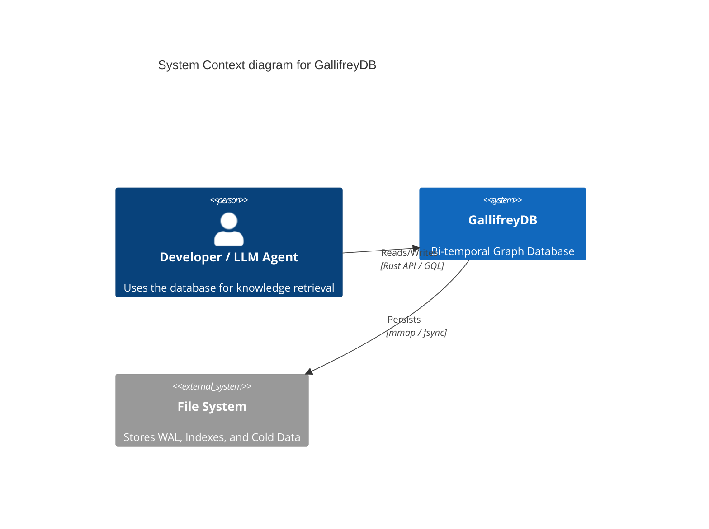
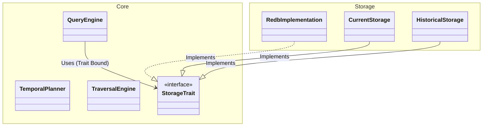
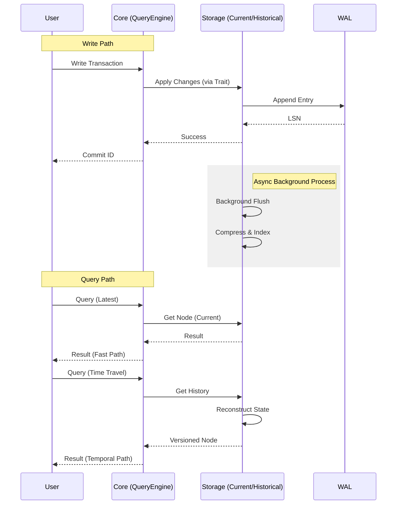

# GallifreyDB Architecture

This document describes the core architecture principles, design patterns, and system design of GallifreyDB.

## Table of Contents

- [Architecture Principles](#architecture-principles)
- [System Context (C4 Model)](#system-context-c4-model)
- [Design Patterns](#design-patterns)
- [Hybrid Storage Architecture](#hybrid-storage-architecture)
- [Temporal Query Processing](#temporal-query-processing)
- [LLM Integration Patterns](#llm-integration-patterns)

## Architecture Principles

### 1. Performance First

**Current-State Queries Must Be Fast:**
- Current state stored separately from historical data (hybrid storage architecture)
- Zero abstraction overhead for non-temporal queries
- CSR (Compressed Sparse Row) adjacency representation for cache-friendly traversals
- **Target**: <1µs single-hop traversal, <100µs for 3-hop traversal

**Temporal Queries Must Be Efficient:**
- Anchor+delta compression reduces storage 5-6X
- Temporal B-Tree indexes for range queries
- Anchor-based reconstruction skips unnecessary versions
- **Target**: <10ms for point-in-time reconstruction

### 2. Storage Efficiency

**Compression Strategy:**
- Create anchor (full snapshot) every 10 versions (configurable)
- Delta encoding for incremental changes
- Copy-on-write with `Arc<T>` for property deduplication
- String interning for labels and property keys
- **Target**: <2X overhead vs non-temporal storage

**Immutable History:**
- Historical versions are immutable after creation
- Enables aggressive caching and compression
- Safe for concurrent access without locks

### 3. Correctness Guarantees

**Temporal Consistency:**
- Transaction time is monotonically increasing
- Valid time can be retroactive but must be consistent
- No temporal paradoxes (e.g., deleting an entity before it was created)

**ACID Properties:**
- **Atomicity**: WAL ensures atomic commits
- **Consistency**: Invariants checked on write
- **Isolation**: MVCC provides snapshot isolation
- **Durability**: WAL + fsync guarantees

## System Context (C4 Model)



## Design Patterns

### Hybrid Storage Architecture



**When to Use Each:**
- **Current**: All non-temporal queries, latest state access
- **Historical**: Time-travel, audit trails, temporal analysis, LLM reasoning

### Temporal Query Processing

**Query Types:**

1. **Time Point Query** (as of timestamp T): Lookup in temporal index → Find nearest anchor ≤ T → Apply deltas → Return state
2. **Time Range Query** (between T1 and T2): Range scan temporal index → Reconstruct each version → Stream results
3. **Knowledge Evolution Query** (for LLMs): Track how entity changed over time → Provenance and sources → Identify when understanding shifted

## Hybrid Storage Architecture

GallifreyDB's architecture separates current state from historical data for optimal performance:

### Current Storage Layer
- **Live Graph**: Active nodes and edges in CSR (Compressed Sparse Row) format
- **Hot Indexes**: Frequently accessed indexes in memory
- **Property Storage**: Current property values with Arc-based deduplication
- **Vector Indexes**: Current HNSW indexes for semantic search

**Optimizations:**
- Zero abstraction overhead for non-temporal queries
- Cache-friendly memory layout
- Lock-free concurrent access for reads

### Historical Storage Layer
- **Version Chains**: Linked list of entity versions over time
- **Anchor+Delta Compression**: Full snapshots every N versions (default: 10)
- **Temporal Indexes**: B-Tree indexes for time-based lookup
- **Vector Snapshots**: Historical HNSW indexes for temporal semantic search

**Optimizations:**
- Immutable history (safe for concurrent reads)
- Aggressive compression (5-6X reduction)
- LFU cache for reconstructed versions

### Storage Flow



## Temporal Query Processing

### Point-in-Time Queries

**Algorithm:**
1. Query temporal index for timestamp T
2. Find nearest anchor ≤ T
3. Apply deltas from anchor to T
4. Return reconstructed state

**Complexity**: O(log N + D) where N = versions, D = deltas since anchor
**Target**: <10ms for typical workloads

### Time Range Queries

**Algorithm:**
1. Range scan temporal index [T1, T2]
2. For each version in range:
   - Reconstruct state (using nearest anchor)
   - Apply predicates/filters
   - Stream result
3. Return iterator over versions

**Complexity**: O(V × (log N + D)) where V = versions in range
**Optimization**: Skip versions that don't match predicates

### Hybrid Queries

Combine graph traversal + vector similarity + temporal queries:

**Example**: "Who did Alice know in 2023 that was similar to Bob?"

```rust
db.query()
    .as_of(timestamp_2023)     // Temporal filter
    .start(alice_id)           // Graph source
    .traverse("KNOWS")         // Graph traversal
    .rank_by_similarity(&bob_embedding, 10)  // Vector ranking
    .execute(&db)?
```

**Query Plan:**
1. Reconstruct Alice's state at 2023
2. Traverse KNOWS edges (using temporal index)
3. Reconstruct each neighbor at 2023
4. Load embeddings from temporal vector index
5. Rank by similarity to Bob's embedding
6. Return top 10

See [Hybrid Query Guide](guides/hybrid-query-guide.md) for complete API reference.

## LLM Integration Patterns

### Temporal Query API for LLMs

**Natural Language-Like Queries:**
```rust
db.as_of("2024-01-15T10:00:00Z").find_node("Person", "name" == "Alice").get_relationships("KNOWS")
db.between("2024-01-01", "2024-12-31").track_changes(node_id).with_provenance()
```

**Query Patterns LLMs Can Use:**
- "What did we know about X at time T?" → `db.as_of(T).get(X)`
- "How has Y changed?" → `db.history(Y).changes()`
- "When did we first record F?" → `db.first_occurrence(F)`
- "Show changes to E between T1 and T2" → `db.between(T1, T2).track_changes(E)`

### Integration Methods

1. **Direct Rust API** (for embedded use)
2. **MCP Server** (for Claude integration)
3. **REST/GraphQL API** (for general LLM tool use)
4. **Natural Query Language** (intuitive for LLMs to generate)

### Provenance Tracking

GallifreyDB tracks data lineage for LLM reasoning:

- **Source Attribution**: Which data source contributed this fact?
- **Temporal Provenance**: When was this fact recorded?
- **Version History**: How has this fact evolved?
- **Contradiction Detection**: Did this fact contradict earlier facts?

**API:**
```rust
let result = db.query()
    .start(node_id)
    .with_provenance()  // Include metadata
    .execute(&db)?;

for row in result {
    if let Some(prov) = row.provenance {
        println!("Source: {:?}", prov.source);
        println!("Valid time: {:?}", prov.valid_time);
        println!("Transaction time: {:?}", prov.tx_time);
    }
}
```

## Future Architecture Considerations

### Scalability

- **Sharding**: Horizontal scale by partitioning graph
- **Distributed Transactions**: Two-phase commit across shards
- **Replication**: High availability via replicas

### Query Language

- **Cypher Extensions**: Temporal extensions to Cypher query language
- **SQL:2011 Temporal Syntax**: `AS OF SYSTEM_TIME` support
- **Time-Aware Pattern Matching**: Temporal graph patterns

### Advanced Features

- **Temporal Graph Algorithms**: Shortest path over time, temporal PageRank
- **Streaming Temporal Queries**: Subscribe to changes in real-time
- **Incremental Materialized Views**: Maintain derived data efficiently
- **LLM-Assisted Query Generation**: Natural language → GallifreyDB queries

## References

- [AeonG: Efficient Temporal Graph Database](https://arxiv.org/abs/2304.12212)
- [XTDB Bi-temporality](https://v1-docs.xtdb.com/concepts/bitemporality/)
- [Temporal Database Concepts](https://en.wikipedia.org/wiki/Temporal_database)
- [Rust Performance Book](https://nnethercote.github.io/perf-book/)
