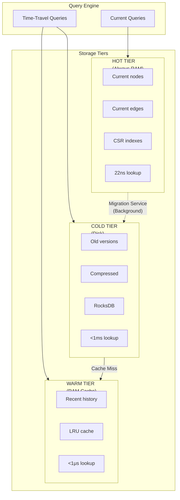
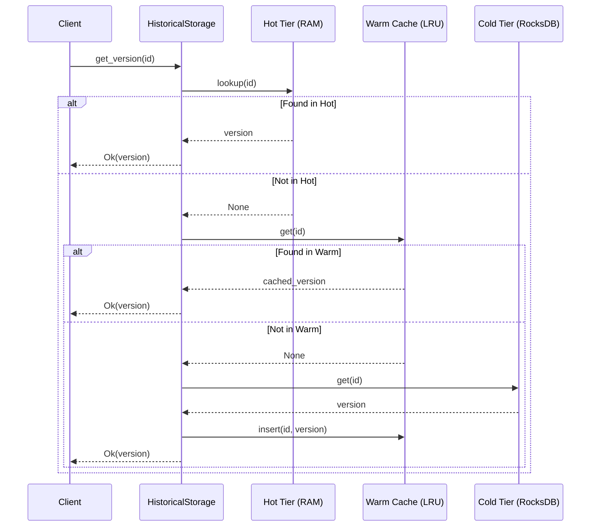
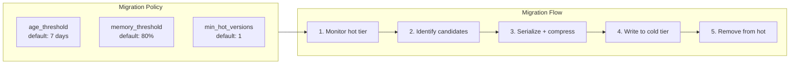
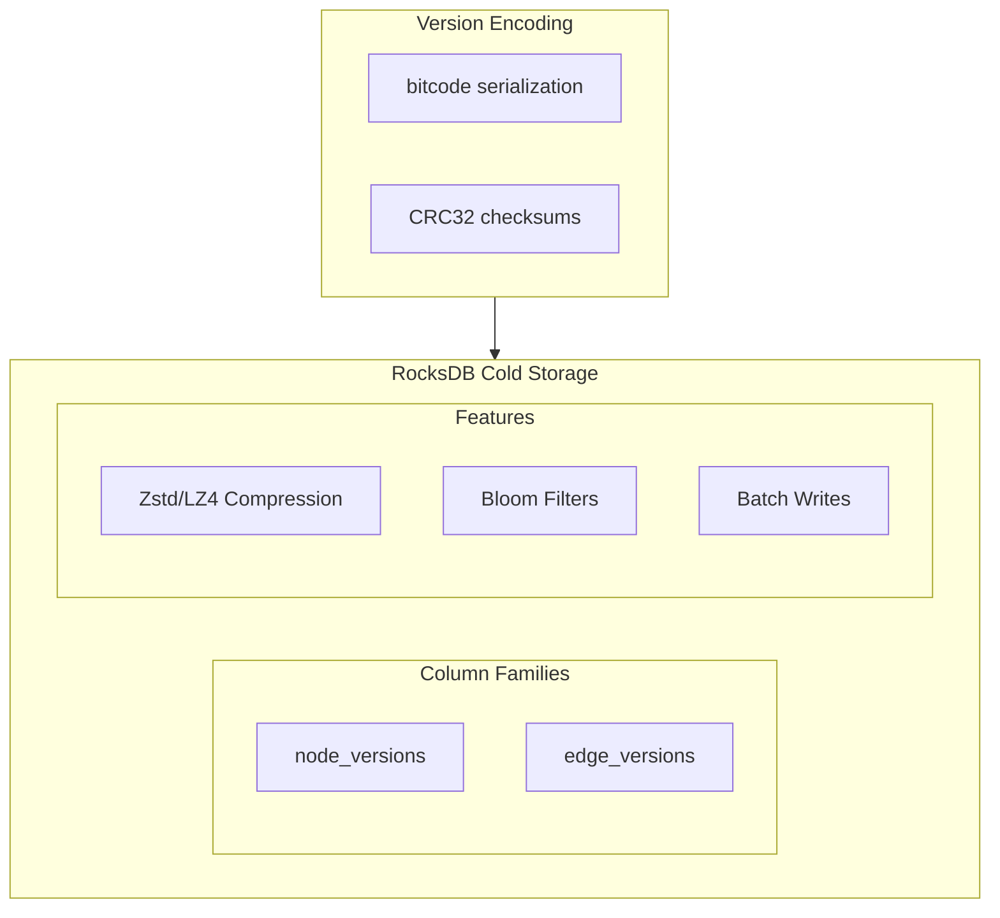
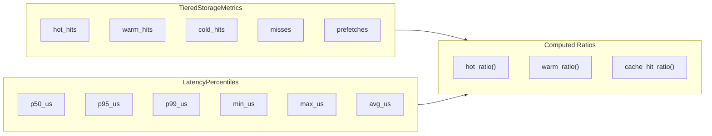

# ADR-0013: Tiered Storage Architecture

**Status:** Accepted
**Date:** 2026-01-22
**Deciders:** GallifreyDB Core Team
**Categories:** storage, scalability, performance

## Context

GallifreyDB achieves exceptional read performance (22-24ns node lookup, 52-71ns traversal) through pure in-memory storage. However, this limits dataset size to available RAM:

**Current Constraints:**
- 64GB RAM → ~300M nodes with properties
- 256GB RAM → ~1.2B nodes with properties
- Historical versions multiply storage requirements

**Scalability Requirements:**
- Support datasets larger than single-machine RAM
- Preserve current-state query performance (critical for LLM integration)
- Accept higher latency for historical/time-travel queries
- Enable cost-effective storage of years of temporal history

The bi-temporal nature of GallifreyDB creates a natural hot/cold split:
- **Current state**: Frequently accessed, performance-critical
- **Historical versions**: Infrequently accessed, acceptable higher latency

## Decision

We will implement a tiered storage architecture that keeps current state in RAM while storing historical versions on disk.

### Architecture Overview



### Data Flow



### Storage Tiers

| Tier | Storage | Latency | Content |
|------|---------|---------|---------|
| **Hot** | RAM (DashMap) | 22-70ns | Current state, live indexes |
| **Warm** | RAM (LRU Cache) | 100ns-1µs | Recently accessed history |
| **Cold** | Disk (RocksDB) | 100µs-1ms | Compressed historical versions |

### Migration Strategy



Versions migrate from hot to cold based on configurable policies:

```rust
pub struct MigrationPolicy {
    /// Migrate versions older than this
    pub age_threshold: Duration,  // default: 7 days

    /// Migrate when memory exceeds this
    pub memory_threshold_bytes: usize,  // default: 80% of available

    /// Minimum versions to keep in hot tier
    pub min_hot_versions: usize,  // default: 1 (current only)

    /// Maximum batch size for migration
    pub batch_size: usize,  // default: 1000

    /// Interval between migration runs
    pub run_interval: Duration,  // default: 60 seconds
}
```

### Query Routing

```rust
impl HistoricalStorage {
    pub fn get_node_version_tiered(&self, id: VersionId) -> Result<Option<Arc<NodeVersion>>> {
        // 1. Check hot tier (fast path)
        if let Some(v) = self.node_versions.get(&id) {
            self.tiered_storage.record_hot_hit();
            return Ok(Some(Arc::new(v.clone())));
        }

        // 2. Check warm cache, then cold tier
        if let Some(ref tiered) = self.tiered_storage {
            return tiered.get_node_version_cold(id);
        }

        Ok(None)
    }
}
```

### Cold Tier Implementation

We use **RocksDB** as the cold storage engine:



**Rationale:**
- LSM-tree optimized for write-heavy workloads (version ingestion)
- Built-in compression (LZ4/Zstd)
- Proven at scale (used by Meta, Netflix, etc.)
- Rust bindings available (`rocksdb` crate)

**Alternative Considered - LMDB:**
- B-tree optimized for read-heavy workloads
- Memory-mapped, excellent read performance
- Single-writer limitation

RocksDB chosen because historical versions are write-once (immutable) and compression is critical for storage efficiency.

```rust
pub struct RocksDBColdStorage {
    db: DBWithThreadMode<MultiThreaded>,
    path: PathBuf,
    stats: AtomicColdStorageStats,
}

impl ColdStorage for RocksDBColdStorage {
    fn store_node_version(&self, version: &NodeVersion) -> Result<()>;
    fn get_node_version(&self, id: VersionId) -> Result<Option<NodeVersion>>;
    fn store_node_versions_batch(&self, versions: &[NodeVersion]) -> Result<()>;
    // ... edge version methods
}
```

### Metrics and Monitoring



Key metrics exposed:
- Hot tier size (bytes, version count)
- Cold tier size (bytes, version count)
- Cache hit ratio (hot_hits + warm_hits) / total
- Migration throughput (versions/sec)
- Cold query latency (p50, p95, p99)

## Consequences

### Positive

- **Unlimited historical depth**: Store years of temporal history on disk
- **Preserved hot path performance**: Current-state queries unchanged at 22-70ns
- **Cost-effective**: SSD storage is 10-100x cheaper than RAM per GB
- **Natural fit**: Bi-temporal model already separates current vs historical
- **Incremental adoption**: Can deploy without migrating existing data

### Negative

- **Increased complexity**: Two storage engines to operate and monitor
- **Cold query latency**: Historical queries increase from ~30ns to ~1ms
- **Migration overhead**: Background CPU/IO for version migration
- **Recovery complexity**: Must recover both hot and cold tiers

### Neutral

- Current-state queries unchanged (no code changes for hot path)
- Version chain logic unchanged (just pointer resolution differs)
- WAL continues to capture all operations for recovery

## Alternatives Considered

### Alternative 1: Pure Memory-Mapped Files

Use mmap for all storage, let OS handle paging.

**Rejected because:**
- No control over what stays in memory
- Graph traversal patterns can thrash page cache
- Page faults on hot path break latency guarantees

### Alternative 2: Sharding Only

Skip tiered storage, go directly to distributed sharding.

**Rejected because:**
- Adds distributed systems complexity prematurely
- Network latency higher than disk latency for single-machine
- Current state fits in single machine for most use cases
- Tiered storage is prerequisite anyway (each shard needs it)

### Alternative 3: External Object Store (S3)

Store cold data in S3 or similar object storage.

**Rejected because:**
- 50-200ms latency per request is too high
- Network costs for time-travel queries
- Complexity of eventual consistency

## Implementation Notes

### Compression Strategy

Historical versions compress well due to:
- Delta encoding (small changes between versions)
- Property value repetition
- Label/key interning

Target: 3-5x compression ratio with Zstd level 3.

### Cache Sizing

The warm cache should be sized based on working set:

```rust
pub struct TieredStorageConfig {
    /// Size of warm cache (number of entries)
    pub warm_cache_size: usize,  // default: 10,000

    /// Enable prefetching of version chains
    pub enable_prefetch: bool,  // default: true

    /// Maximum prefetch depth
    pub prefetch_depth: usize,  // default: 5
}
```

### Feature Flag

The RocksDB cold storage backend is behind an optional feature flag:

```toml
[features]
tiered-storage = ["dep:rocksdb"]
```

This allows users to opt-in to the additional dependency.

## References

- GitHub Issues: [#119](https://github.com/madmax983/GallifreyDB/issues/119), [#120](https://github.com/madmax983/GallifreyDB/issues/120), [#121](https://github.com/madmax983/GallifreyDB/issues/121), [#122](https://github.com/madmax983/GallifreyDB/issues/122)
- Project: [GallifreyDB Scalability Roadmap](https://github.com/users/madmax983/projects/4)
- RocksDB: [Documentation](https://rocksdb.org/docs/)
- ADR-0001: Hybrid Storage Architecture (foundation for this design)
- ADR-0004: Anchor+Delta Compression (compression strategy)
- User Guide: [Tiered Storage Guide](../guides/tiered-storage-guide.md)
