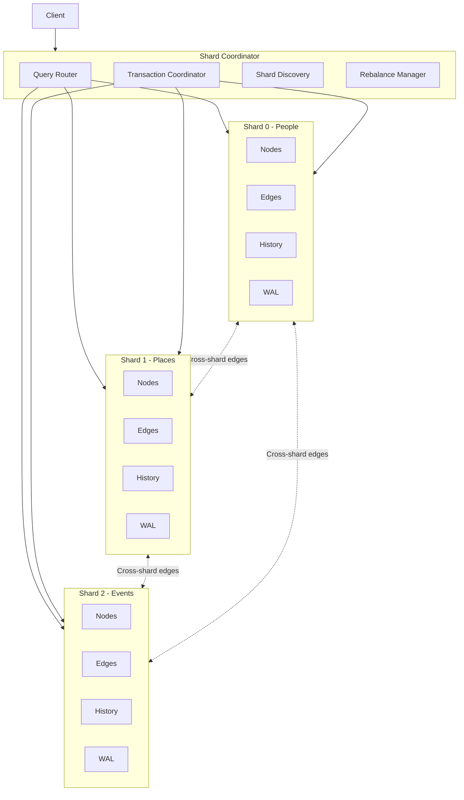
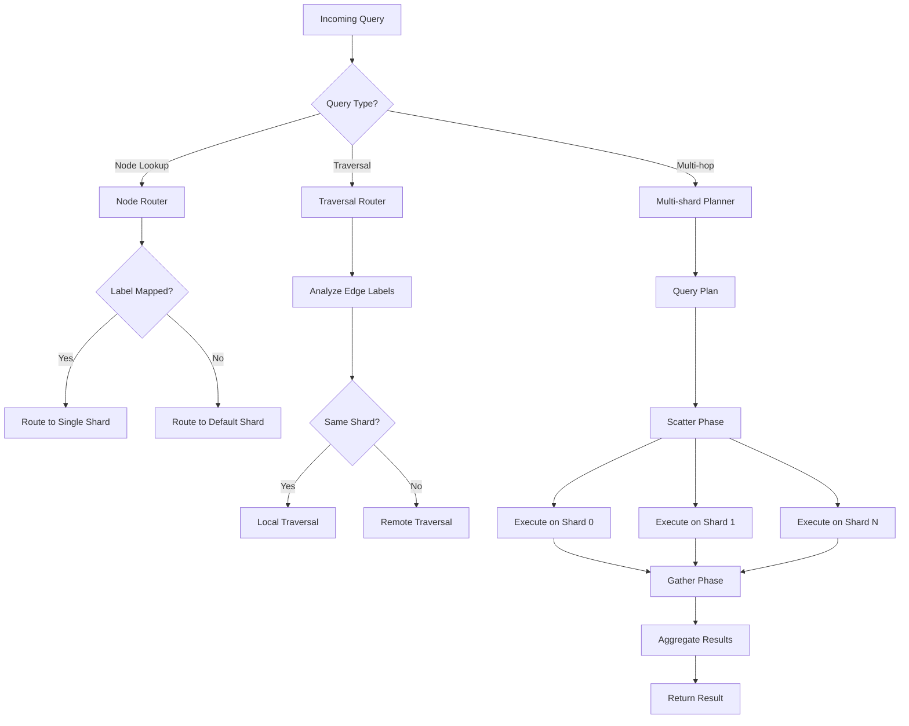
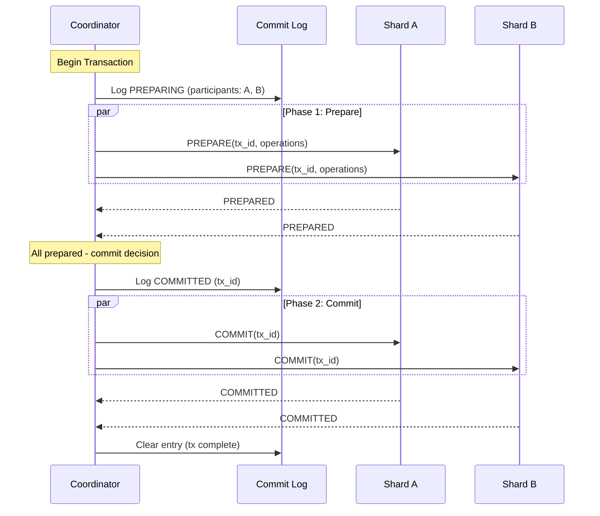
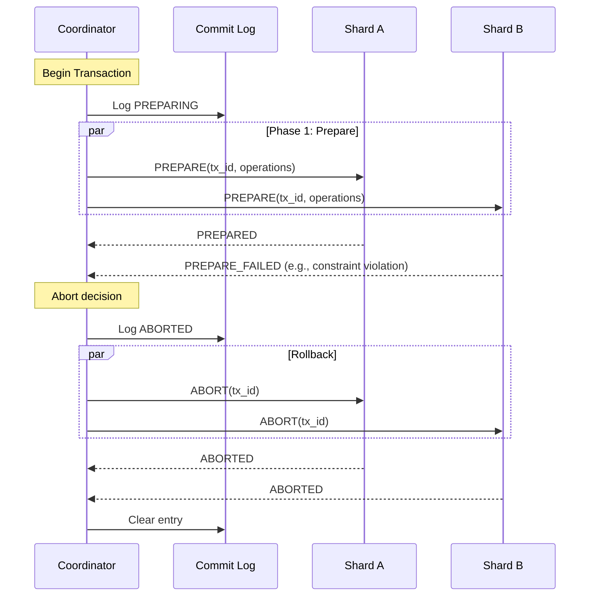
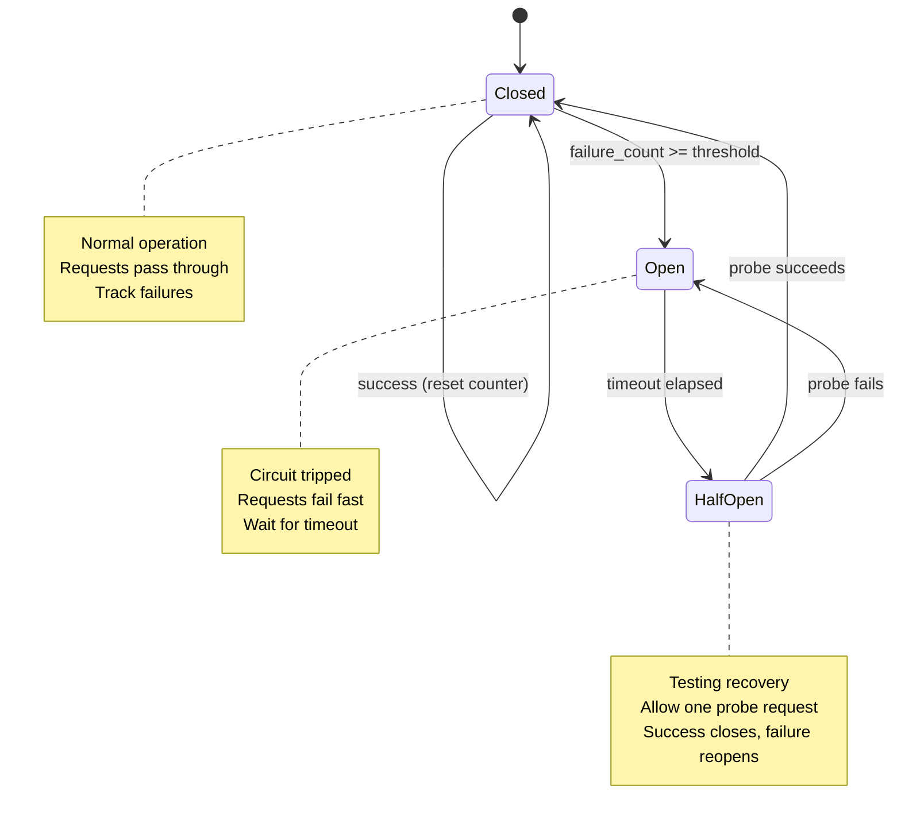
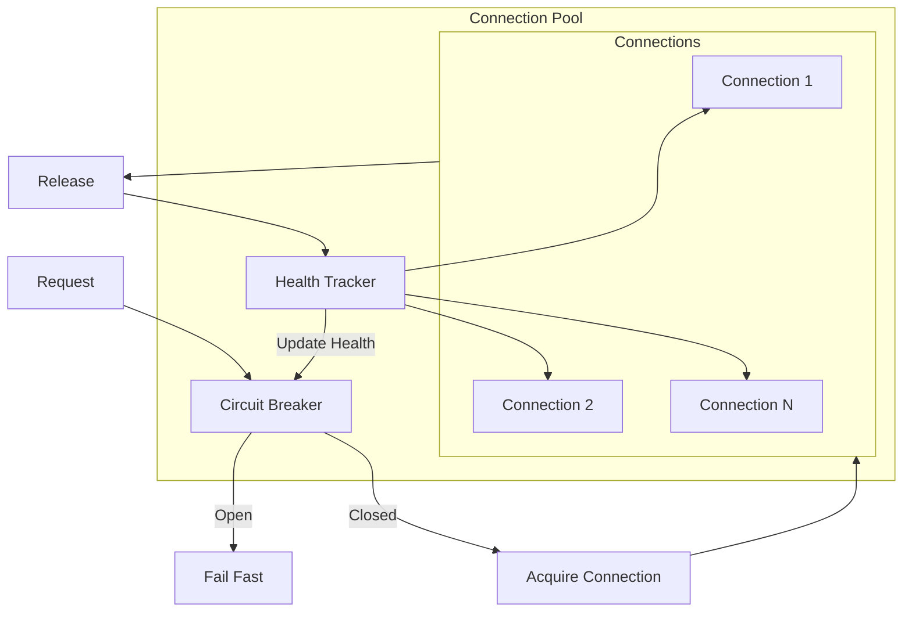
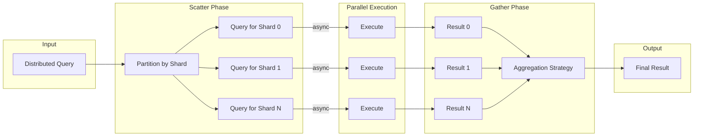
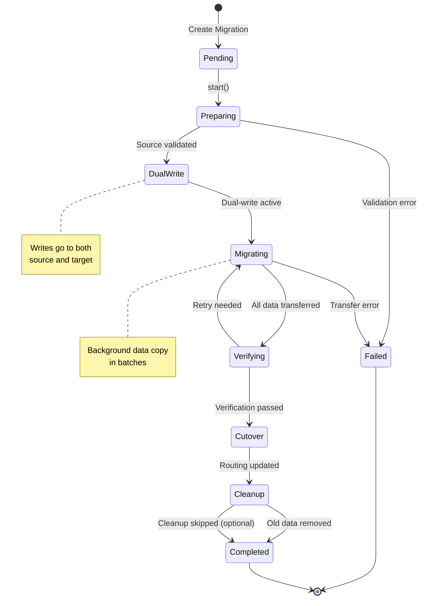
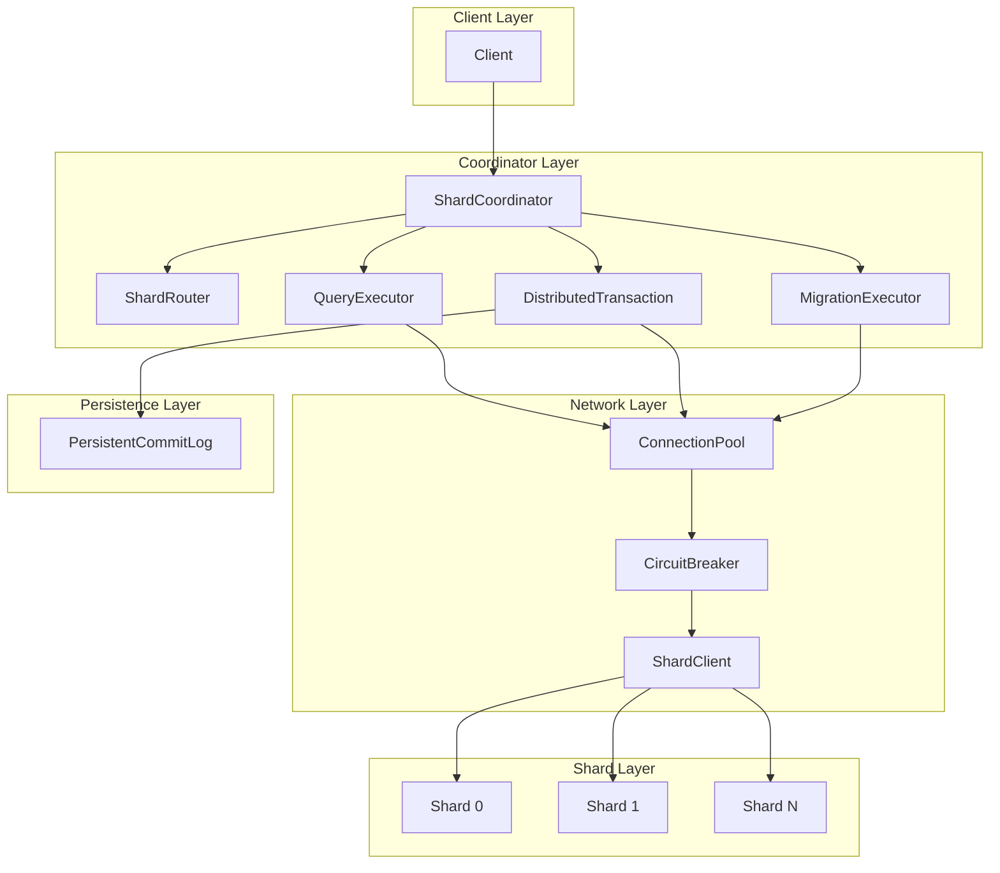

# ADR-0014: Graph Sharding Strategy

**Status:** Accepted
**Date:** 2026-01-01 (Proposed), 2026-01-22 (Accepted)
**Deciders:** GallifreyDB Core Team
**Categories:** storage, scalability, distributed

## Context

When the current-state dataset exceeds single-machine RAM (even with tiered storage for historical data), horizontal sharding becomes necessary:

**Scaling Limits:**
- Single machine: ~256GB RAM → ~1.2B current nodes
- Beyond this: Must distribute across multiple machines

**Graph Sharding Challenges:**
- **Edge cuts**: Edges crossing shard boundaries require network hops
- **Multi-hop queries**: N-hop traversal may touch N shards
- **Distributed transactions**: Writes spanning shards need coordination
- **Rebalancing**: Moving data between shards is expensive

**GallifreyDB-Specific Considerations:**
- Bi-temporal data must maintain consistency across shards
- Time-travel queries may need to reconstruct state across shards
- LLM queries often traverse relationships (multi-hop patterns)

## Decision

We implement **domain-based partitioning with edge replication** as the primary sharding strategy.

### Sharding Architecture Overview



### Partitioning Strategy

**Primary: Domain-Based Partitioning**

Nodes are partitioned by label/type. This provides natural data locality since queries within a domain stay local.

```rust
pub struct ShardConfig {
    pub shards: Vec<ShardDefinition>,
    pub default_shard: ShardId,  // Fallback for unlabeled nodes
}

pub struct ShardDefinition {
    pub id: ShardId,
    pub endpoint: String,
    pub labels: Vec<String>,  // Node labels owned by this shard
}

// Example configuration
let config = ShardConfig {
    shards: vec![
        ShardDefinition {
            id: ShardId(0),
            endpoint: "shard0.gallifrey.local:9000",
            labels: vec!["Person", "User", "Account"],
        },
        ShardDefinition {
            id: ShardId(1),
            endpoint: "shard1.gallifrey.local:9000",
            labels: vec!["Place", "Location", "Address"],
        },
        ShardDefinition {
            id: ShardId(2),
            endpoint: "shard2.gallifrey.local:9000",
            labels: vec!["Event", "Transaction", "Activity"],
        },
    ],
};
```

### Query Routing Architecture



### Edge Replication Strategy

Cross-shard edges are stored on **both** source and target shards:

```
Person (Shard 0)  ----VISITED---->  Place (Shard 1)

Shard 0 stores: (person_id) --VISITED--> (place_id@shard1)
Shard 1 stores: (person_id@shard0) --VISITED--> (place_id)
```

**Benefits:**
- Outgoing traversal from Person: local lookup on Shard 0
- Incoming traversal to Place: local lookup on Shard 1
- No network hop for first-level traversal

**Trade-off:**
- 2x storage for cross-shard edges
- Must maintain consistency on edge updates

### Distributed Transaction Protocol (Two-Phase Commit)

For writes spanning multiple shards, we use **Two-Phase Commit (2PC)** with a persistent commit log for crash recovery.



**Abort Flow:**



**Persistent Commit Log Format:**

```
┌─────────────────────────────────────────────────────┐
│ Header (16 bytes)                                   │
├─────────────────────────────────────────────────────┤
│ Magic: "GDB2" (4 bytes)                             │
│ Version: u32 (4 bytes)                              │
│ Reserved (8 bytes)                                  │
├─────────────────────────────────────────────────────┤
│ Entry 1                                             │
├─────────────────────────────────────────────────────┤
│ Length: u32 (4 bytes)                               │
│ LSN: u64 (8 bytes)                                  │
│ Entry Type: u8 (Preparing=1, Committed=2, Aborted=3)│
│ TxId: u64 (8 bytes)                                 │
│ Participants: Vec<ShardId>                          │
│ CRC32: u32 (4 bytes)                                │
├─────────────────────────────────────────────────────┤
│ Entry 2...                                          │
└─────────────────────────────────────────────────────┘
```

### Circuit Breaker Pattern

Network connections use circuit breakers to prevent cascade failures:



**Configuration:**

```rust
pub struct CircuitBreakerConfig {
    /// Number of failures before opening circuit
    pub failure_threshold: u32,      // default: 5

    /// Time to wait in open state before probing
    pub reset_timeout: Duration,     // default: 30 seconds

    /// Number of successes in half-open to close
    pub success_threshold: u32,      // default: 2
}
```

### Connection Pool Architecture



### Query Execution (Scatter-Gather)



**Aggregation Strategies:**

| Strategy | Description | Use Case |
|----------|-------------|----------|
| `Concat` | Append all results | Collecting all matches |
| `First` | Return first non-empty result | Existence check |
| `MergeNodes` | Deduplicate by node ID | Multi-hop traversal |
| `Sum` | Sum numeric values | Count aggregations |
| `Count` | Count total entries | Size queries |
| `ByShard` | Preserve shard grouping | Debugging/analysis |

### Migration and Rebalancing



**Migration Lifecycle:**

1. **Pending**: Migration defined but not started
2. **Preparing**: Validating source and target shards
3. **DualWrite**: New writes go to both old and new shards
4. **Migrating**: Copying existing data in batches
5. **Verifying**: Confirming data integrity
6. **Cutover**: Atomic routing table update
7. **Cleanup**: Remove data from old shard
8. **Completed**: Migration finished successfully

**Dual-Write Router:**

```rust
impl DualWriteRouter {
    pub fn route_write(&self, label: &str, primary_shard: ShardId) -> Vec<ShardId> {
        if let Some((source, target)) = self.active_migrations.get(label) {
            if primary_shard == *source {
                return vec![*source, *target]; // Dual-write
            }
        }
        vec![primary_shard] // Normal routing
    }
}
```

### Component Interactions



## Implementation Details

### Module Structure

```
src/storage/sharding/
├── mod.rs               # Module exports and documentation
├── types.rs             # ShardId, ShardState, ShardMetrics
├── config.rs            # ShardConfig, ShardDefinition, RebalanceConfig
├── router.rs            # ShardRouter, TraversalPlan
├── coordinator.rs       # ShardCoordinator, ShardConnection
├── transaction.rs       # DistributedTransaction, TwoPhaseCommitLog
├── network.rs           # ShardClient, CircuitBreaker, ConnectionPool
├── persistent_commit_log.rs # Durable commit decisions
├── executor.rs          # QueryExecutor, scatter-gather execution
├── migration.rs         # MigrationExecutor, DualWriteRouter
├── rebalance.rs         # RebalanceManager, MigrationPlan
└── simulation.rs        # ShardingSimulation, EdgeCutAnalysis
```

### Test Coverage

The implementation includes comprehensive test coverage:

| Module | Tests | Coverage Focus |
|--------|-------|----------------|
| `network.rs` | 24 | Circuit breaker states, connection pool health |
| `persistent_commit_log.rs` | 14 | Durability, recovery, corruption handling |
| `executor.rs` | 20 | Aggregation strategies, error handling |
| `migration.rs` | 16 | State transitions, dual-write routing |
| **Total** | **179** | Full sharding system |

## Consequences

### Positive

- **Horizontal scalability**: Add shards as data grows
- **Domain locality**: Queries within domain stay fast
- **Predictable routing**: No hash ring complexity
- **Edge replication**: Fast single-hop traversal across shards
- **Fault tolerance**: Circuit breakers prevent cascade failures
- **Crash recovery**: Persistent commit log enables recovery

### Negative

- **Operational complexity**: Multiple nodes to manage
- **Network latency**: Cross-shard queries add ~1ms per hop
- **2PC overhead**: Distributed writes slower than local
- **Edge storage overhead**: 2x for cross-shard edges
- **Rebalancing disruption**: Some impact during migrations

### Neutral

- Each shard is a full GallifreyDB instance with tiered storage
- Bi-temporal semantics preserved within and across shards
- WAL per shard, no global WAL needed

## Alternatives Considered

### Alternative 1: Hash-Based Partitioning

Assign nodes to shards based on hash(node_id) % num_shards.

**Rejected because:**
- No data locality - related nodes scattered randomly
- Every multi-hop traversal crosses shards
- Rebalancing requires moving ~1/N data when adding shard

### Alternative 2: Community Detection

Use graph algorithms to find dense subgraphs, shard by community.

**Rejected because:**
- Expensive to compute (O(E) or worse)
- Requires full graph analysis before any sharding
- Communities change over time, requiring frequent recomputation
- Better suited as optimization on top of domain-based partitioning

### Alternative 3: Hierarchical Sharding

Shard by relationship depth from "anchor" nodes.

**Rejected because:**
- Requires identifying stable anchor nodes
- Depth from anchor changes as graph grows
- Complex to reason about shard placement

## Future Enhancements

1. **Read replicas**: Add read-only replicas per shard
2. **Automatic sharding**: Infer domains from label distribution
3. **Query planning optimization**: Cost-based multi-shard query planning
4. **Shard splitting**: Subdivide large shards automatically
5. **Raft consensus**: Replace 2PC with Raft for coordinator election
6. **Streaming migration**: Stream-based data transfer for large migrations

## References

- GitHub Issues: [#123](https://github.com/madmax983/GallifreyDB/issues/123), [#124](https://github.com/madmax983/GallifreyDB/issues/124), [#125](https://github.com/madmax983/GallifreyDB/issues/125), [#126](https://github.com/madmax983/GallifreyDB/issues/126)
- Project: [GallifreyDB Scalability Roadmap](https://github.com/users/madmax983/projects/4)
- ADR-0013: Tiered Storage Architecture (prerequisite)
- Facebook TAO: [Paper](https://www.usenix.org/system/files/conference/atc13/atc13-bronson.pdf)
- Google Spanner: [Paper](https://research.google/pubs/pub39966/)
- Guide: [Sharding Guide](../guides/sharding-guide.md)
