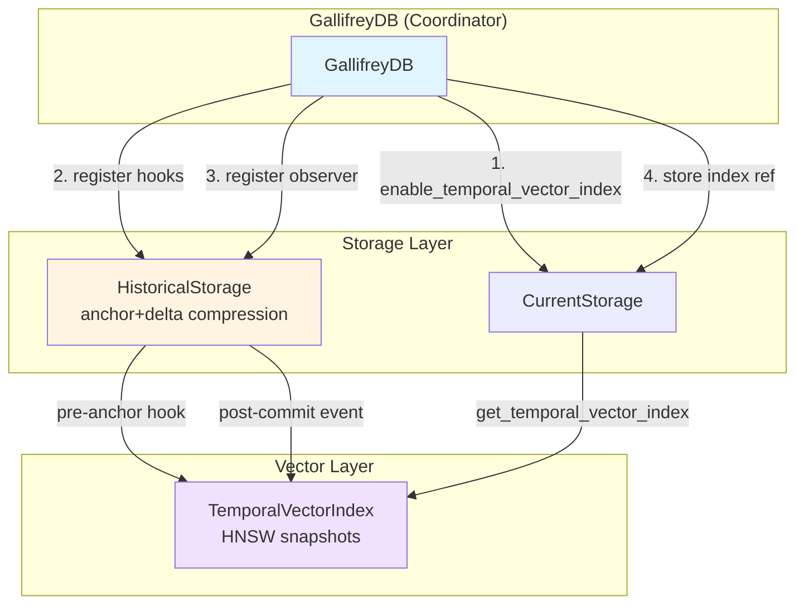
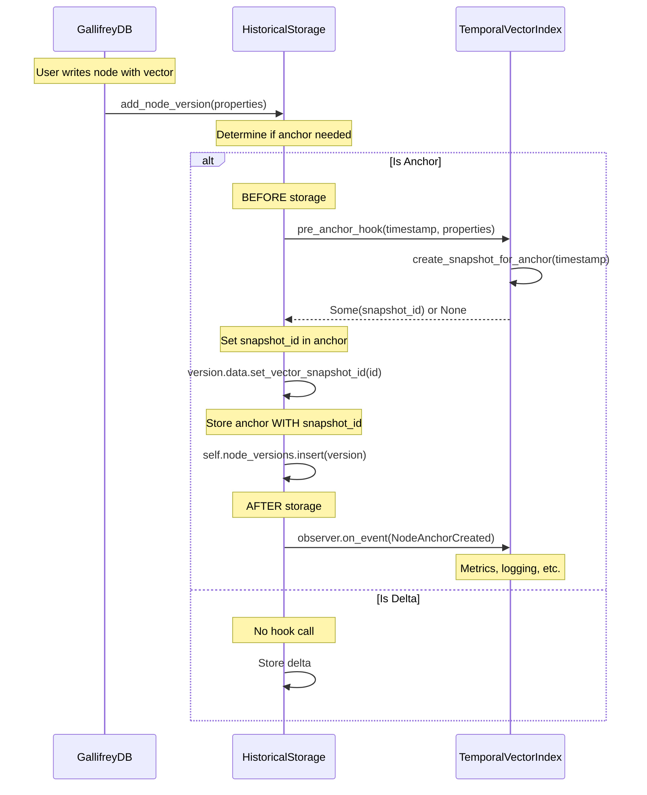
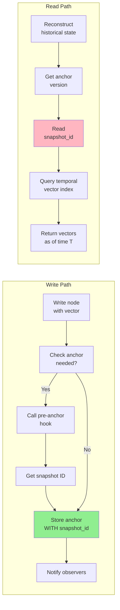

# ADR 0018: Temporal Vector Historical Integration (VS-047)

**Status**: Accepted
**Date**: 2026-01-08
**Context**: Issue #67 - Integrate Temporal Vectors with HistoricalStorage

## Problem Statement

GallifreyDB's temporal vector index and historical storage (anchor+delta versioning) operate as completely independent systems. Vector snapshots have no connection to graph data anchors, preventing:

1. **Provenance tracking**: No way to link a graph anchor to its corresponding vector snapshot
2. **Temporal consistency**: Vector and graph temporal queries aren't synchronized
3. **Semantic time-travel**: Can't query "what did we know at timestamp T" across both graph and vectors

**Critical Gap**: The `vector_snapshot_id` field exists in `VersionData::Anchor` but was **never populated** - provenance tracking was incomplete.

## Decision

Implement a **Hybrid Pre-Anchor Hooks + Post-Commit Observers** pattern:

- **Pre-anchor hooks**: Fire BEFORE anchor storage, return snapshot IDs → **strong consistency**
- **Post-commit observers**: Fire AFTER storage for metrics/logging → **extensibility**

This achieves both user requirements:
- Strong consistency (no eventual consistency window)
- Observer-based tracking (extensibility for metrics, logging, other indexes)

## Architecture

### System Overview



### Hook vs Observer Pattern



### Data Flow



## Implementation Details

### Core Types

```rust
/// Pre-anchor hook for creating snapshots before anchor storage.
///
/// Returns Some(snapshot_id) to link to anchor, or None if no snapshot needed.
pub type PreAnchorHook = Arc<
    dyn Fn(
        /* entity_type */ &str,
        /* entity_id */ u64,
        /* timestamp */ Timestamp,
        /* properties */ &PropertyMap,
    ) -> Result<Option<usize>>
        + Send
        + Sync,
>;
```

### Key Methods

**HistoricalStorage**:
```rust
// Hook registration
pub fn register_pre_node_anchor_hook(&mut self, hook: PreAnchorHook);
pub fn register_pre_edge_anchor_hook(&mut self, hook: PreAnchorHook);

// Called in add_node_version() BEFORE anchor storage
if version.is_anchor() {
    if let Some(ref hook) = self.pre_node_anchor_hook {
        match hook("node", node_id.as_u64(), timestamp, &properties) {
            Ok(Some(snapshot_id)) => {
                version.data.set_vector_snapshot_id(snapshot_id);
            }
            Ok(None) => { /* No snapshot needed */ }
            Err(e) => { /* Log but don't block anchor creation */ }
        }
    }
}
```

**GallifreyDB**:
```rust
pub fn enable_temporal_vector_index(&self, property_name: &str, config: TemporalVectorConfig) -> Result<()> {
    // 1. Create temporal vector index in CurrentStorage
    self.current.enable_temporal_vector_index(property_name, config)?;
    let temporal_index = self.current.get_temporal_vector_index().ok_or(...)?;

    // 2. Register pre-anchor hooks (strong consistency)
    // Both node and edge hooks perform the same action, so we create one and clone it
    let hook: PreAnchorHook = {
        let index = Arc::clone(&temporal_index);
        Arc::new(move |_entity_type, _entity_id, timestamp, _properties| {
            index.create_snapshot_for_anchor(timestamp)
        })
    };

    let mut historical = self.historical.write()?;
    historical.register_pre_node_anchor_hook(Arc::clone(&hook));
    historical.register_pre_edge_anchor_hook(hook);

    // 3. Register observer (extensibility)
    let observer = VectorIndexObserver::new(temporal_index);
    historical.add_observer(Arc::new(observer));

    Ok(())
}
```

## Alternatives Considered

### Alternative 1: Post-Commit Callback (Rejected)

**Approach**: Observer returns snapshot ID after anchor stored, update anchor retroactively.

**Rejected because**:
- Creates consistency window where `snapshot_id = None`
- Requires additional write to update anchor
- Violates immutability of historical versions
- Adds complexity with rollback scenarios

### Alternative 2: Synchronous Snapshot in add_node_version (Rejected)

**Approach**: Directly call `temporal_vector_index.create_snapshot()` in `add_node_version()`.

**Rejected because**:
- HistoricalStorage would depend on TemporalVectorIndex
- Tight coupling violates separation of concerns
- Hard to extend for other index types
- Observer pattern already established

### Alternative 3: Pure Observer Pattern with Buffering (Rejected)

**Approach**: Observer buffers snapshot IDs, HistoricalStorage queries buffer on next read.

**Rejected because**:
- User explicitly required "no eventual consistency window"
- Adds complexity with buffer synchronization
- Race conditions possible between write and read
- Doesn't meet strong consistency requirement

## Consequences

### Positive

1. **Strong Consistency**: `snapshot_id` set atomically when anchor created - no consistency window
2. **Observer Extensibility**: Post-commit observers for metrics, logging, future indexes
3. **Graceful Degradation**: Hook failures don't block anchor creation (snapshot_id = None)
4. **Provenance Tracking**: Complete chain from anchor → vector snapshot
5. **1:1 Alignment**: Every anchor gets a snapshot (simpler for MVP)
6. **Separate Concerns**: Clean separation between graph versioning and vector indexing

### Negative

1. **Synchronous Snapshot Creation**: Adds latency to anchor creation (acceptable - anchors infrequent)
2. **Dual Pattern Complexity**: Two systems (hooks + observers) require clear documentation
3. **Memory Overhead**: Snapshot created even if never queried temporally

### Mitigations

- **Performance**: Anchors created infrequently (default: every 10 versions)
- **Complexity**: Comprehensive documentation of when to use hooks vs observers
- **Memory**: Future optimization: lazy snapshot creation with buffering (Phase 4)

## Test Coverage

### Unit Tests (6 tests in historical.rs)

1. `test_pre_anchor_hook_called_before_storage()` - Hook fires when creating anchors
2. `test_pre_anchor_hook_returns_snapshot_id()` - ID stored in anchor
3. `test_pre_anchor_hook_none_handling()` - Graceful None handling
4. `test_pre_anchor_hook_error_graceful_degradation()` - Anchor created even if hook fails
5. `test_pre_anchor_hook_not_called_for_delta()` - Hook only fires for anchors
6. `test_pre_anchor_hook_node_and_edge_separate()` - Independent hooks for nodes vs edges

### Integration Tests (5 tests in temporal_vector_integration.rs)

1. `test_full_temporal_vector_lifecycle()` - End-to-end with multiple anchors
2. `test_multiple_nodes_with_temporal_vectors()` - Multiple nodes tracked
3. `test_temporal_vector_index_without_anchors()` - Minimal activity
4. `test_observer_graceful_degradation()` - Operations succeed with constraints
5. `test_edge_versions_with_temporal_vectors()` - Edge anchors trigger snapshots

**Result**: All 684 unit tests pass, all 5 integration tests pass, clippy clean.

## Design Trade-offs

| Aspect | Hook (Pre-Anchor) | Observer (Post-Commit) |
|--------|------------------|------------------------|
| **When** | BEFORE anchor storage | AFTER anchor storage |
| **Purpose** | Return snapshot ID | Notify of event |
| **Consistency** | Strong (atomic) | Eventual |
| **Blocking** | No (graceful degradation) | No |
| **Use Case** | Snapshot ID provenance | Metrics, logging, notifications |
| **Extensibility** | Limited (specific to anchors) | High (any event type) |

## Future Enhancements

### Phase 4: Async Snapshot Creation

- Buffer snapshot requests during transaction
- Create snapshots asynchronously post-commit
- Trade: Strong consistency for lower latency
- Requires: Snapshot request queue, reconciliation logic

### Phase 5: Snapshot Compaction

- Delta compression within TemporalVectorIndex snapshots
- Prune unused snapshots (anchors with no temporal queries)
- Reduces memory overhead for write-heavy workloads

## References

- **Issue**: #67 - Integrate Temporal Vectors with HistoricalStorage
- **PR**: [To be filled]
- **Related ADRs**:
  - ADR-0017: Temporal Vector Strategy (Phase 1-2)
  - ADR-0010: Historical Storage Architecture
- **Design Doc**: `docs/VECTOR_SEARCH_DESIGN.md`
- **Plan**: `.claude/plans/effervescent-hugging-tower.md`

## Decision Rationale

The hybrid approach was chosen because it **uniquely satisfies both user requirements**:

1. ✅ **Observer-based tracking** (extensibility) → Post-commit observers
2. ✅ **Strong consistency** (no eventual window) → Pre-anchor hooks

No single pattern could achieve both. The added complexity of two systems is justified by meeting otherwise conflicting requirements without compromise.

---

**Approved by**: Implementation verified through comprehensive test coverage
**Implemented**: 2026-01-08
**Supersedes**: None
