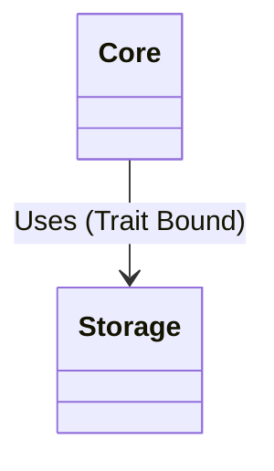

# ADR-0027: Decouple Storage from Core

**Status:** Accepted
**Date:** 2026-01-27
**Deciders:** AletheiaDB Core Team
**Categories:** architecture, storage, core, modularity

## Context

AletheiaDB's initial monolithic architecture placed both core business logic (graph topology, query execution, temporal reasoning) and storage implementation (WAL, page management, serialization) within the same compilation unit.

As the system has grown, several issues have emerged:

1.  **Circular Dependencies:** The `core` logic frequently references `storage` types for persistence, while `storage` needs `core` types (like `Node`, `Edge`) for serialization. This tight coupling makes refactoring difficult and introduces circular dependency risks.
2.  **Build Times:** Any change in the storage layer (e.g., modifying the WAL format) triggers a rebuild of the entire core, slowing down development cycles.
3.  **Testing Complexity:** Unit testing core logic requires mocking complex storage interactions or spinning up temporary files, leading to slower and flaky tests.
4.  **Pluggability:** We want to support multiple storage backends (e.g., in-memory for testing, Redb for embedded, remote for distributed), but the current design assumes a specific storage implementation.

## Decision

We will **decouple the storage logic from the core domain** by moving all persistence-related code into a dedicated `storage` module (intended to become a separate crate `aletheiadb-storage`).

The architectural boundary will be defined by a set of **Storage Traits** located in the `core` module:



```rust
// In Core
pub trait StorageEngine: Send + Sync {
    fn get_node(&self, id: NodeId) -> Result<Node>;
    fn save_node(&self, node: &Node) -> Result<()>;
    // ...
}
```

The `storage` module will implement these traits:

```rust
// In Storage
pub struct RedbStorage { ... }
impl StorageEngine for RedbStorage { ... }
```

**Key Changes:**
1.  **Dependency Inversion:** `Core` defines the interface; `Storage` implements it. `Core` no longer depends on concrete storage types.
2.  **Type Migration:** `Node`, `Edge`, `Property` and other domain objects remain in `Core`. Serialization logic (DTOs) moves to `Storage`.
3.  **Module Restructuring:**
    *   `src/core/` - Pure domain logic, query planner, traits.
    *   `src/storage/` - Concrete implementations (WAL, Redb, caching).

## Consequences

### Positive

-   **Clearer Boundaries:** Enforces strict separation of concerns. `Core` focuses on "what" (graph logic), `Storage` focuses on "how" (bytes on disk).
-   **Improved Build Times:** Changes to storage internals do not force recompilation of the query planner or API layers.
-   **Testability:** `Core` can be tested against lightweight in-memory implementations of the `StorageEngine` trait, removing IO from unit tests.
-   **Pluggability:** Enables easier addition of new storage backends (e.g., a distributed backend) without touching core logic.

### Negative

-   **Indirection Overhead:** Virtual dispatch (via traits) introduces a negligible runtime cost compared to direct function calls (though strictly typed generic implementations can monomorphize this away).
-   **FFI Complexity:** If we move to separate dynamic libraries or cross-language boundaries later, the interface complexity increases.
-   **Boilerplate:** Need to define and maintain trait definitions and potentially duplicate DTO structs for serialization optimization.

### Neutral

-   **Refactoring Effort:** Requires a significant one-time effort to move files and break existing cycles.

## Alternatives Considered

### Alternative 1: Feature Flags

Keep the code in the same module but use feature flags (e.g., `feature = "redb"`) to toggle storage implementations.

*   **Why not:** Does not solve the circular dependency or logical coupling issues. Still results in a monolithic build.

### Alternative 2: Microservices

Split storage into a completely separate service accessed via gRPC.

*   **Why not:** Introduces network latency unacceptable for the "Performance First" principle (<1µs traversal target). AletheiaDB is designed as an embedded database first.

## Implementation Notes

-   The `StorageEngine` trait should be async-aware to support future remote backends, although current implementations may be blocking (using `spawn_blocking`).
-   Care must be taken to ensure `Trait` methods are safe for FFI if we plan to expose them to other languages.
-   This change aligns with the "Hexagonal Architecture" (Ports and Adapters) pattern.
