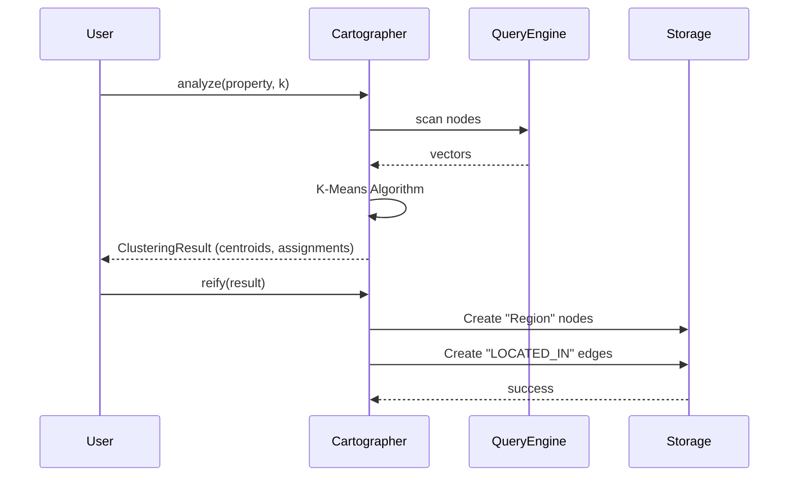

# ADR-0029: Semantic Clustering Architecture

**Status:** Accepted
**Date:** 2026-05-20
**Deciders:** Vantage (Product), Nova (Engineering), Codex (Architecture)
**Categories:** architecture, experimental, analytics, vector-search
**Related:** SPEC-003 (Semantic Clustering)

## Context

Graph databases traditionally excel at structural queries ("Find friends of friends") but struggle with high-level topological analysis ("What are the main topics in this dataset?"). Vector databases allow similarity search ("Find things like X") but lack structure.

We need a way to **bridge the gap between vector space and graph structure**, allowing users to segment the graph into semantic regions. This capability is described in [SPEC-003](../specs/003_semantic_clustering.md) as "The Cartographer".

The core problem is representing implicit vector similarity as explicit, traversable graph relationships to enable:
1.  **Cluster-based Retrieval:** Routing queries to specific semantic regions.
2.  **Graph Visualization:** simplifying dense graphs into high-level clusters.
3.  **Automated Taxonomy:** Discovering categories in unstructured data.

## Decision

We will implement **Semantic Clustering** by reifying vector clusters into the graph structure.

### 1. Algorithm: K-Means
We will use the **K-Means clustering algorithm** to partition nodes based on their vector embeddings.
-   **Why K-Means?** It is simple, interpretable, and efficient enough for the target batch sizes.
-   **Initialization:** Deterministic initialization (selecting points at fixed intervals) to ensure reproducible results without complex seeding.

### 2. Graph Reification
Clusters will be materialized as explicit nodes in the graph:
-   **New Node Label:** `Region`
-   **New Edge Label:** `LOCATED_IN`
-   **Properties:**
    -   `Region` nodes store the cluster centroid vector in the `centroid` property.
    -   `Region` nodes store the `cluster_id` (index).

### 3. Architecture Component: `Cartographer`
The logic is encapsulated in a new experimental component, `Cartographer` (in `src/experimental/cartographer.rs`), which:
1.  **Harvests** vectors from the graph using the Query Engine.
2.  **Computes** clusters in memory.
3.  **Writes** the new `Region` nodes and `LOCATED_IN` edges back to the graph storage.

## Consequences

### Positive

-   **Semantic Transparency:** Implicit mathematical similarity becomes explicit graph structure.
-   **Hybrid Traversal:** Query engines can now "jump" between semantically related but structurally distant nodes via `Region` hubs.
-   **Observability:** Users can query `MATCH (r:Region) RETURN r` to see the "map" of their data.

### Negative

-   **Write Amplification:** Reifying clusters generates $N$ new edges for $N$ clustered nodes, which creates significant WAL pressure and index churn.
-   **Staleness:** The `Region` structure is a snapshot of the vector space at calculation time. It does not update automatically as nodes change (requires re-running the job).
-   **Memory Usage:** The current implementation loads vectors into memory for clustering, limiting the scale to available RAM (not streaming).

### Neutral

-   **Experimental Status:** Currently resides in `src/experimental`, allowing for API evolution without strict backwards compatibility guarantees.

## Alternatives Considered

### Alternative 1: Dynamic/Online Clustering (e.g., streaming K-Means)
-   **Why not:** significantly more complex to implement and maintain consistency. Batch processing fits the "Analysis" use case better.

### Alternative 2: HDBSCAN
-   **Why not:** More complex parameters and computationally heavier. K-Means provides a "good enough" partitioning for broad categorization.

### Alternative 3: Virtual/Transient Clusters
-   **Why not:** Returning clusters only as query results prevents subsequent graph queries (e.g., "Find all regions connected to 'Finance'"). Reification allows composition.
