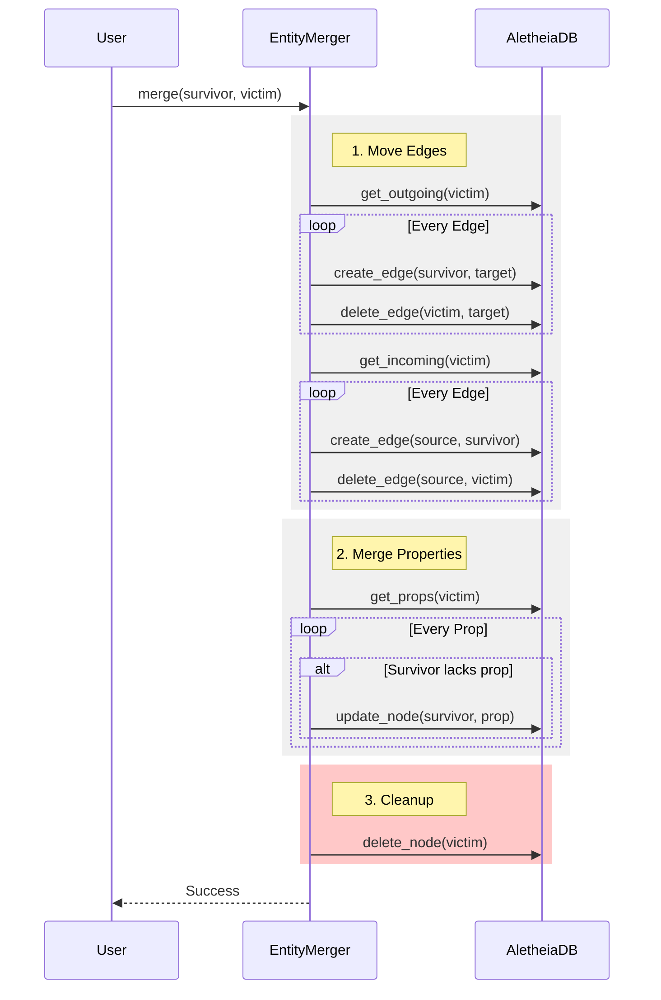

# ADR-0047: Highlander (Entity Resolution)

**Status:** Accepted
**Date:** 2026-01-27
**Deciders:** AletheiaDB Core Team
**Categories:** experimental, semantic-analysis, data-quality

## Context

In real-world graph data, especially when integrating multiple sources, duplicate entities are common. For example, "J. Smith" and "John Smith" might refer to the same person but exist as separate nodes. This fragmentation reduces the effectiveness of graph traversals and queries.

We need a mechanism to:
1.  **Identify** potential duplicates based on semantic similarity (vector embeddings) and structural properties.
2.  **Resolve** these duplicates by merging them into a single canonical entity.

The system must handle the complexity of merging properties (conflicts) and edges (redirecting relationships) while maintaining graph consistency.

## Decision

We will implement the **Highlander** module (`src/experimental/highlander.rs`) for Semantic Entity Resolution.

"There can be only one."

### 1. Detection Strategy (`HighlanderDetector`)

We use vector similarity to find potential duplicates.

-   **Input**: Target node ID, similarity threshold (e.g., 0.9), limit.
-   **Mechanism**: Query the HNSW vector index for the target node's embedding to find nearest neighbors.
-   **Output**: List of candidate `(NodeId, score)` pairs exceeding the threshold.

### 2. Merge Strategy (`EntityMerger`)

We adopt a **"Survivor Wins"** merge strategy:

-   **Survivor**: The node that remains.
-   **Victim**: The node that is merged into the survivor and then deleted.

**Merge Process:**
1.  **Edge Redirection**:
    -   All edges *outgoing* from the Victim are recreated as outgoing edges from the Survivor.
    -   All edges *incoming* to the Victim are recreated as incoming edges to the Survivor.
    -   Self-loops (Victim → Victim) become Survivor → Survivor.
    -   Original edges connected to the Victim are deleted.
2.  **Property Merging**:
    -   Properties present in the Victim but *missing* in the Survivor are copied to the Survivor.
    -   **Conflict Resolution**: Survivor's properties take precedence. We do *not* overwrite existing properties on the Survivor.
3.  **Deletion**:
    -   The Victim node is permanently deleted.

## Consequences

### Positive

-   **Data Quality**: Significantly improves graph connectivity by eliminating duplicates.
-   **Automation**: Can be automated via agents scanning for high-similarity pairs.
-   **Flexibility**: Vector-based detection handles fuzzy matches (typos, abbreviations) better than strict string matching.

### Negative

-   **Destructive**: Merging is irreversible (unless using time travel to a previous state).
-   **Data Loss Risk**: "Survivor Wins" strategy discards conflicting property values from the victim.
-   **Performance**: Merging high-degree nodes is expensive (O(E) where E is the number of edges connected to the victim).

## Alternatives Considered

### Alternative 1: Equivalence Edges (`SAME_AS`)

Instead of merging, add a `SAME_AS` edge between duplicates.

-   **Pros**: Non-destructive.
-   **Cons**: Queries become complex; every traversal must check for `SAME_AS` links. Performance degrades.

### Alternative 2: Property Concatenation

Merge properties by concatenating values (e.g., "John Smith" + "J. Smith").

-   **Pros**: Preserves all data.
-   **Cons**: Creates messy, non-canonical data types. Complicates schema.
