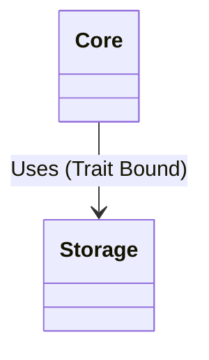

# 48. Decouple Storage from Core

Date: 2026-04-10

## Status

Proposed

## Context

Circular dependencies between the core domain logic and the storage implementation were causing build failures and hindering refactoring. The monolithic structure made it difficult to introduce alternative storage backends or optimize build times.

## Decision

We will decouple the storage logic from the core domain by moving all persistence-related code into a dedicated `storage` module (intended to become a separate crate). The architectural boundary will be enforced via trait definitions in `Core` that `Storage` implements.

## Consequences

### Positive

-   **Build Times:** Build times improve as changes to storage internals do not force recompilation of the core logic.
-   **Modularity:** Clear separation of concerns between domain logic and persistence.
-   **Testability:** Core logic can be tested with mock storage implementations.

### Negative

-   **FFI Complexity:** Complexity increases if we need to expose the storage interface via FFI.
-   **Indirection:** Trait-based dispatch introduces a small runtime overhead compared to direct function calls.

## Visuals

### Class Diagram

