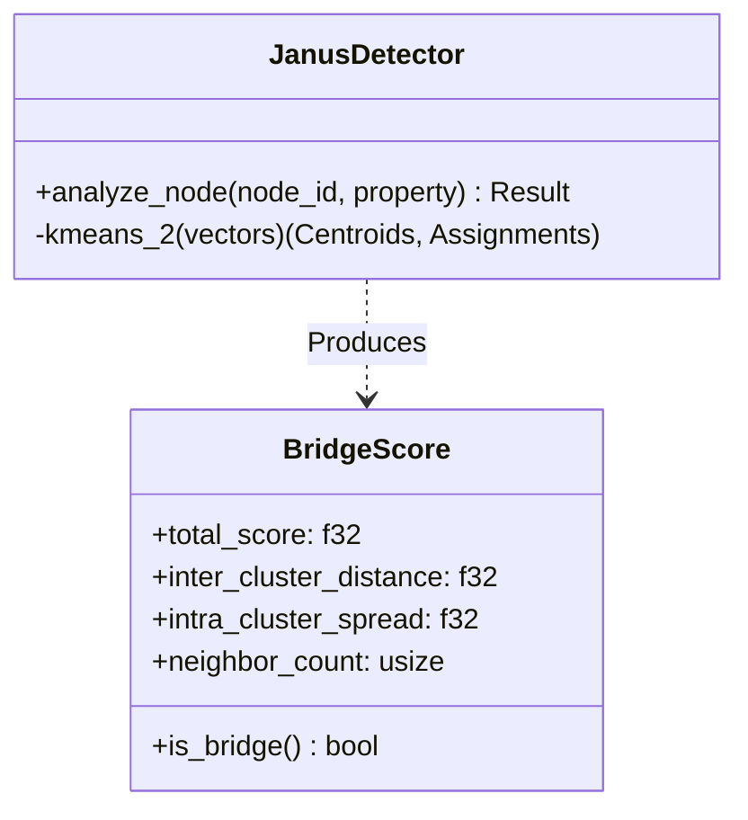

# ADR-0048: Janus (Semantic Bridge Detection)

**Status:** Accepted
**Date:** 2026-01-27
**Deciders:** AletheiaDB Core Team
**Categories:** experimental, semantic-analysis, graph-theory

## Context

In complex knowledge graphs, some nodes serve a critical role not by being central to a single community, but by connecting two otherwise disparate communities. These "bridge" or "diplomat" nodes are essential for:

-   **Interdisciplinary Discovery**: Papers citing multiple distinct fields (e.g., Biology + Computer Science).
-   **Social Dynamics**: Individuals linking separate social groups.
-   **Conflict Detection**: Identifying entities mediating between opposing viewpoints.

Standard centrality measures (Degree, PageRank) often fail to distinguish between a node deeply embedded in one cluster versus a node spanning two clusters. We need a semantic-aware metric.

## Decision

We will implement the **Janus** module (`src/experimental/janus.rs`) for Semantic Bridge Detection.

"Bridging the Gap."

### 1. Detection Strategy (`JanusDetector`)

We use a local clustering approach on the *neighbors* of a target node.

-   **Input**: Target node ID, vector property name.
-   **Mechanism**:
    1.  Fetch the embedding vectors of all immediate neighbors of the target node.
    2.  Perform a local **2-Means Clustering** on these neighbor vectors.
    3.  Calculate the **Bridge Score**.

### 2. The Bridge Score

The score is derived from the ratio of *inter-cluster distance* to *intra-cluster spread*.

$$
\text{Score} = \frac{\text{Distance}(\text{Centroid}_1, \text{Centroid}_2)}{\text{Average Spread within Clusters}}
$$

-   **High Score (> 1.2)**: The neighbors form two distinct, well-separated groups. The node is a bridge.
-   **Low Score**: The neighbors are mixed or form a single cluster. The node is embedded within a community.

### 3. Implementation Details

-   **Algorithm**: Standard K-Means with K=2, initialized with the two most distant points.
-   **Complexity**: O(N * D * I) where N = number of neighbors, D = vector dimension, I = iterations (fixed at 10).
-   **Optimization**: We fetch neighbor vectors directly from the property map.

## Consequences

### Positive

-   **Unique Insight**: Identifies structural holes and semantic bridges invisible to topology-only metrics.
-   **Actionable Intelligence**: Useful for recommendation systems (suggesting cross-domain content) and community detection.
-   **Scalable**: Local computation only requires immediate neighbors, making it parallelizable.

### Negative

-   **Computational Cost**: For high-degree nodes (supernodes), fetching and clustering thousands of vectors can be slow.
-   **Assumption of Bimodality**: Assumes the node bridges exactly *two* communities. A node bridging three or more might have a complex score interpretation.

## Alternatives Considered

### Alternative 1: Betweenness Centrality

Compute global betweenness centrality.

-   **Pros**: Standard graph metric.
-   **Cons**: Extremely expensive (O(V*E)) on large graphs. Ignores semantic content (vectors).

### Alternative 2: Global Clustering

Run global clustering (e.g., Louvain) and check boundary nodes.

-   **Pros**: Full community structure.
-   **Cons**: Batch process, not real-time or query-time. Overkill for single-node analysis.
