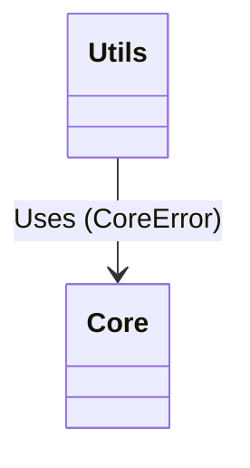

# ADR-0054: Resolve Circular Dependency Between Core and Utils

**Status:** Accepted
**Date:** 2026-03-03
**Deciders:** AletheiaDB Core Team
**Categories:** architecture, core, error-handling

## Context

AletheiaDB's structure contained a significant circular dependency tangle between the `core` and `utils` modules.

The structural problem was:
- The `core` module had a dependency on `utils::error::StorageError` and `utils::error::VectorError` for its result types and internal logic.
- Simultaneously, `utils::error` depended heavily on types defined within `core` (such as `NodeId`, `VersionId`, and `Timestamp`) to define the context for these errors.

This cycle created tight coupling between what should be independent layers, making refactoring difficult, impacting compilation times, and violating the architectural goal of maintaining a strict Directed Acyclic Graph (DAG) for module dependencies.

## Decision

We have resolved the circular dependency by isolating core-specific errors and strictly defining the dependency hierarchy:

1. **Extract `CoreError`:** We created a new module `src/core/error.rs` that defines a `CoreError` enum. This encapsulates all errors generated natively within the core domain (e.g., ID bounds, dimension mismatches, timestamp errors).
2. **Refactor Core Modules:** All `core` submodules now use `CoreError` instead of reaching out to `utils::error::Error`.
3. **Isolate Temporal Errors:** We moved `TemporalError` entirely inside `core::temporal` to ensure it resides next to the domain it describes.
4. **Integrate into Utils:** We integrated `CoreError` as a variant inside the higher-level `utils::error::Error` enum.

## Consequences

### Positive
- **Architectural Clarity:** We have re-established a clean, unidirectional dependency hierarchy where `utils` depends on `core`, but `core` is independent of `utils`.
- **Stricter Encapsulation:** Error types are now defined closest to the modules that generate them.
- **Improved Build Times:** Changes to utility functions or storage errors no longer force recompilation of the entire `core` module.

### Negative
- **Indirection Overhead:** Callers consuming the top-level `utils::error::Error` may need to unwrap or pattern-match through the `CoreError` variant to handle specific domain errors.

### Neutral
- **Refactoring Churn:** Required updating all unit tests and Warden verification suites to match the new `CoreError` structure.

## Alternatives Considered

- **Move all errors to `core`:** We considered moving the entirety of `utils::error::Error` to `core`. However, this was rejected as it would mean `core` would need to know about `StorageError` and `IndexError`, which violates the abstraction layers since `core` shouldn't know about concrete storage details.
