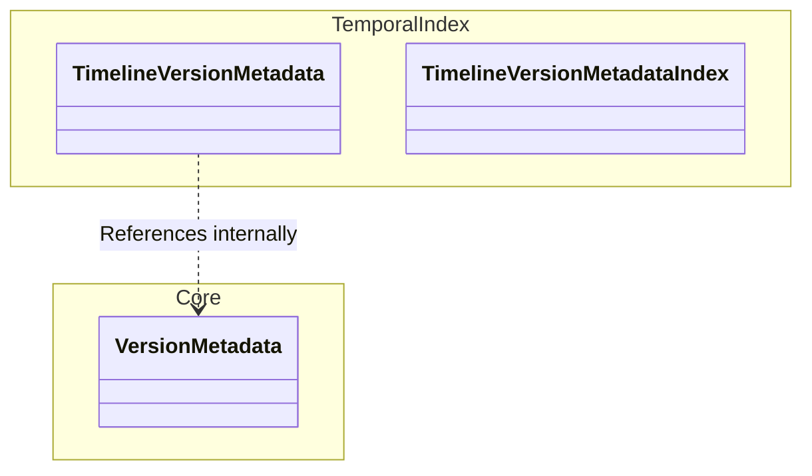

# ADR-0054: Resolve VersionMetadata Naming Collision

**Status:** Accepted
**Date:** 2026-03-10
**Deciders:** AletheiaDB Core Team
**Categories:** architecture, core, temporal-index

## Context

AletheiaDB manages temporal dimensions through a combination of global domain version primitives and index-specific data structures. Previously, both `src/index/temporal.rs` and `src/core/version.rs` defined a struct named `VersionMetadata`.

This naming collision caused:
1.  **Semantic Ambiguity:** "The Leak" architectural smell, where it wasn't immediately clear if a module was referencing the global domain primitive (`core`) or the internal index state (`temporal`).
2.  **Coupling Risks:** Confusion when developing or refactoring, potentially blurring the lines between index implementation details and core concepts.

## Decision

We renamed the index-specific struct from `src/index/temporal.rs::VersionMetadata` to `TimelineVersionMetadata` (along with its associated type alias `TimelineVersionMetadataIndex`).

## Consequences

### Positive

-   **Clear Domain Boundaries:** `core` is the definitive source for the global domain primitive (`VersionMetadata`), while `TimelineVersionMetadata` explicitly identifies itself as an implementation detail of the temporal index timelines.
-   **Improved Readability:** Code working with either type now has immediate, unambiguous context.
-   **Reduced Refactoring Risk:** Less likely to accidentally couple index logic to core logic due to name confusion.

### Negative

-   **None:** The change was purely semantic renaming and does not affect the runtime performance or public API.
