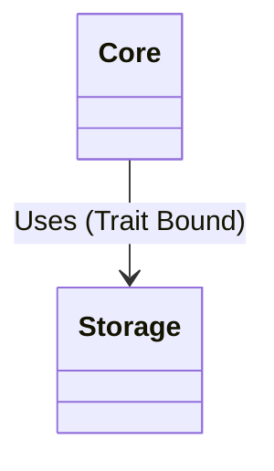

# ADR-0055: Decouple Storage from Core

**Status:** Proposed
**Date:** 2026-03-13
**Deciders:** AletheiaDB Core Team
**Categories:** architecture, storage, core

## Context

AletheiaDB has historically maintained tight coupling between its core graph domain logic and its underlying persistence layer. Specifically, the core logic frequently referenced concrete storage types for persistence operations, while the storage logic needed core types (like `Node`, `Edge`) for serialization.

This tight coupling introduced several significant issues:
1. **Circular Dependencies:** Circular dependencies were causing build failures and logic entanglement between the `core` and `storage` modules.
2. **Build Times:** Any modification to the storage layer, such as changes to the WAL format, triggered a full recompilation of the core domain, significantly inflating development cycle times.
3. **Pluggability Constraints:** Extending the system to support new backends (like an embedded Redb database or distributed configurations) became challenging due to hardcoded references.

To alleviate these issues, Atlas recently initiated a structural change to formally move the `storage` module.

## Decision

We will **decouple the storage logic from the core domain** by moving persistence logic to a dedicated `storage` crate (`aletheiadb-storage`).

The architectural boundary will be strictly defined by a set of **Storage Traits** (such as `StorageEngine`) located in the `core` module.



```rust
// In Core
pub trait StorageEngine: Send + Sync {
    fn get_node(&self, id: NodeId) -> Result<Node>;
    fn save_node(&self, node: &Node) -> Result<()>;
}
```

The `storage` module will then implement these traits directly without core depending on concrete implementations.

## Consequences

### Positive
- **Clearer Boundaries:** Enforces strict separation of concerns, allowing `Core` to focus on the domain topology and `Storage` to focus exclusively on IO and byte persistence.
- **Improved Build Times:** Build times improve as modifications to storage internals no longer force the query planner or API layers to recompile.
- **Improved Testability:** `Core` can be tested against lightweight, in-memory mock implementations of the `StorageEngine` trait.

### Negative
- **Indirection Overhead:** Virtual dispatch (via traits) introduces a negligible runtime cost.
- **FFI Complexity:** If we move to separate dynamic libraries or cross-language boundaries later, the FFI complexity increases.
- **Code Boilerplate:** Defining trait definitions and potentially duplicating DTO structs for serialization optimization increases the overall maintenance burden.
