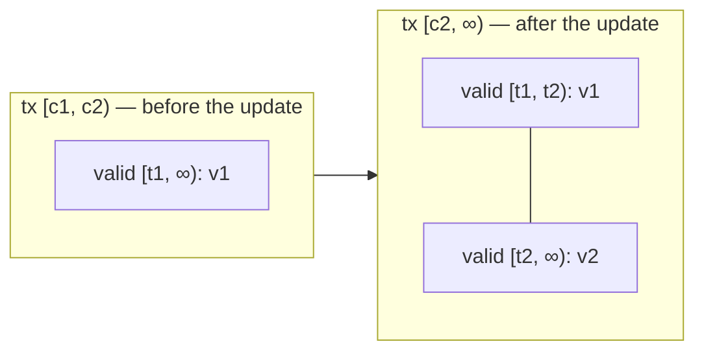

# ADR-0061: Append-Only Valid-Time Supersession on Update

**Status:** Accepted
**Date:** 2026-10-01
**Deciders:** AletheiaDB Core Team
**Categories:** temporal, storage, core
**Related:** Issue #3504 (append-only valid intervals), Issue #3407 (explicit
tx-close on replay), Issue #3387 (persisted chain links)

## Context

`update_node_with_valid_time` / `update_edge_with_valid_time` (and every plain
update, whose `valid_from` defaults to the transaction start) appended the new
version with an open-ended valid interval and closed only the predecessor's
**transaction** time. At the current transaction time the predecessor was
therefore invisible at *every* valid time, so:

```rust
let id = db.create_node_with_valid_time("N", props, Some(t1))?;
db.update_node_with_valid_time(id, props2, Some(t2))?;
db.get_node_at_valid_time(id, mid)?; // t1 < mid < t2  =>  NodeNotFound
```

The obvious fix — close the predecessor's *valid* interval in place at `t2` —
is exactly what Issue #3504 removed: shrinking a recorded interval retroactively
changes what earlier transaction-time snapshots observe (a reader whose
snapshot predates the update loses the entity for valid times `>= t2`).

The predecessor's complete belief is L-shaped in the bi-temporal plane:



A version is a single rectangle, so one record cannot express it.

## Decision

Keep #3504's append-only rule and add a second rectangle:

1. **Slices.** The *still-recorded* (transaction-open, non-empty valid interval)
   versions of a live entity are its *slices*; they partition valid time with no
   overlaps and no gaps. `HistoricalStorage` indexes the non-head slices per
   entity (`node_open_slices` / `edge_open_slices`, rebuilt on restore).
2. **Update at `valid_from = t`** (`storage::historical::slices`):
   - find the slice `P` containing `t` (O(1) for the open head, the common case);
   - transaction-close `P` (explicitly, never via the add-path's strict `>`
     auto-close — #3407);
   - if `P.start < t`, append a **carry-forward** version with `P`'s properties,
     label and provenance over `[P.start, t)`; if `P.start == t` the update is a
     **degenerate replace** (no carry-forward, no empty interval);
   - append the new version over `[t, P.end)`: open-ended for an ordinary
     update, **bounded by the successor** for a backfill;
   - after a backfill, **re-assert** the open head (tx-close it, append an
     identical copy) so the chain head — and current storage — stays the
     entity's actual current state.
3. **Structural ids.** Carry-forward and re-assertion versions get ids with the
   reserved `STRUCTURAL_VERSION_TAG` bit (`1 << 62`). The marker therefore
   survives the WAL, index persistence, cold tier and backups with **no format
   change**. `IdGenerator::{reset_to, ensure_at_least}` strip the bit so a
   re-seed from persisted data never enters the tagged range.
4. **Changefeed.** `build_raw_change` skips structural versions, so
   `list_changes` stays identical to the push feed (which only broadcasts the
   ids a transaction wrote): one row per write.
5. **Delete** transaction-closes the head *and every slice*: a deleted entity is
   still absent at every valid time as of the delete (unchanged semantics).
   **Retraction** is unchanged (it splits the head; validation already rejects a
   `valid_to` before the head's `valid_from`) and now preserves the earlier
   slices too.
6. **Recovery and replication.** Structural ids are not logged. Replay
   re-derives the same plan from the replayed history (the plan depends only on
   it) and mints its own structural ids. Each mint consumes one sequence number
   from the replay synthesizer, exactly as the live path consumes one from the
   generator, so replay's synthesized ids stay in step with the primary's
   allocation — the incremental replication applier relies on this (jumping the
   synthesizer ahead of the primary would collide with ids logged in a later
   batch). The tag bit keeps structural ids disjoint from ordinary ones.
7. **Cold tier.** Still-recorded versions are never migration candidates (like
   heads): a later delete or backfill must be able to transaction-close them,
   and cold versions are immutable.
8. **Restore.** `rebuild_version_chains` treats persisted links (Issue #3387) as
   authoritative per entity — the tx-sort heuristic (close every non-latest open
   interval, head = last) only runs for legacy files, which predate structural
   versions — and selects the head by following `next_version` links.

## Consequences

**Positive**

- As-of valid-time reads resolve to exactly one version for any `t` in an
  entity's lifetime; history shows the predecessor over `[t1, t2)`.
- Snapshot isolation on the valid dimension (#3504) is preserved: earlier
  transaction-time reads still see the predecessor open-ended.
- Backfills no longer overwrite later versions or the current state.
- No WAL / persistence / cold / backup format change.

**Negative / trade-offs**

- An ordinary update now stores **two** versions (the carry-forward is an
  empty delta against its predecessor); raw storage counts (`stats()`,
  `historical_stats()`) include structural versions. The per-entity
  `max_versions_per_entity` cap counts only *logical* versions (writes) —
  structural versions are exempt, so an entity's update headroom is unchanged
  and memory stays bounded by a small constant factor (at most two structural
  versions per write). The cap is checked before any mutation, so a rejected
  update never leaves a half-applied state.
- A backfill stores up to three versions (carry-forward, new, re-assertion).
- Still-recorded slices stay in the hot tier for the life of the entity.
- `get_node_history` / `get_edge_history` and `get_*_at_version` list **writes**
  and omit structural versions, so history and version numbers are unchanged
  for callers. The current valid-time partition (structural slices included) is
  exposed by the new `get_node_valid_time_slices` / `get_edge_valid_time_slices`.
- After a backfill, the history's last entry is the backfill write; the current
  state is the re-asserted head (see the slices API / `get_node`).

## Alternatives considered

- **In-place valid close (the issue's proposal).** Reverts #3504; rejected.
- **Read-time derivation** of implicit valid ends from the chain. No storage
  change, but rewrites visibility in every reader (temporal index, `is_visible_at`
  callers) and stored intervals would still read `[t1, ∞)`; rejected.
- **Logging structural ids in the WAL.** Requires a WAL format bump colliding
  with the keyversioned encrypted container's version-byte scheme; unnecessary
  because replay re-derives the plan deterministically.
