# GallifreyDB Architecture

> A high-performance bi-temporal graph database designed for LLM knowledge evolution tracking

## Overview

GallifreyDB combines three powerful concepts:
- **Graph Database**: Nodes and edges with property storage
- **Bi-Temporal Tracking**: Valid time + transaction time
- **LLM Integration**: Enabling AI reasoning about knowledge evolution

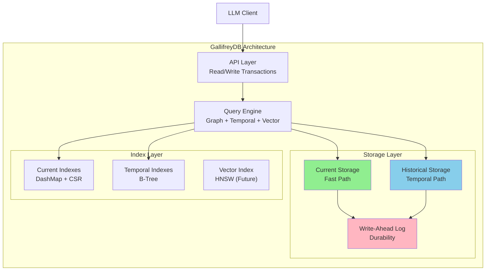

## Core Design Principles

### 1. Hybrid Storage Architecture

Separate paths for current-state and historical queries:

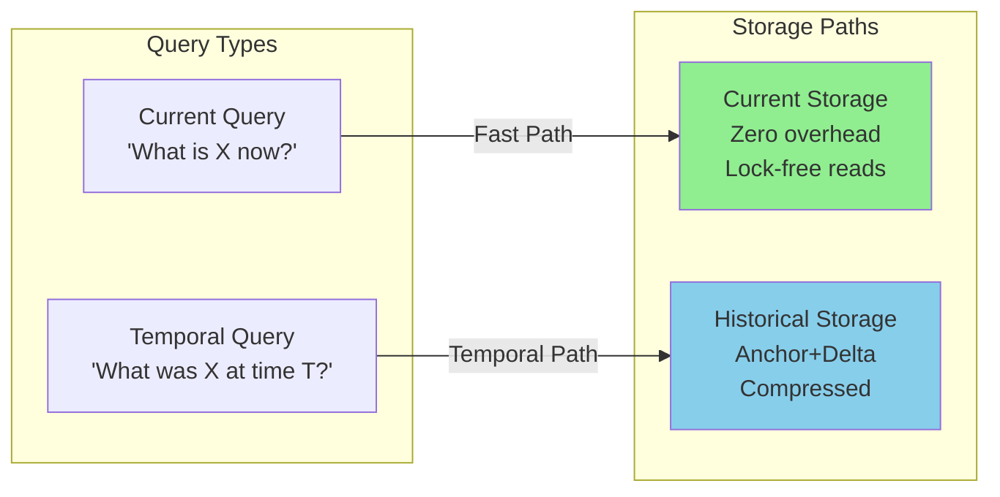

### 2. Bi-Temporal Model

Track two independent time dimensions:

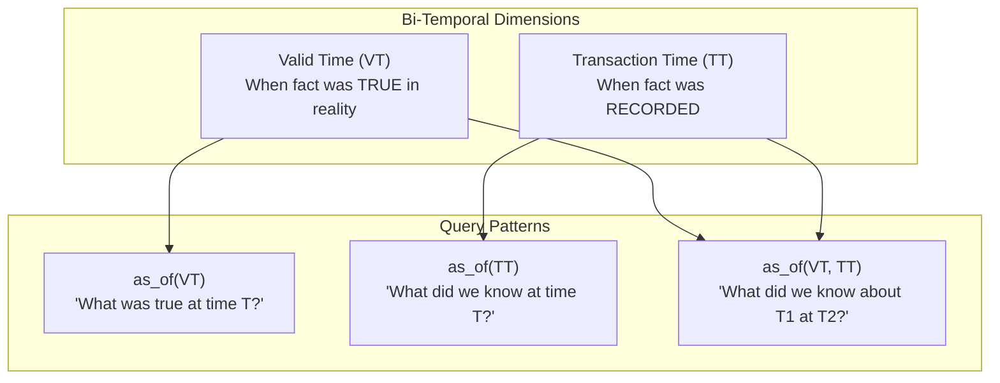

### 3. ACID with MVCC

Full transactional guarantees with high concurrency:

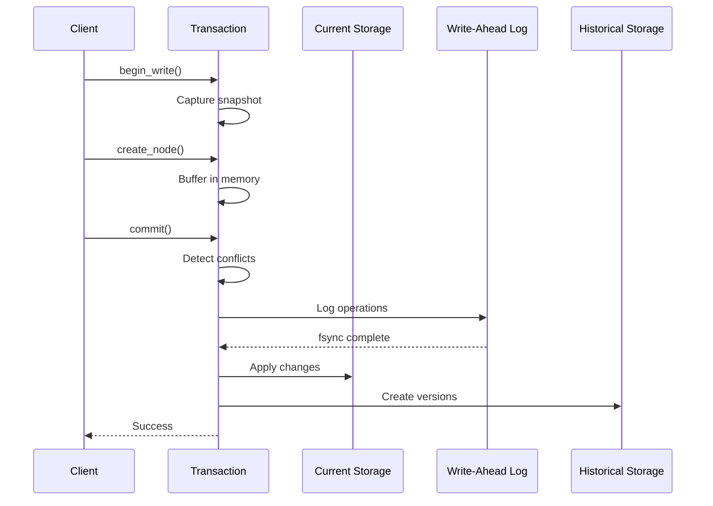

## Architecture Layers

### Layer 1: Core Types

Foundational data structures used throughout:

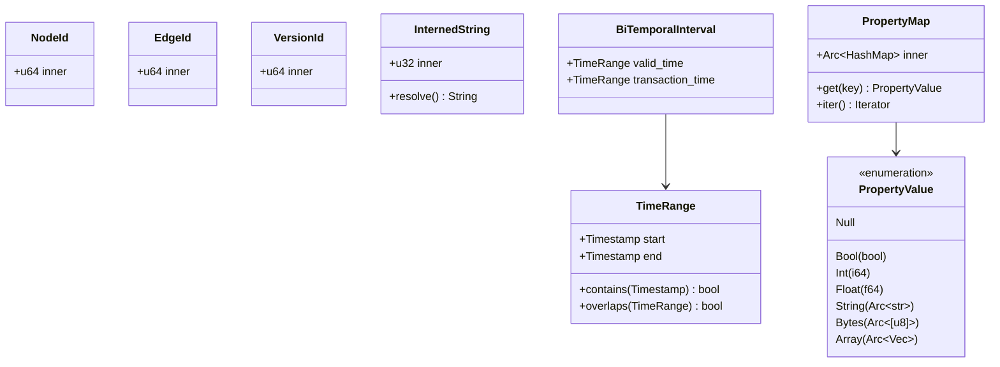

### Layer 2: Graph Entities

Nodes and edges with temporal versioning:

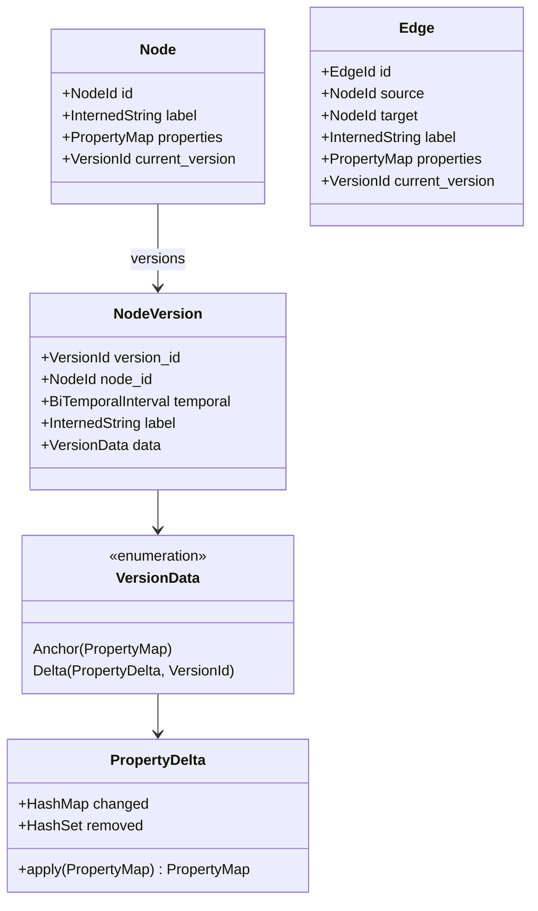

### Layer 3: Storage

Dual-path storage with WAL durability:

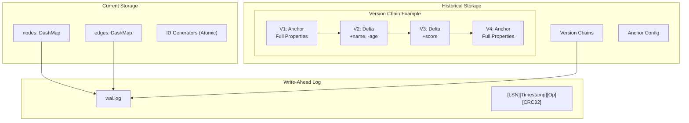

### Layer 4: Indexes

Multiple index strategies for different query types:

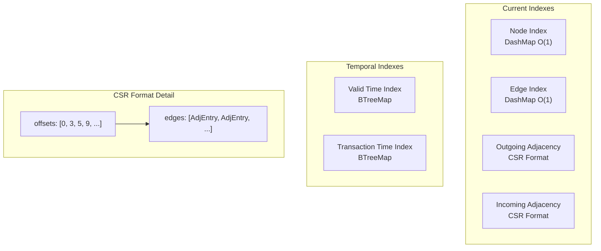

### Layer 5: Transactions

MVCC with Snapshot Isolation:

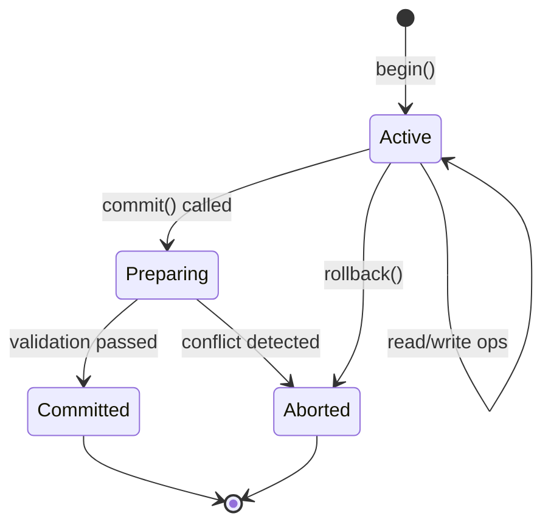

## Data Flow

### Write Path

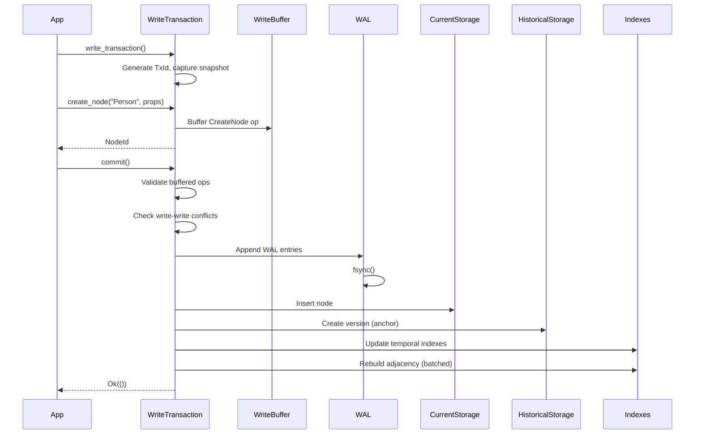

### Read Path

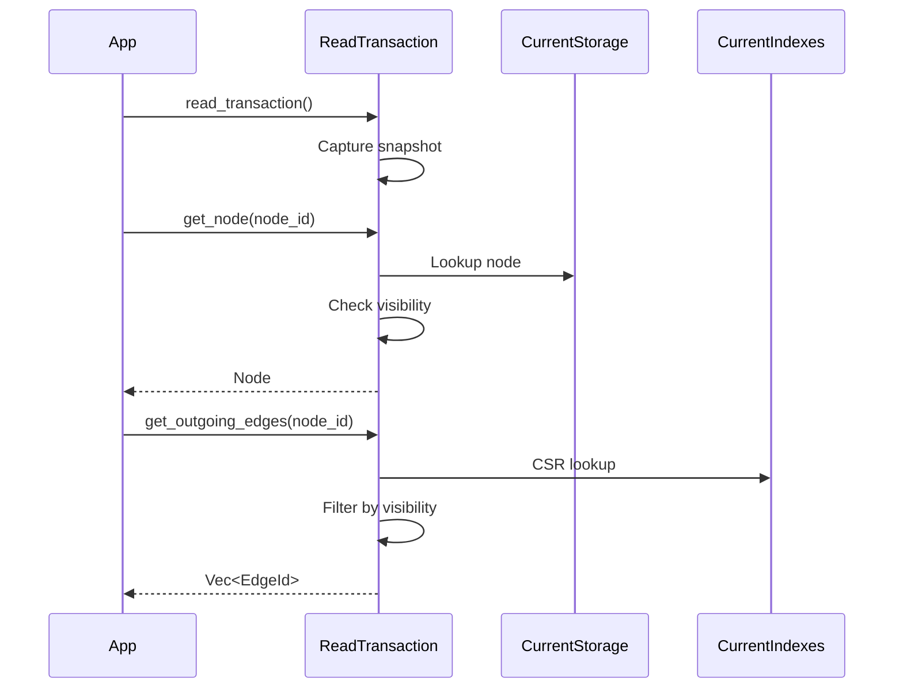

### Time-Travel Path

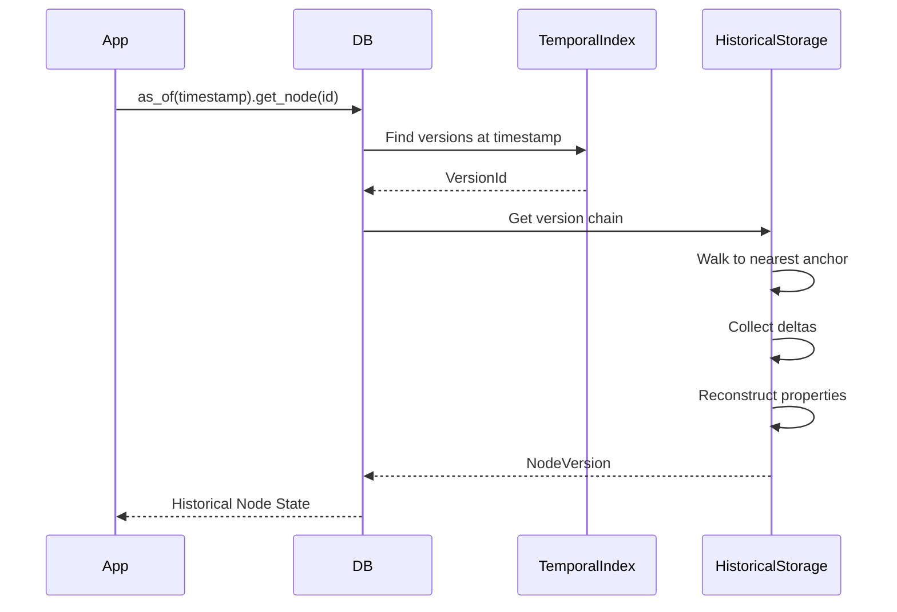

## Performance Characteristics

### Target Metrics

| Operation | Target | Achieved |
|-----------|--------|----------|
| Single-hop traversal | <1µs | ~22ns |
| 3-hop traversal | <100µs | TBD |
| Time-travel reconstruction | <10ms | ~20ns* |
| Write transaction | <10ms | ~7-12µs |
| Storage overhead | <2x | ~20% (anchor+delta) |

*For versions close to anchor

### Scalability

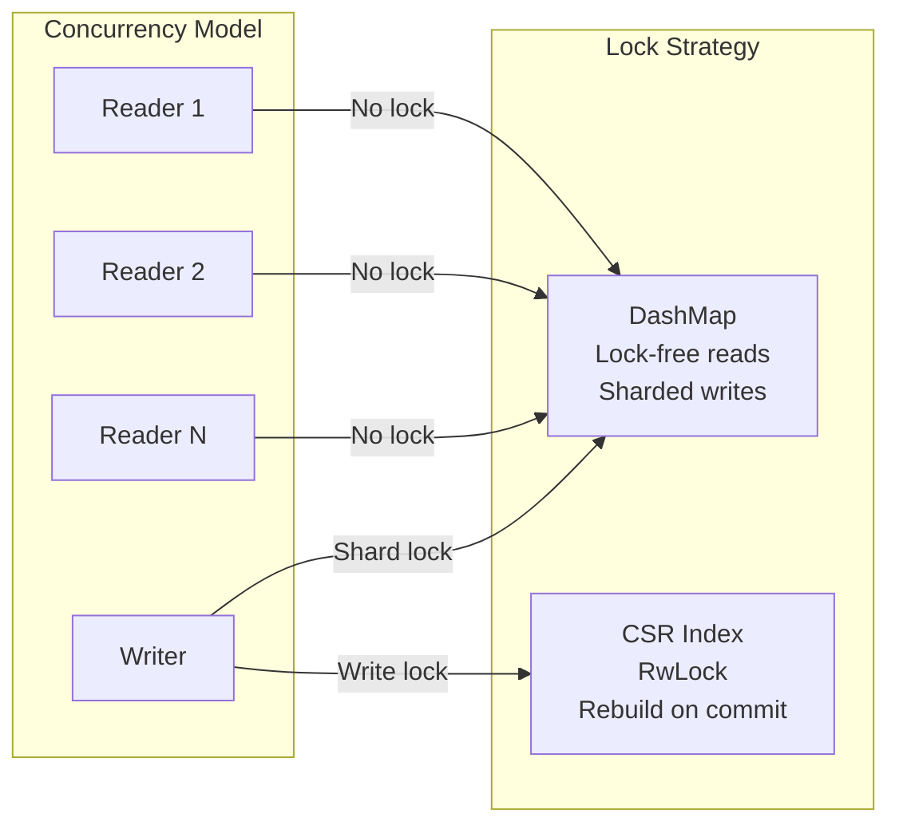

## Module Organization

```
gallifreydb/
├── src/
│   ├── lib.rs              # Public exports
│   ├── db.rs               # GallifreyDB orchestrator
│   │
│   ├── core/               # Core primitives
│   │   ├── id.rs           # NodeId, EdgeId, VersionId
│   │   ├── temporal.rs     # BiTemporalInterval, TimeRange
│   │   ├── property.rs     # PropertyValue, PropertyMap
│   │   ├── graph.rs        # Node, Edge
│   │   └── interning.rs    # InternedString, StringInterner
│   │
│   ├── storage/            # Persistence layer
│   │   ├── current.rs      # CurrentStorage
│   │   ├── historical.rs   # HistoricalStorage
│   │   ├── version.rs      # NodeVersion, EdgeVersion
│   │   ├── wal.rs          # WriteAheadLog
│   │   └── persistence.rs  # Checkpointing
│   │
│   ├── index/              # Query indexes
│   │   ├── current.rs      # CurrentIndexes (DashMap)
│   │   ├── temporal.rs     # TemporalIndexes (BTree)
│   │   └── adjacency.rs    # AdjacencyIndex (CSR)
│   │
│   ├── api/                # Transaction API
│   │   └── transaction/
│   │       ├── types.rs    # TxId, TxState
│   │       ├── visibility.rs # Snapshot Isolation
│   │       ├── read_tx.rs  # ReadTransaction
│   │       ├── write_tx.rs # WriteTransaction
│   │       └── write_buffer.rs
│   │
│   └── utils/
│       └── error.rs        # Error types
│
├── benches/                # Criterion benchmarks
├── docs/
│   ├── adr/               # Architecture Decision Records
│   └── architecture/      # This documentation
└── tests/                 # Integration tests
```

## Related Documentation

### Core Architecture
- [Storage Layer](storage-layer.md) - Detailed storage architecture
- [Transaction System](transaction-system.md) - MVCC and isolation
- [Index Layer](index-layer.md) - Index structures and algorithms
- [Data Model](data-model.md) - Core types and temporal model

### Performance & Scalability
- [Durability Modes](durability-modes.md) - Configurable WAL sync strategies (Sync/Batched/Async)
- [Scalability](scalability.md) - Tiered storage and horizontal sharding

### Decision Records
- [ADRs](../adr/README.md) - Architecture Decision Records
