# Data Model Architecture

GallifreyDB's data model combines graph structures with bi-temporal tracking to enable knowledge evolution queries.

## Overview

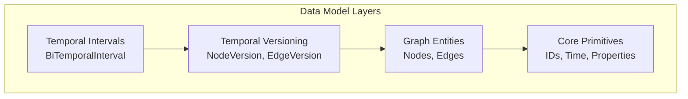
```mermaid
graph TB
    subgraph "Data Model Layers"
        L1["Core Primitives<br/>IDs, Time, Properties"]
        L2["Graph Entities<br/>Nodes, Edges"]
        L3["Temporal Versioning<br/>NodeVersion, EdgeVersion"]
        L4["Temporal Intervals<br/>BiTemporalInterval"]
    end

    L4 --> L3 --> L2 --> L1
```

## Core Primitives

### Identity Types

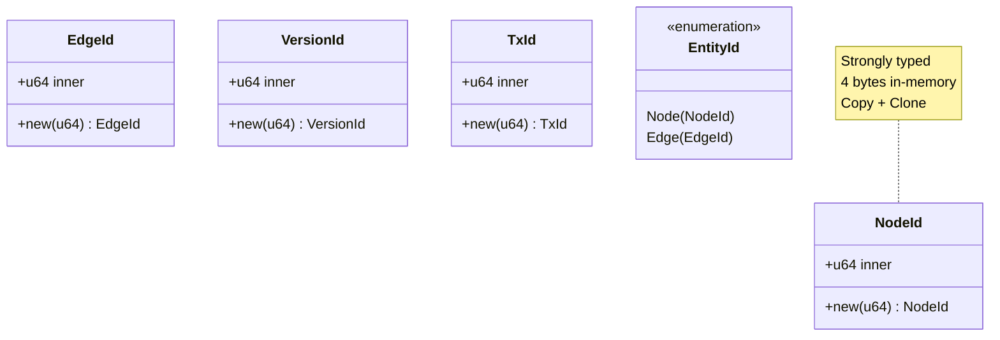
```mermaid
classDiagram
    class NodeId {
        +u64 inner
        +new(u64) NodeId
    }
    class EdgeId {
        +u64 inner
        +new(u64) EdgeId
    }
    class VersionId {
        +u64 inner
        +new(u64) VersionId
    }
    class TxId {
        +u64 inner
        +new(u64) TxId
    }
    class EntityId {
        <<enumeration>>
        Node(NodeId)
        Edge(EdgeId)
    }

    note for NodeId "Strongly typed<br/>4 bytes in-memory<br/>Copy + Clone"
```

### ID Generation

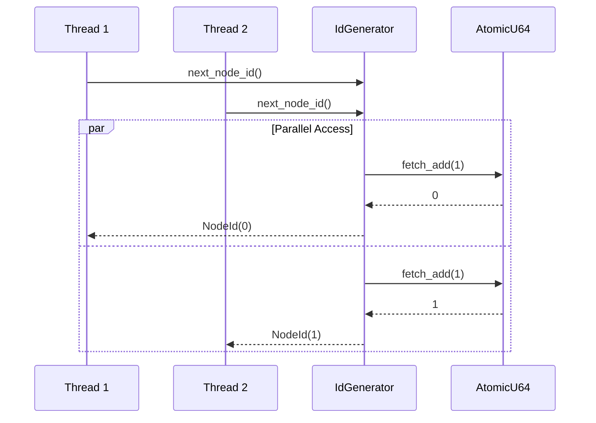
```mermaid
sequenceDiagram
    participant T1 as Thread 1
    participant T2 as Thread 2
    participant GEN as IdGenerator
    participant COUNTER as AtomicU64

    T1->>GEN: next_node_id()
    T2->>GEN: next_node_id()

    par Parallel Access
        GEN->>COUNTER: fetch_add(1)
        COUNTER-->>GEN: 0
        GEN-->>T1: NodeId(0)
    and
        GEN->>COUNTER: fetch_add(1)
        COUNTER-->>GEN: 1
        GEN-->>T2: NodeId(1)
    end
```

### Timestamp Model

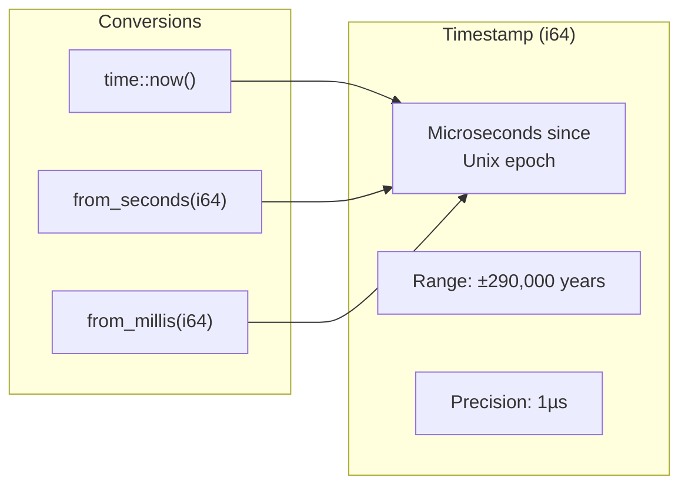
```mermaid
graph LR
    subgraph "Timestamp (i64)"
        MICRO["Microseconds since<br/>Unix epoch"]
        RANGE["Range: ±290,000 years"]
        PRECISION["Precision: 1µs"]
    end

    subgraph "Conversions"
        NOW["time::now()"]
        FROM_SEC["from_seconds(i64)"]
        FROM_MS["from_millis(i64)"]
    end

    NOW --> MICRO
    FROM_SEC --> MICRO
    FROM_MS --> MICRO
```

## Temporal Model

### TimeRange

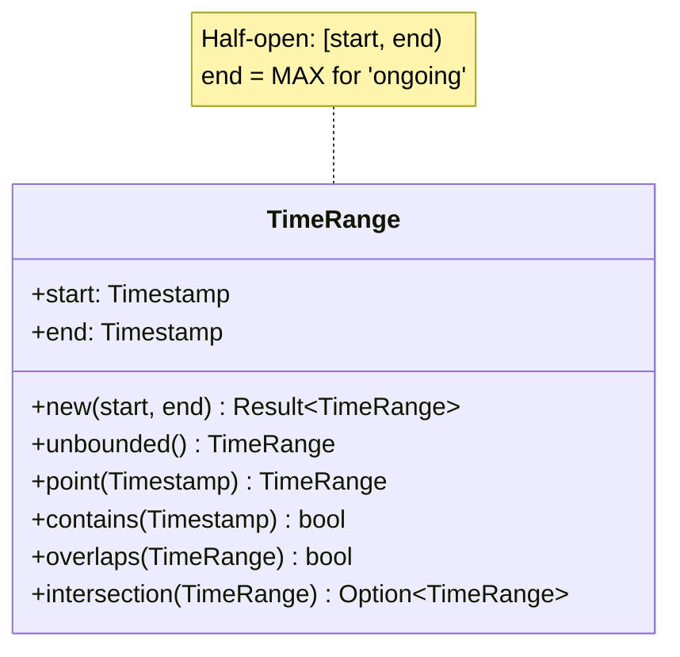
```mermaid
classDiagram
    class TimeRange {
        +start: Timestamp
        +end: Timestamp
        +new(start, end) Result~TimeRange~
        +unbounded() TimeRange
        +point(Timestamp) TimeRange
        +contains(Timestamp) bool
        +overlaps(TimeRange) bool
        +intersection(TimeRange) Option~TimeRange~
    }

    note for TimeRange "Half-open: [start, end)<br/>end = MAX for 'ongoing'"
```

### Range Semantics

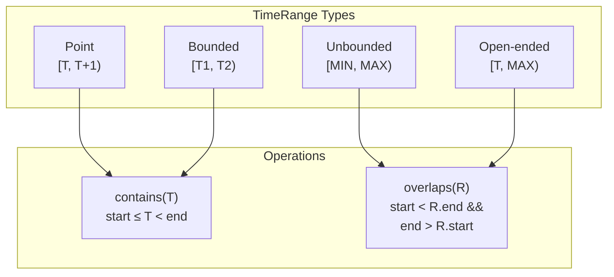
```mermaid
graph TB
    subgraph "TimeRange Types"
        R1["Point<br/>[T, T+1)"]
        R2["Bounded<br/>[T1, T2)"]
        R3["Unbounded<br/>[MIN, MAX)"]
        R4["Open-ended<br/>[T, MAX)"]
    end

    subgraph "Operations"
        CONTAINS["contains(T)<br/>start ≤ T < end"]
        OVERLAPS["overlaps(R)<br/>start < R.end &&<br/>end > R.start"]
    end

    R1 --> CONTAINS
    R2 --> CONTAINS
    R3 --> OVERLAPS
    R4 --> OVERLAPS
```

### BiTemporalInterval

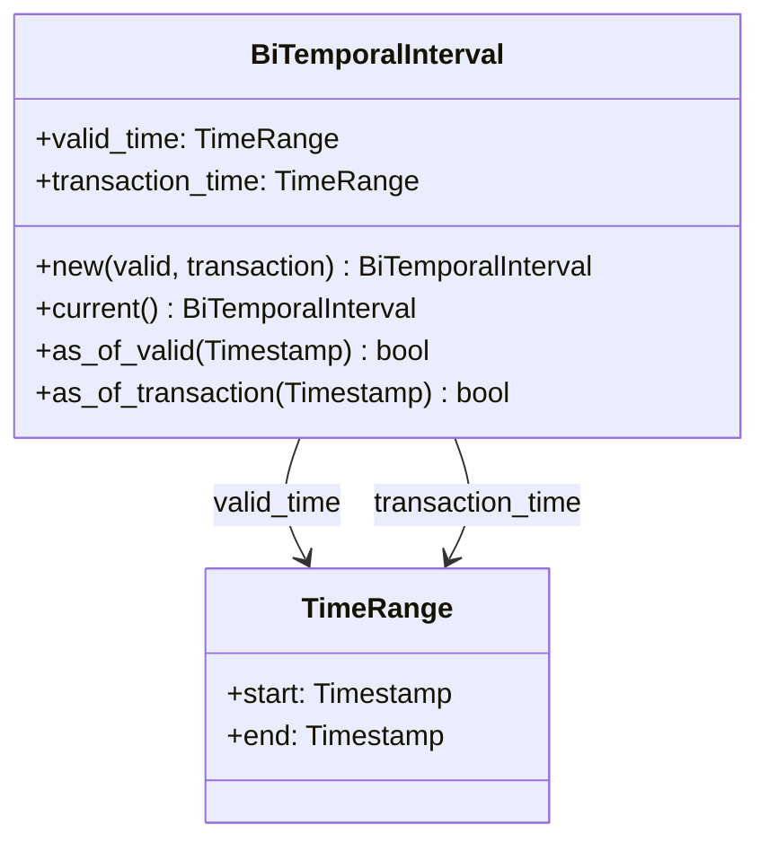
```mermaid
classDiagram
    class BiTemporalInterval {
        +valid_time: TimeRange
        +transaction_time: TimeRange
        +new(valid, transaction) BiTemporalInterval
        +current() BiTemporalInterval
        +as_of_valid(Timestamp) bool
        +as_of_transaction(Timestamp) bool
    }

    class TimeRange {
        +start: Timestamp
        +end: Timestamp
    }

    BiTemporalInterval --> TimeRange : valid_time
    BiTemporalInterval --> TimeRange : transaction_time
```

### Bi-Temporal Diagram

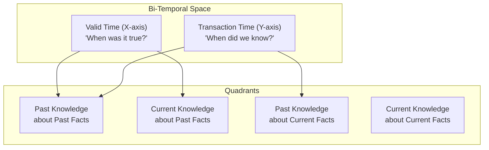
```mermaid
graph TB
    subgraph "Bi-Temporal Space"
        VT["Valid Time (X-axis)<br/>'When was it true?'"]
        TT["Transaction Time (Y-axis)<br/>'When did we know?'"]
    end

    subgraph "Quadrants"
        Q1["Past Knowledge<br/>about Past Facts"]
        Q2["Current Knowledge<br/>about Past Facts"]
        Q3["Past Knowledge<br/>about Current Facts"]
        Q4["Current Knowledge<br/>about Current Facts"]
    end

    VT --> Q1
    VT --> Q2
    TT --> Q1
    TT --> Q3
```

### Temporal Query Examples

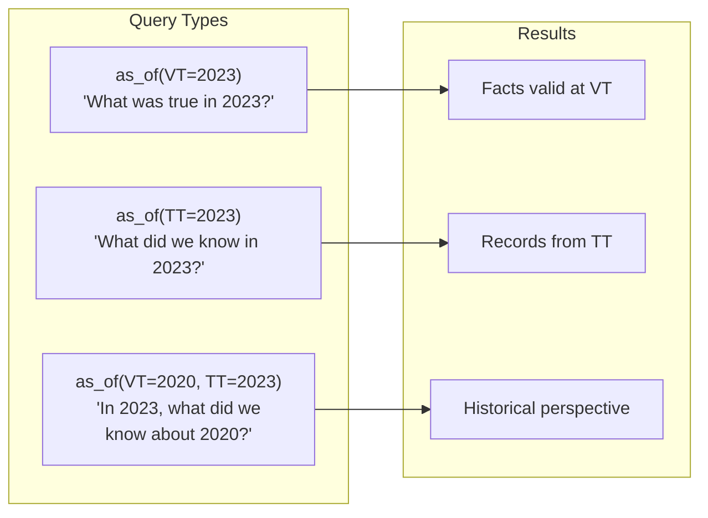
```mermaid
flowchart LR
    subgraph "Query Types"
        Q1["as_of(VT=2023)<br/>'What was true in 2023?'"]
        Q2["as_of(TT=2023)<br/>'What did we know in 2023?'"]
        Q3["as_of(VT=2020, TT=2023)<br/>'In 2023, what did we<br/>know about 2020?'"]
    end

    subgraph "Results"
        R1["Facts valid at VT"]
        R2["Records from TT"]
        R3["Historical perspective"]
    end

    Q1 --> R1
    Q2 --> R2
    Q3 --> R3
```

## Property System

### PropertyValue

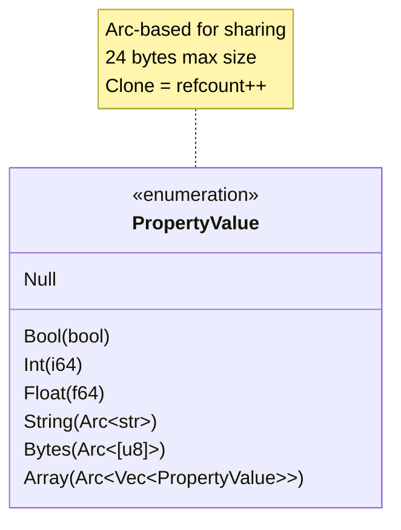
```mermaid
classDiagram
    class PropertyValue {
        <<enumeration>>
        Null
        Bool(bool)
        Int(i64)
        Float(f64)
        String(Arc~str~)
        Bytes(Arc~[u8]~)
        Array(Arc~Vec~PropertyValue~~)
    }

    note for PropertyValue "Arc-based for sharing<br/>24 bytes max size<br/>Clone = refcount++"
```

### Type Sizes

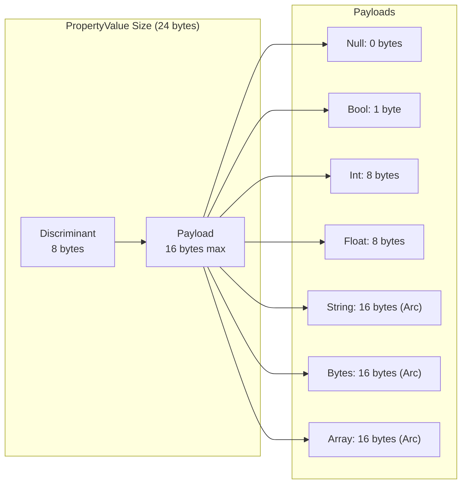
```mermaid
graph LR
    subgraph "PropertyValue Size (24 bytes)"
        DISC["Discriminant<br/>8 bytes"]
        PAYLOAD["Payload<br/>16 bytes max"]
    end

    subgraph "Payloads"
        P1["Null: 0 bytes"]
        P2["Bool: 1 byte"]
        P3["Int: 8 bytes"]
        P4["Float: 8 bytes"]
        P5["String: 16 bytes (Arc)"]
        P6["Bytes: 16 bytes (Arc)"]
        P7["Array: 16 bytes (Arc)"]
    end

    DISC --> PAYLOAD
    PAYLOAD --> P1
    PAYLOAD --> P2
    PAYLOAD --> P3
    PAYLOAD --> P4
    PAYLOAD --> P5
    PAYLOAD --> P6
    PAYLOAD --> P7
```

### PropertyMap

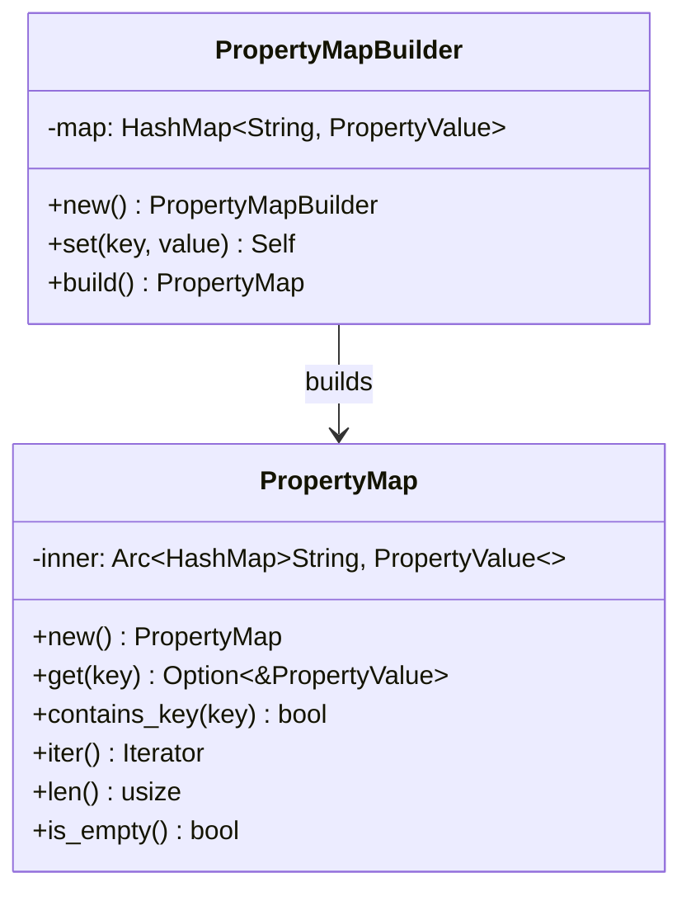
```mermaid
classDiagram
    class PropertyMap {
        -inner: Arc~HashMap~String, PropertyValue~~
        +new() PropertyMap
        +get(key) Option~&PropertyValue~
        +contains_key(key) bool
        +iter() Iterator
        +len() usize
        +is_empty() bool
    }

    class PropertyMapBuilder {
        -map: HashMap~String, PropertyValue~
        +new() PropertyMapBuilder
        +set(key, value) Self
        +build() PropertyMap
    }

    PropertyMapBuilder --> PropertyMap : builds
```

### Copy-on-Write Semantics

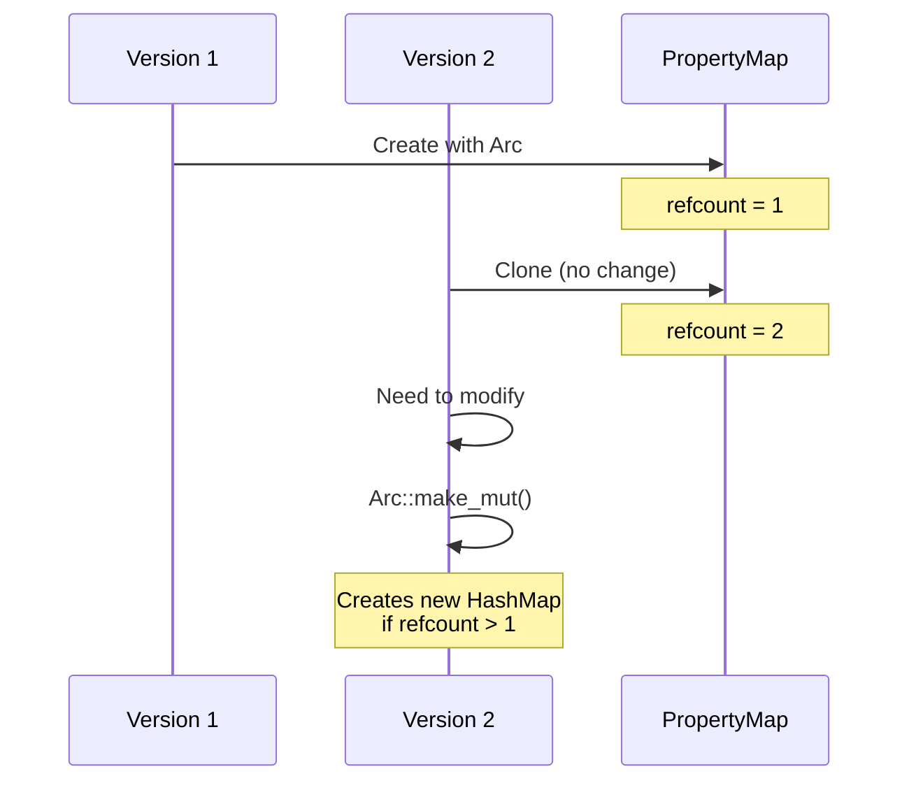
```mermaid
sequenceDiagram
    participant V1 as Version 1
    participant V2 as Version 2
    participant PM as PropertyMap

    V1->>PM: Create with Arc
    Note over PM: refcount = 1

    V2->>PM: Clone (no change)
    Note over PM: refcount = 2

    V2->>V2: Need to modify
    V2->>V2: Arc::make_mut()
    Note over V2: Creates new HashMap<br/>if refcount > 1
```

## Graph Entities

### Node Structure

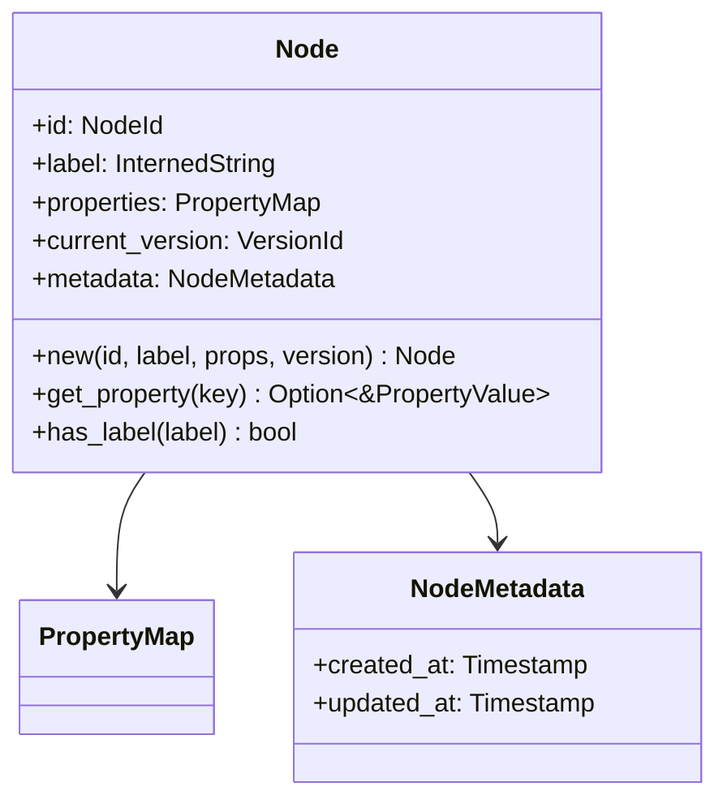
```mermaid
classDiagram
    class Node {
        +id: NodeId
        +label: InternedString
        +properties: PropertyMap
        +current_version: VersionId
        +metadata: NodeMetadata
        +new(id, label, props, version) Node
        +get_property(key) Option~&PropertyValue~
        +has_label(label) bool
    }

    class NodeMetadata {
        +created_at: Timestamp
        +updated_at: Timestamp
    }

    Node --> PropertyMap
    Node --> NodeMetadata
```

### Edge Structure

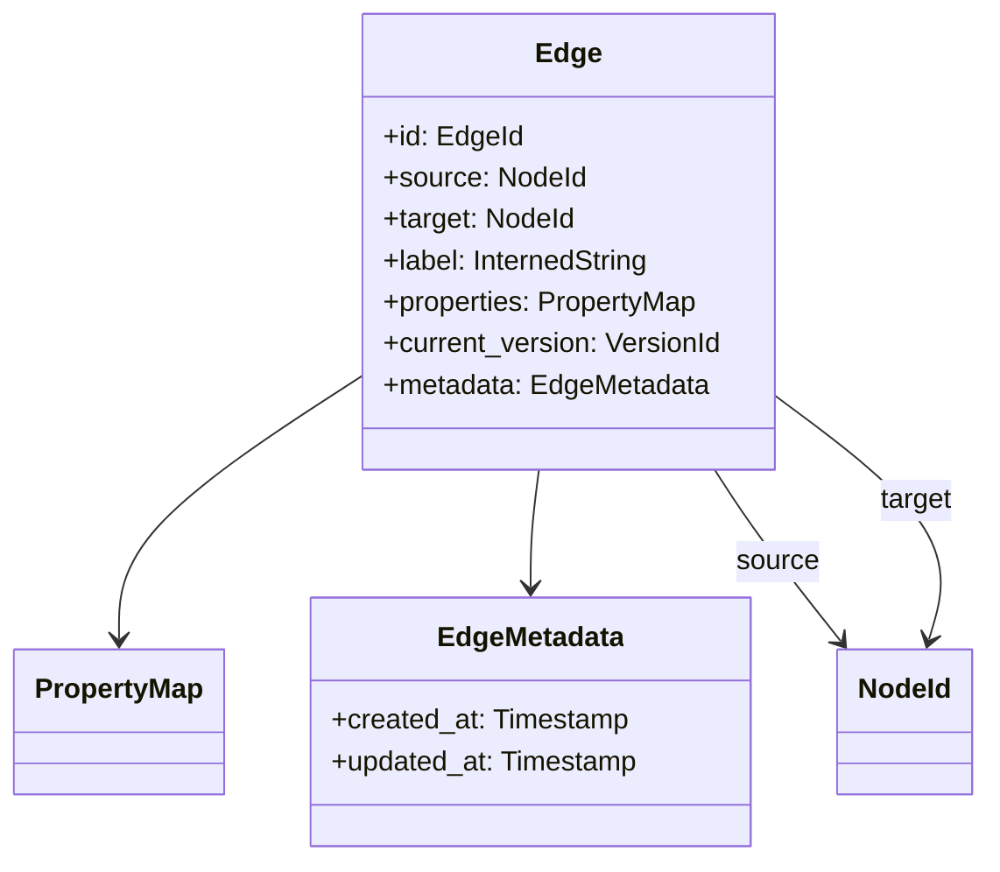
```mermaid
classDiagram
    class Edge {
        +id: EdgeId
        +source: NodeId
        +target: NodeId
        +label: InternedString
        +properties: PropertyMap
        +current_version: VersionId
        +metadata: EdgeMetadata
    }

    class EdgeMetadata {
        +created_at: Timestamp
        +updated_at: Timestamp
    }

    Edge --> PropertyMap
    Edge --> EdgeMetadata
    Edge --> NodeId : source
    Edge --> NodeId : target
```

### Graph Example

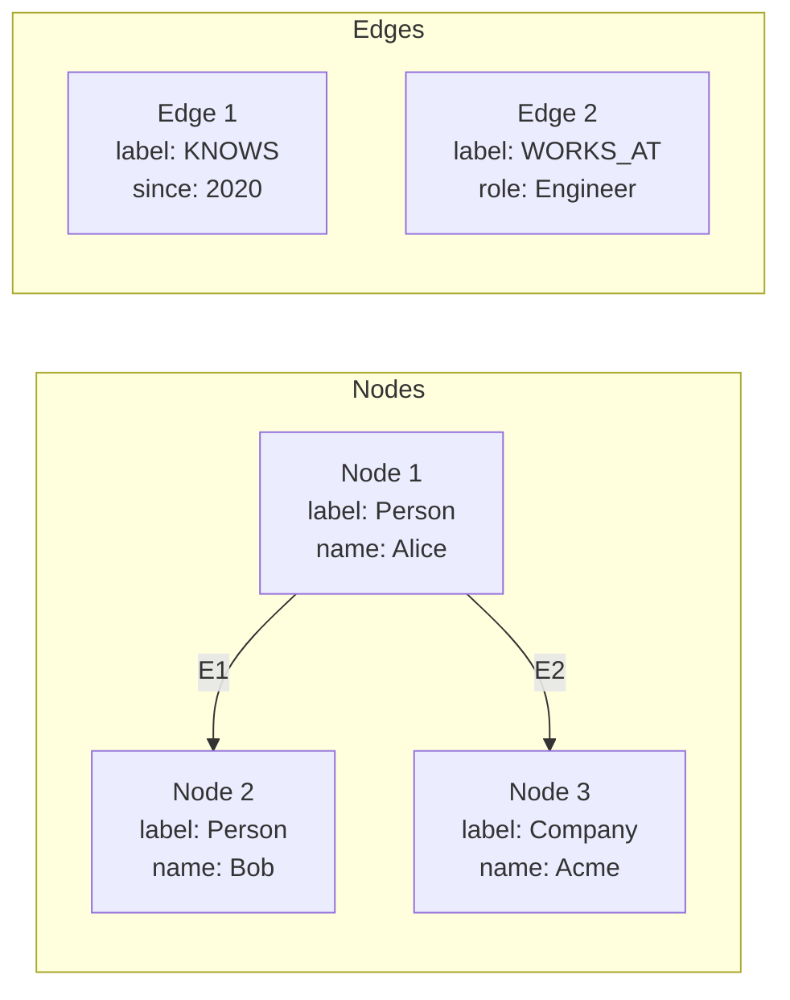
```mermaid
graph LR
    subgraph "Nodes"
        N1["Node 1<br/>label: Person<br/>name: Alice"]
        N2["Node 2<br/>label: Person<br/>name: Bob"]
        N3["Node 3<br/>label: Company<br/>name: Acme"]
    end

    subgraph "Edges"
        E1["Edge 1<br/>label: KNOWS<br/>since: 2020"]
        E2["Edge 2<br/>label: WORKS_AT<br/>role: Engineer"]
    end

    N1 -->|E1| N2
    N1 -->|E2| N3
```

## Version Model

### NodeVersion Structure

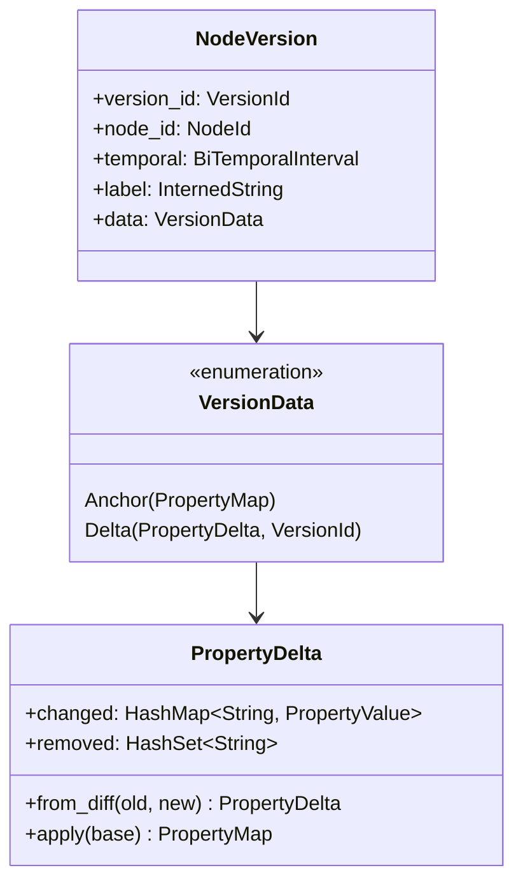
```mermaid
classDiagram
    class NodeVersion {
        +version_id: VersionId
        +node_id: NodeId
        +temporal: BiTemporalInterval
        +label: InternedString
        +data: VersionData
    }

    class VersionData {
        <<enumeration>>
        Anchor(PropertyMap)
        Delta(PropertyDelta, VersionId)
    }

    class PropertyDelta {
        +changed: HashMap~String, PropertyValue~
        +removed: HashSet~String~
        +from_diff(old, new) PropertyDelta
        +apply(base) PropertyMap
    }

    NodeVersion --> VersionData
    VersionData --> PropertyDelta
```

### Version Chain

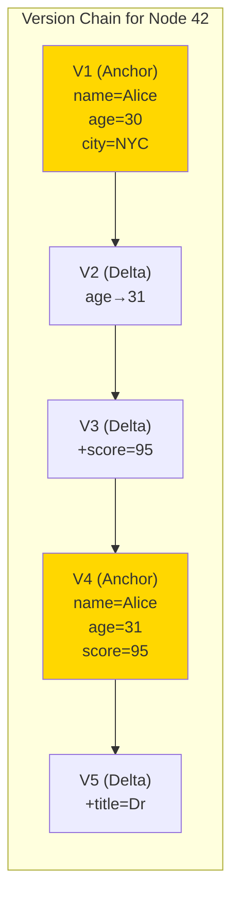
```mermaid
graph LR
    subgraph "Version Chain for Node 42"
        V1["V1 (Anchor)<br/>name=Alice<br/>age=30<br/>city=NYC"]
        V2["V2 (Delta)<br/>age→31"]
        V3["V3 (Delta)<br/>+score=95"]
        V4["V4 (Anchor)<br/>name=Alice<br/>age=31<br/>score=95"]
        V5["V5 (Delta)<br/>+title=Dr"]
    end

    V1 --> V2 --> V3 --> V4 --> V5

    style V1 fill:#FFD700
    style V4 fill:#FFD700
```

### Delta Operations

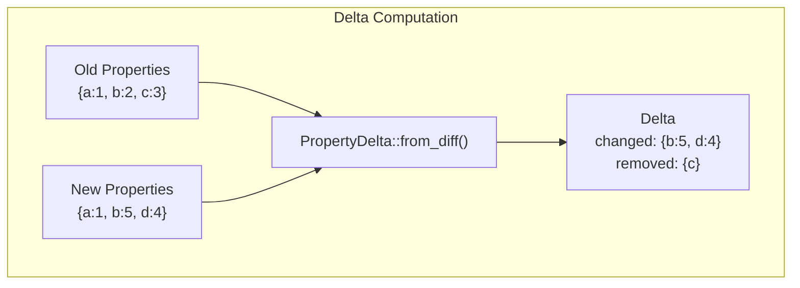
```mermaid
flowchart TD
    subgraph "Delta Computation"
        OLD["Old Properties<br/>{a:1, b:2, c:3}"]
        NEW["New Properties<br/>{a:1, b:5, d:4}"]
        DIFF["PropertyDelta::from_diff()"]
        RESULT["Delta<br/>changed: {b:5, d:4}<br/>removed: {c}"]
    end

    OLD --> DIFF
    NEW --> DIFF
    DIFF --> RESULT
```

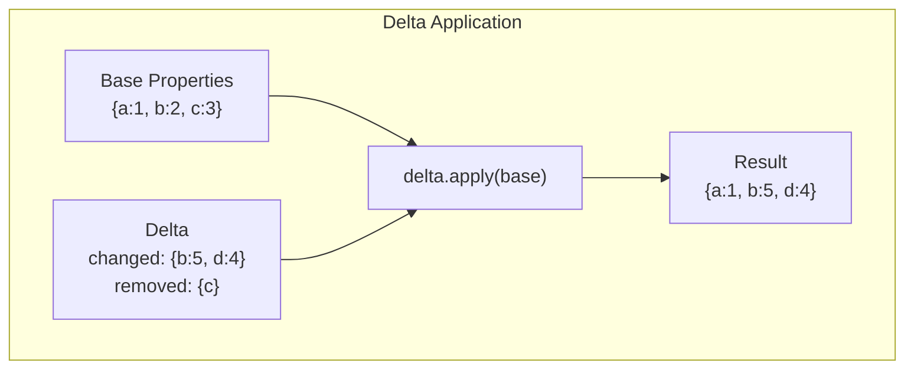
```mermaid
flowchart TD
    subgraph "Delta Application"
        BASE["Base Properties<br/>{a:1, b:2, c:3}"]
        DELTA["Delta<br/>changed: {b:5, d:4}<br/>removed: {c}"]
        APPLY["delta.apply(base)"]
        FINAL["Result<br/>{a:1, b:5, d:4}"]
    end

    BASE --> APPLY
    DELTA --> APPLY
    APPLY --> FINAL
```

## String Interning

### InternedString

```mermaid
classDiagram
    class InternedString {
        +u32 inner
        +resolve() Option~Arc~str~~
    }

    class StringInterner {
        -to_id: DashMap~Arc~str~, InternedString~
        -to_string: DashMap~InternedString, Arc~str~~
        -next_id: AtomicU32
        +intern(str) InternedString
        +resolve(InternedString) Option~Arc~str~~
    }

    class GLOBAL_INTERNER {
        <<singleton>>
    }

    StringInterner --> InternedString
    GLOBAL_INTERNER --> StringInterner
```

### Memory Comparison

```mermaid
graph TB
    subgraph "Without Interning"
        S1["'Person' (24 bytes)"]
        S2["'Person' (24 bytes)"]
        S3["'Person' (24 bytes)"]
        TOTAL1["72 bytes + heap"]
    end

    subgraph "With Interning"
        I1["InternedString(1) - 4 bytes"]
        I2["InternedString(1) - 4 bytes"]
        I3["InternedString(1) - 4 bytes"]
        TABLE["Intern table: 1 entry"]
        TOTAL2["12 bytes + 1 entry"]
    end

    TOTAL1 -->|"Savings"| TOTAL2
```

### Comparison Performance

```mermaid
graph LR
    subgraph "String Comparison"
        SC["strcmp('Person', 'Person')"]
        SC_TIME["O(n) time"]
    end

    subgraph "InternedString Comparison"
        IC["1 == 1"]
        IC_TIME["O(1) time"]
    end

    SC --> SC_TIME
    IC --> IC_TIME
```

## Entity Relationships

### Complete Data Model

```mermaid
erDiagram
    Node ||--o{ NodeVersion : "has versions"
    Edge ||--o{ EdgeVersion : "has versions"
    Node ||--o{ Edge : "source"
    Node ||--o{ Edge : "target"

    Node {
        NodeId id PK
        InternedString label
        PropertyMap properties
        VersionId current_version
    }

    Edge {
        EdgeId id PK
        NodeId source FK
        NodeId target FK
        InternedString label
        PropertyMap properties
        VersionId current_version
    }

    NodeVersion {
        VersionId version_id PK
        NodeId node_id FK
        BiTemporalInterval temporal
        VersionData data
    }

    EdgeVersion {
        VersionId version_id PK
        EdgeId edge_id FK
        BiTemporalInterval temporal
        VersionData data
    }
```

## Query Patterns

### Current State Queries

```mermaid
flowchart LR
    Q1["Get node by ID"] --> CS["Current Storage"]
    Q2["Get edges from node"] --> ADJ["Adjacency Index"]
    Q3["Get all nodes with label"] --> SCAN["Label Index (future)"]

    CS --> RESULT["Node/Edge"]
    ADJ --> RESULT
    SCAN --> RESULT
```

### Temporal Queries

```mermaid
flowchart LR
    Q1["State at time T"] --> TI["Temporal Index"]
    Q2["History of entity"] --> HS["Historical Storage"]
    Q3["Changes between T1-T2"] --> BOTH["TI + HS"]

    TI --> VERSION["VersionId"]
    VERSION --> RECONSTRUCT["Reconstruct"]
    HS --> CHAIN["Version Chain"]
    CHAIN --> RECONSTRUCT
    RECONSTRUCT --> RESULT["Historical State"]
```

## Related Documentation

- [ADR-0002: Bi-Temporal Data Model](../adr/0002-bitemporal-data-model.md)
- [ADR-0006: String Interning](../adr/0006-string-interning.md)
- [ADR-0008: Property Value Types](../adr/0008-property-value-types.md)
- [ADR-0009: Strong ID Types](../adr/0009-strong-id-types.md)
