# Durability Modes Architecture

This document describes the architecture of GallifreyDB's configurable durability modes, which control when WAL data is synchronized to disk.

## Overview

GallifreyDB supports three durability modes that trade off write latency against durability guarantees:

| Mode | Write Latency | Throughput | Data at Risk | ACID |
|------|---------------|------------|--------------|------|
| **Synchronous** | ~1.5ms | ~600/sec | None | ✅ Full |
| **GroupCommit** | ~30-60ms* | ~15K/sec | None | ✅ Full |
| **Async** | ~6µs | ~100K+/sec | ~flush_interval | ❌ Eventual |

*GroupCommit latency = max_delay_ms (default 10ms) + thread scheduling overhead. Provides full ACID by waiting for batch flush.

## Data Flow Diagrams

### Synchronous Mode

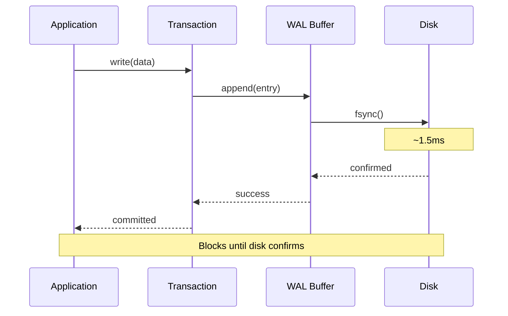

### GroupCommit Mode

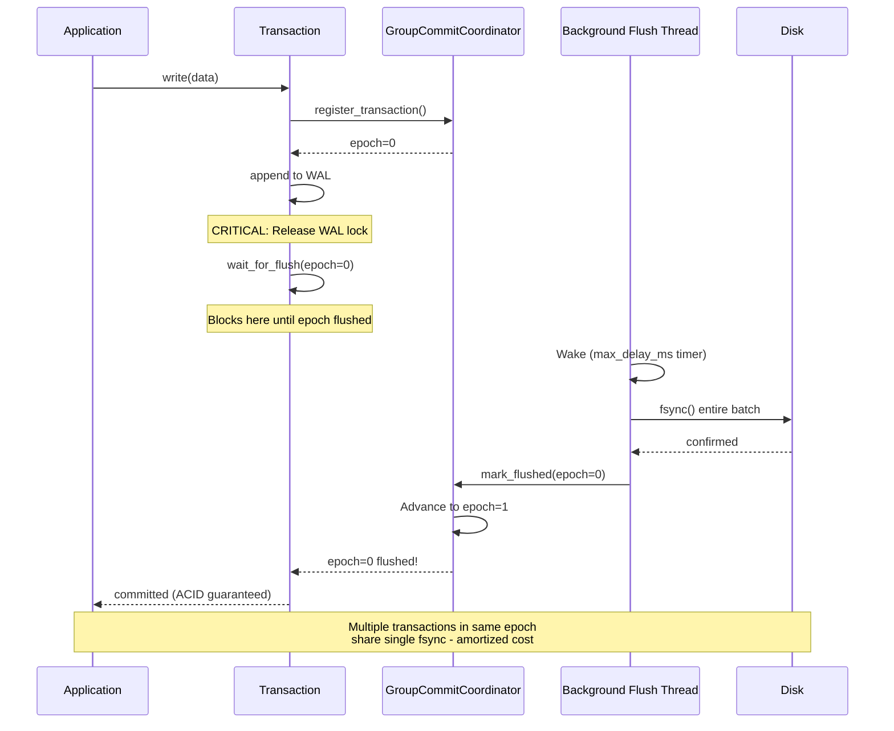

### Async Mode

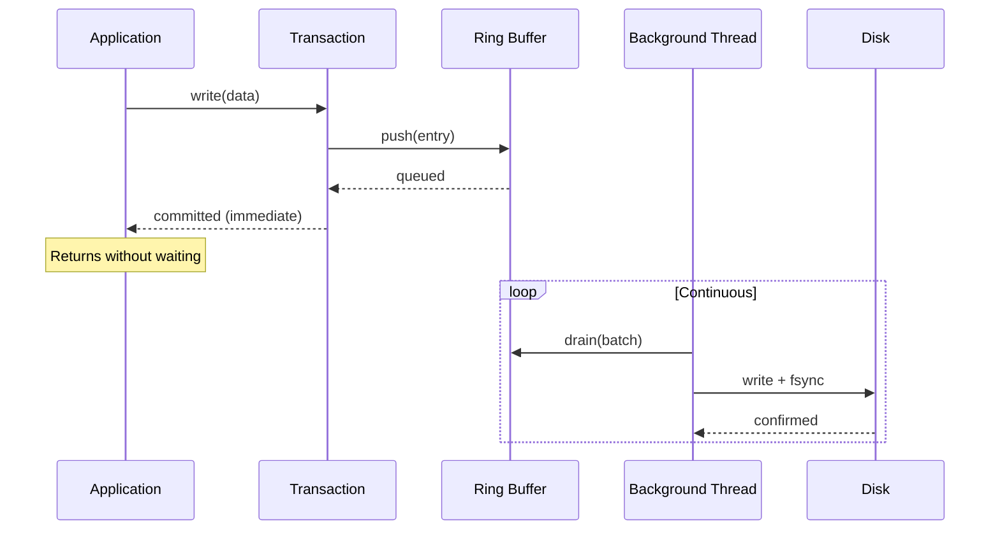

## Component Architecture

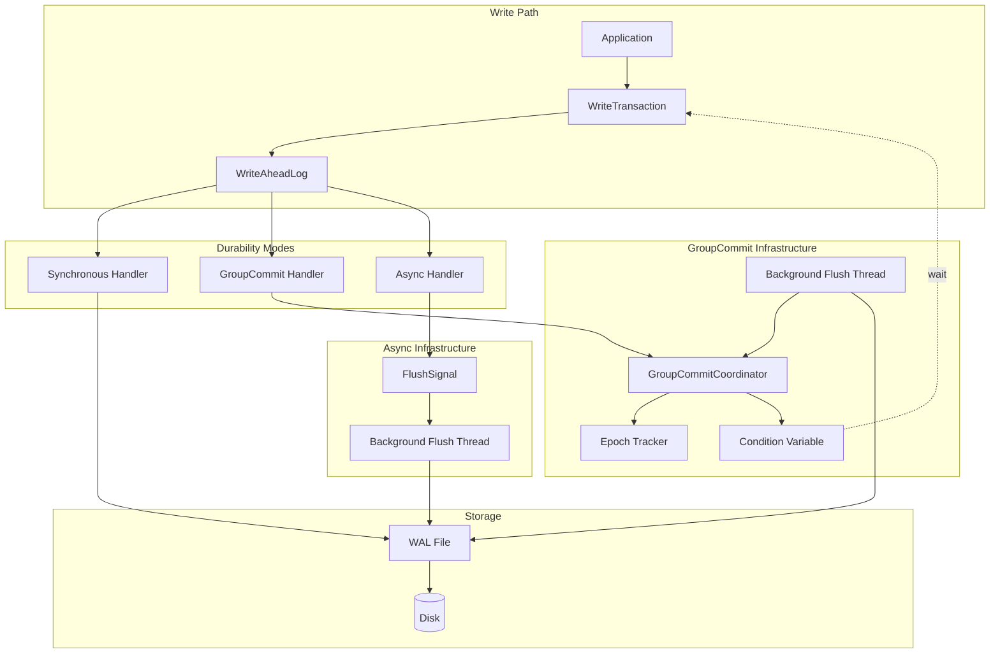

## Configuration

### DurabilityMode Enum

```rust
pub enum DurabilityMode {
    /// Every commit waits for its own fsync
    /// Latency: ~1.5ms | Throughput: ~600/sec | ACID: ✅
    Synchronous,

    /// Multiple commits wait for shared fsync (epoch-based)
    /// Latency: ~max_delay_ms | Throughput: ~15K/sec | ACID: ✅
    /// CRITICAL: Transactions BLOCK until their epoch is flushed
    GroupCommit {
        max_delay_ms: u64,      // default: 10ms
        max_batch_size: usize,  // default: 200
    },

    /// Background thread handles fsync, commits return immediately
    /// Latency: ~6µs | Throughput: ~100K+/sec | ACID: ❌ (eventual)
    Async {
        flush_interval_ms: u64, // default: 10ms
    },
}
```

### WriteOptions for Per-Transaction Override

```mermaid
graph LR
    subgraph "Global Config (WalConfig)"
        GC[default_durability: GroupCommit]
    end

    subgraph "Per-Transaction Override (WriteOptions)"
        TO1[None → use global default]
        TO2[Some\(Synchronous\) → override for critical txn]
        TO3[Some\(Async\) → override for bulk import]
        TO4[Some\(GroupCommit\) → override params]
    end

    subgraph "Effective Mode"
        EFF[Resolved Durability Mode]
    end

    GC --> TO1
    TO1 --> EFF
    TO2 --> EFF
    TO3 --> EFF
    TO4 --> EFF

    Note1[Example: Bulk import uses Async<br/>while rest of DB uses GroupCommit]
    Note2[Example: Financial txn uses Sync<br/>while rest of DB uses GroupCommit]
```

**Convenience Presets:**

```rust
// Preset for critical operations (Synchronous mode)
db.write_with_options(WriteOptions::critical(), |tx| {
    tx.create_node("Payment", payment_data)
})?;

// Preset for bulk imports (Async mode, 100ms flush)
db.write_with_options(WriteOptions::bulk_import(), |tx| {
    for record in bulk_data {
        tx.create_node("Record", record)?;
    }
    Ok(())
})?;

// Custom configuration (builder pattern)
let options = WriteOptions::new()
    .with_durability(DurabilityMode::GroupCommit {
        max_delay_ms: 5,
        max_batch_size: 500,
    });
```

## GroupCommit Mode Internals

### Epoch-Based Coordination

GroupCommit uses an **epoch-based** system where transactions register with the current epoch and wait for that epoch to flush:

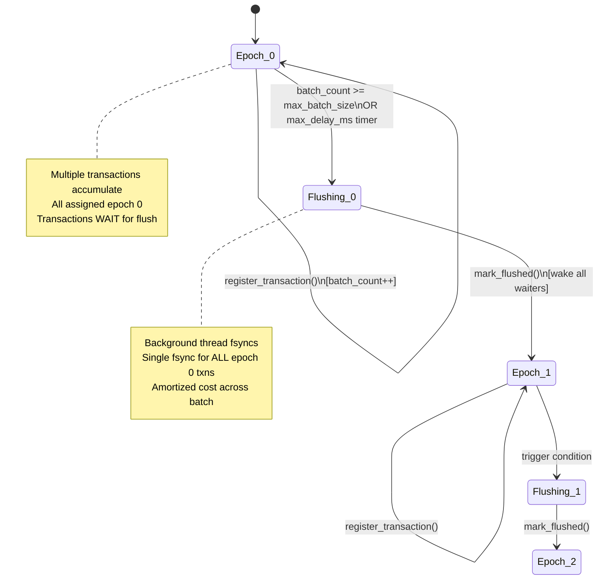

### Transaction Wait Flow

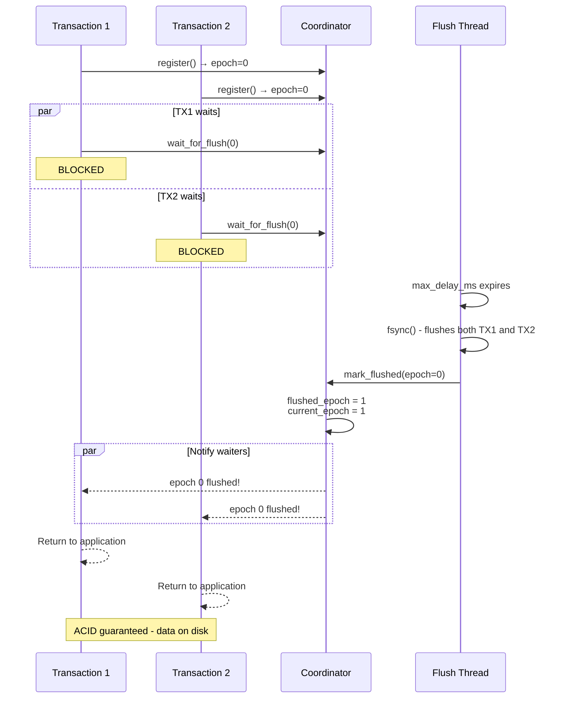

### Critical Implementation Details

#### Race Condition Fix (Commit 6bd42ff)

**Problem:** There was a race between releasing the WAL lock after `commit_with_mode()` and re-acquiring it to get the coordinator reference:

```rust
// BUGGY CODE (race condition):
let epoch = wal.commit_with_mode(...)?;
// WAL lock released here
let coordinator = self.wal.lock_or_err()?.group_commit_coordinator().cloned();
// ^ coordinator could be None if WAL reconfigured!
if let Some(gc) = coordinator {
    gc.wait_for_flush(epoch)?;  // Might skip wait!
}
```

**Impact:** Silent durability violation if transaction registered with coordinator but coordinator was cleared before wait.

**Fix:** Clone coordinator reference **before** releasing WAL lock:

```rust
// SAFE CODE (no race):
let epoch = wal.commit_with_mode(...)?;
let gc = wal.group_commit_coordinator().cloned();  // Clone BEFORE lock release
// WAL lock released here
if let Some(gc) = gc {
    gc.wait_for_flush(epoch)?;  // Always waits on correct coordinator
}
```

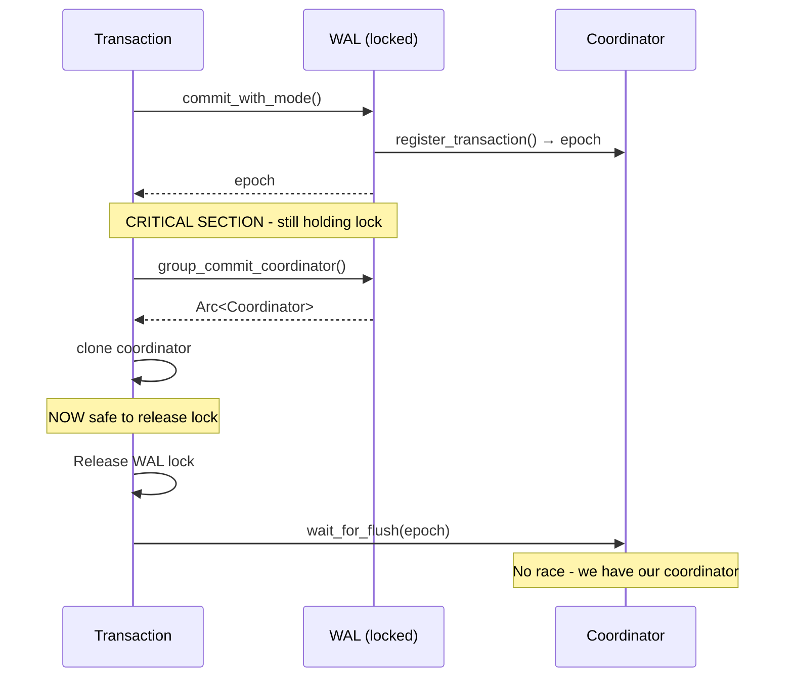

#### Piggybacking Optimization

**Concept:** Synchronous commits can "piggyback" pending async data by triggering an immediate flush before their own fsync.

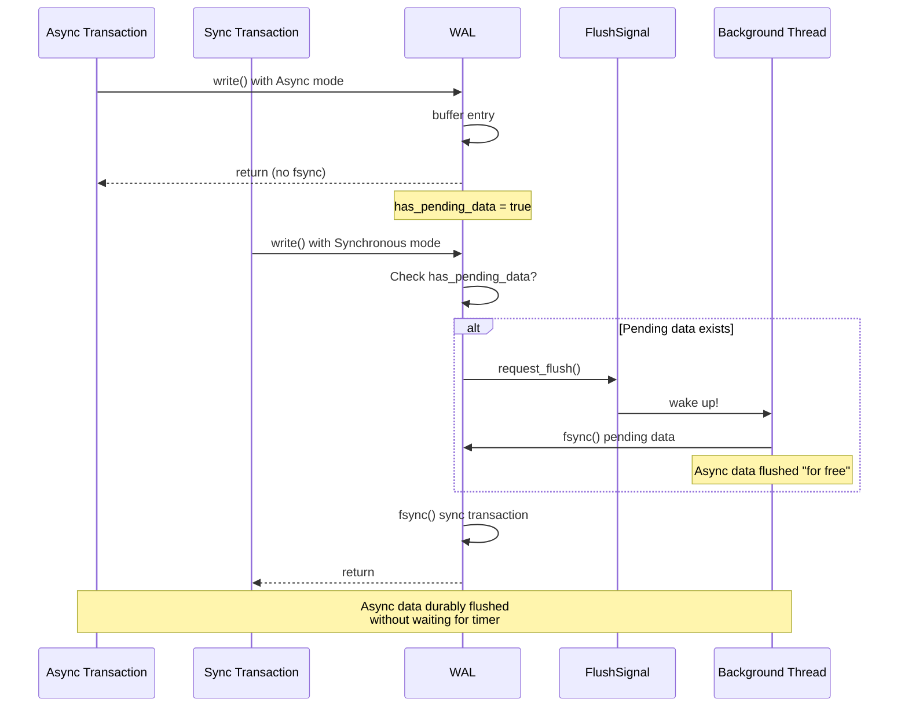

**Benefits:**
- Async writes get durability "for free" when sync writes occur
- Reduces time window for data loss
- No performance penalty for sync writes
- Opportunistic optimization

## Async Mode Internals

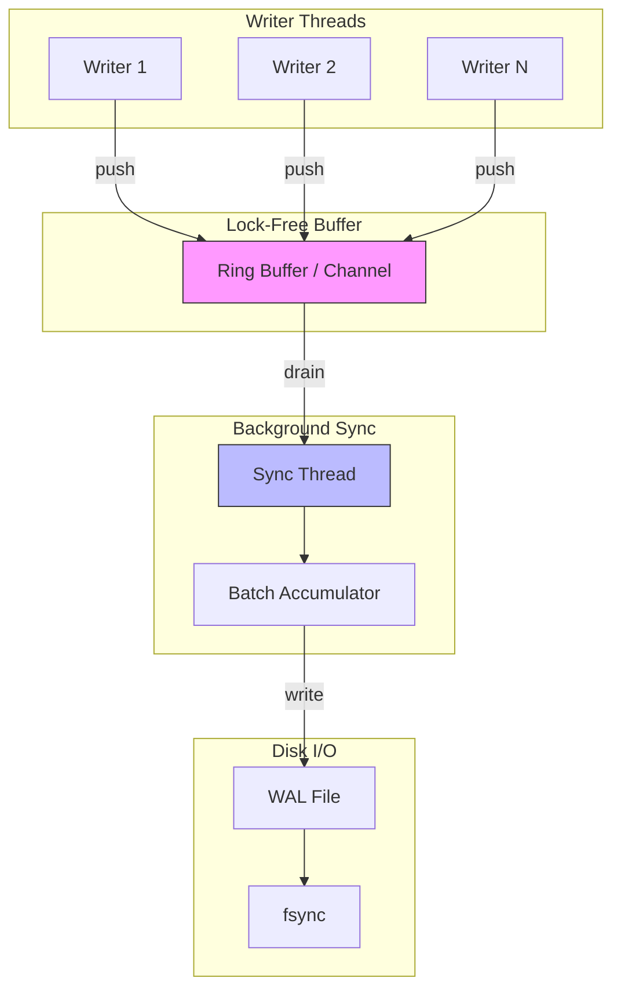

### Backpressure Handling

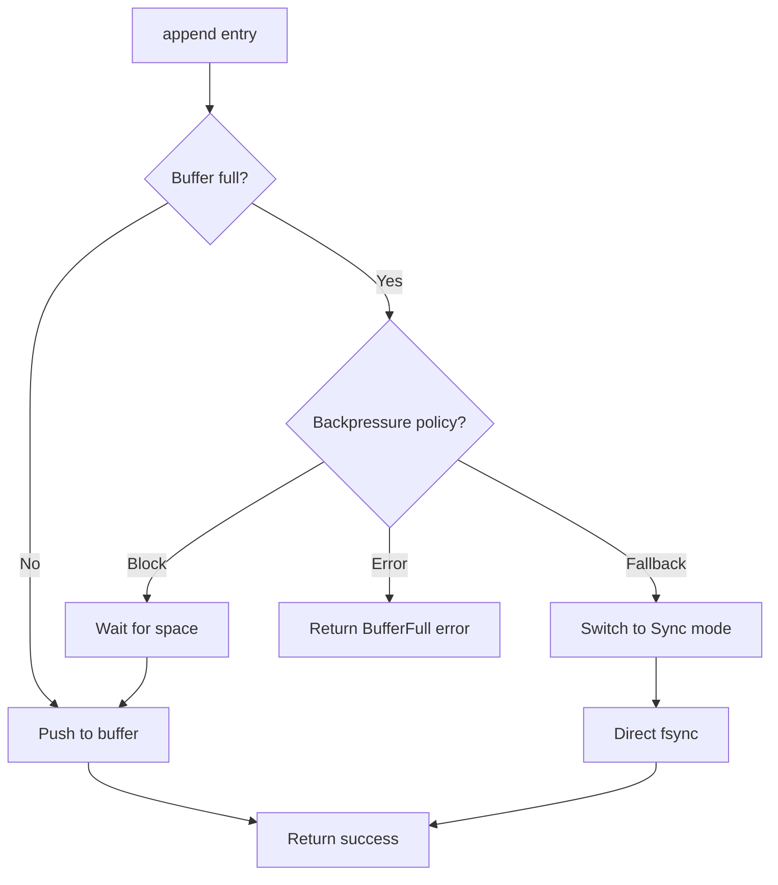

## Performance Comparison

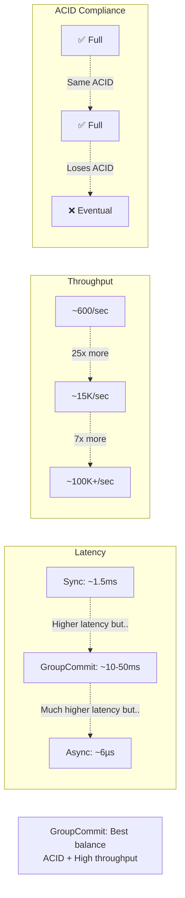

## Use Case Decision Tree

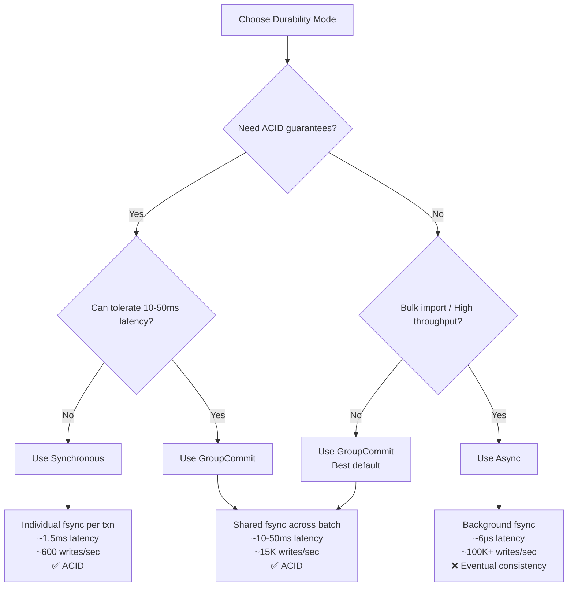

## Graceful Shutdown

All modes ensure pending writes are synced on shutdown using `FlushGuard`:

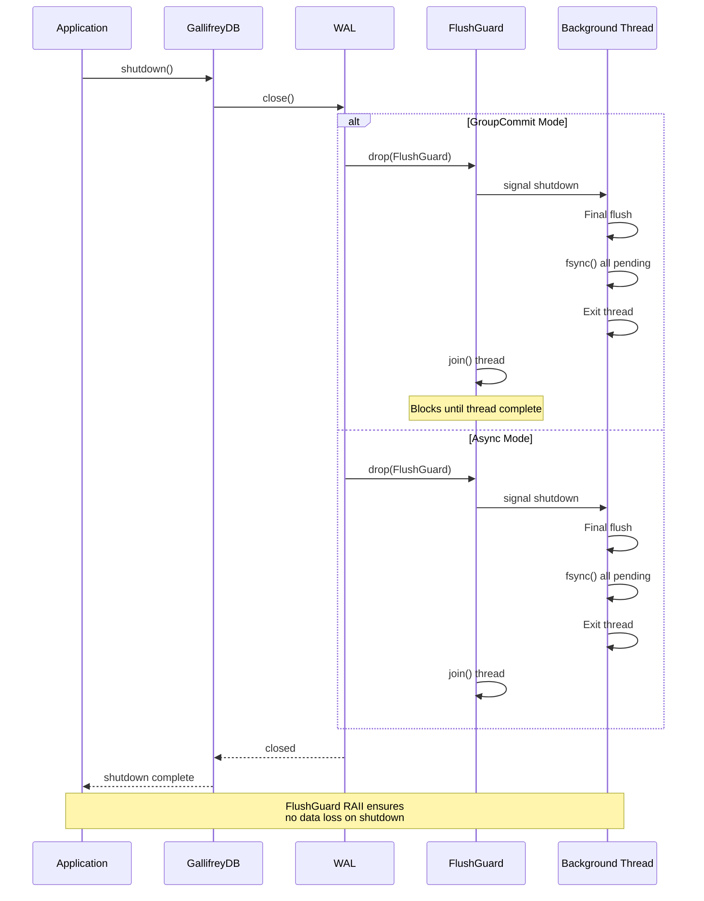

## Related Documentation

- [ADR-0012: Configurable Durability Modes](../adr/0012-configurable-durability-modes.md)
- [ADR-0007: Write-Ahead Log for Durability](../adr/0007-wal-durability.md)
- [WAL Format and Migration](../../CLAUDE.md#wal-format-and-migration)
