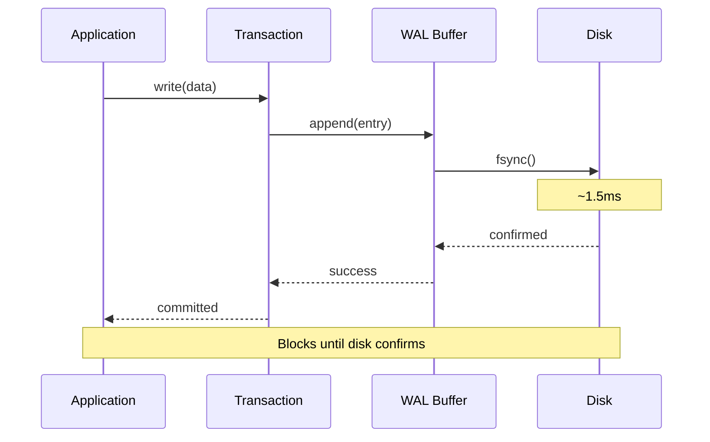
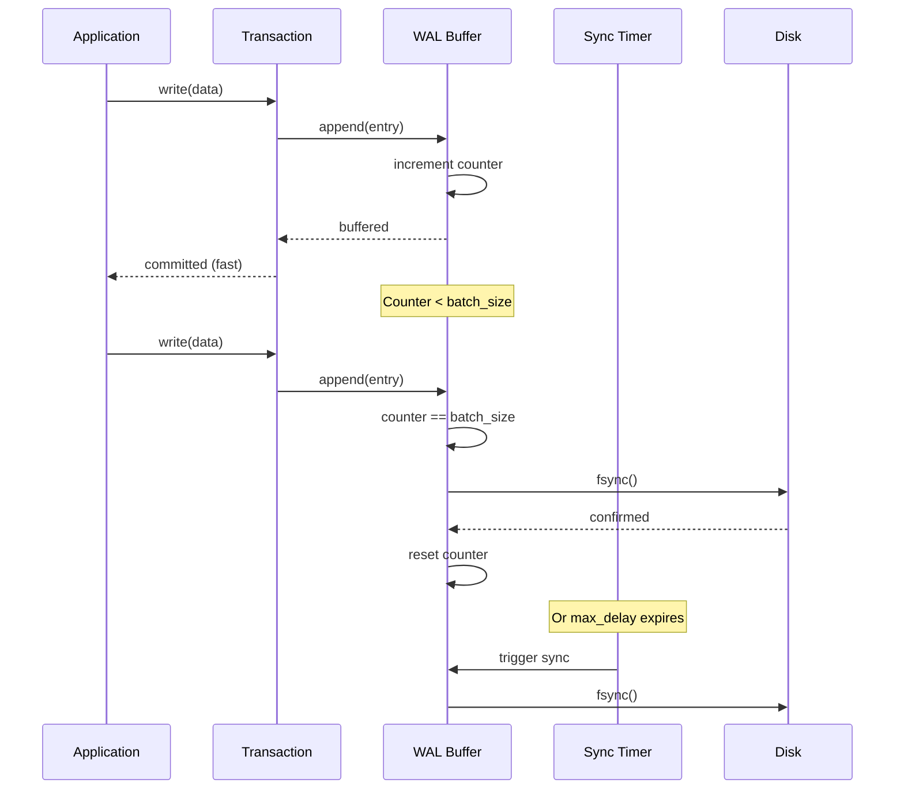
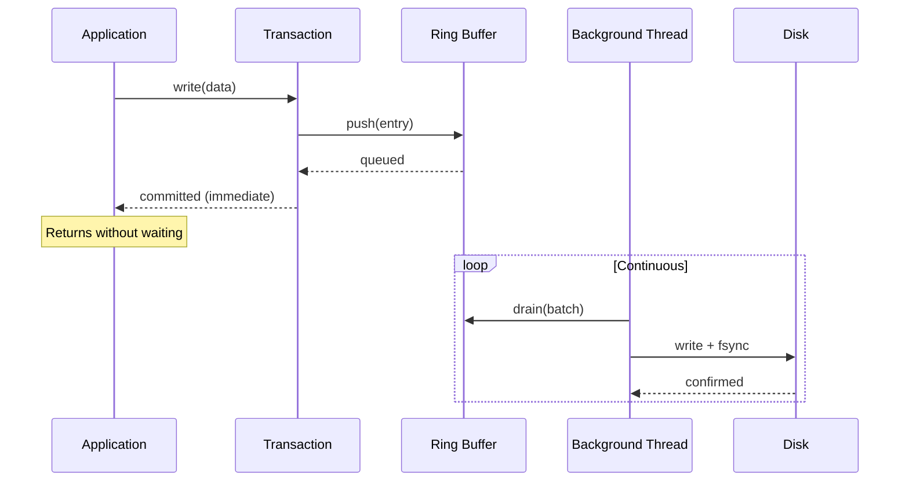
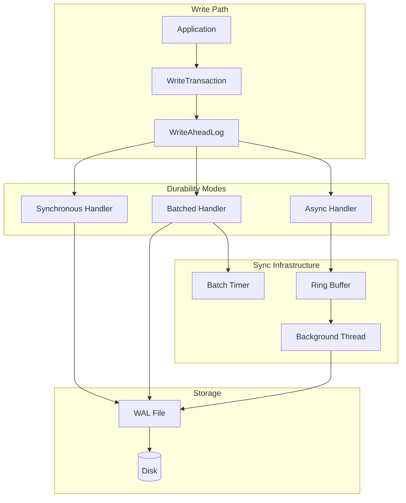
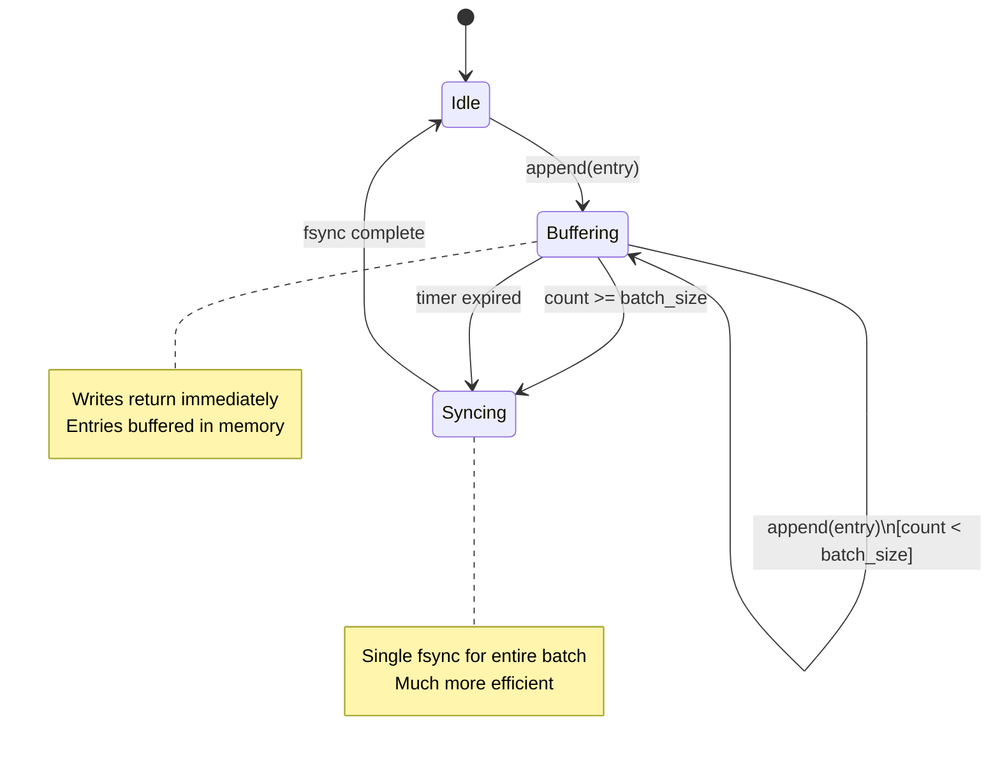
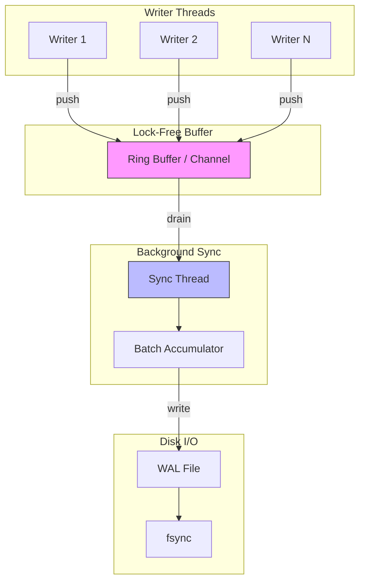
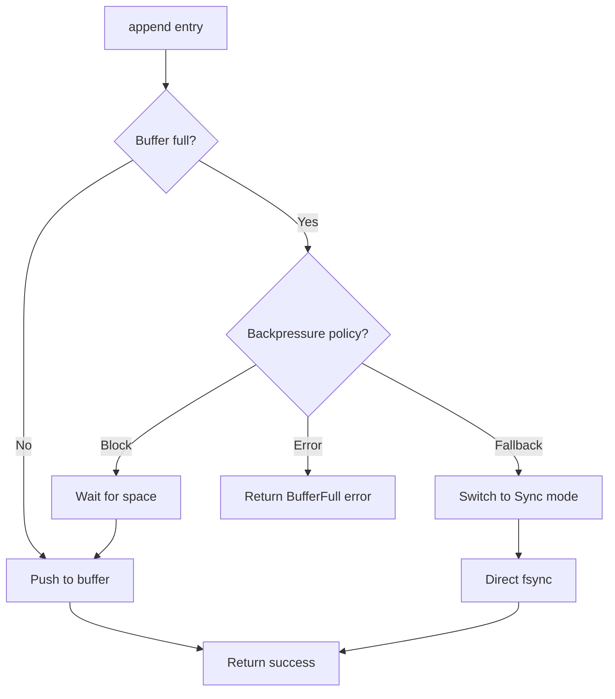
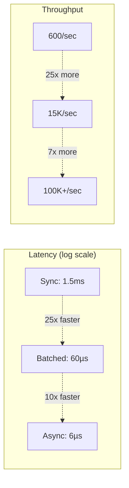
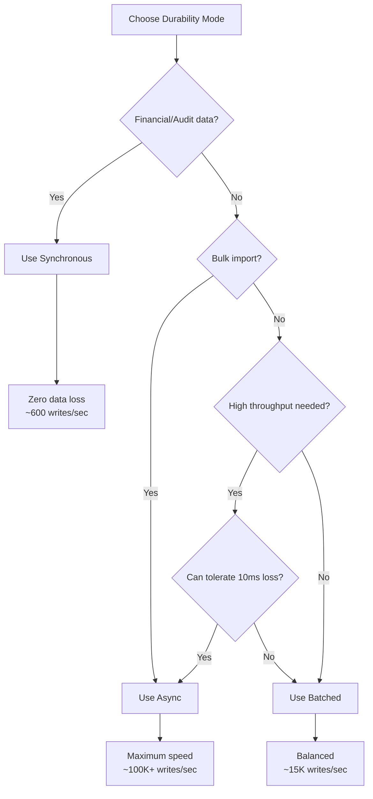
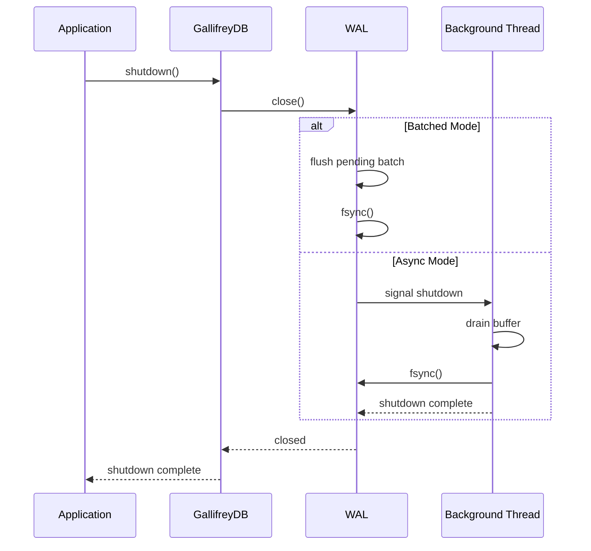

# Durability Modes Architecture

This document describes the architecture of GallifreyDB's configurable durability modes, which control when WAL data is synchronized to disk.

## Overview

GallifreyDB supports three durability modes that trade off write latency against durability guarantees:

| Mode | Write Latency | Throughput | Data at Risk |
|------|---------------|------------|--------------|
| **Synchronous** | ~1.5ms | ~600/sec | None |
| **Batched** | ~60µs | ~15K/sec | Up to 100 ops or 10ms |
| **Async** | ~6µs | ~100K+/sec | ~10ms |

## Data Flow Diagrams

### Synchronous Mode



### Batched Mode



### Async Mode



## Component Architecture



## Configuration

### DurabilityMode Enum

```rust
pub enum DurabilityMode {
    /// Every commit waits for fsync
    Synchronous,

    /// Batch multiple commits before fsync
    Batched {
        batch_size: usize,      // default: 100
        max_delay_ms: u64,      // default: 10
    },

    /// Background thread handles fsync
    Async,
}
```

### WriteOptions for Per-Transaction Override

```mermaid
graph LR
    subgraph "Global Config"
        GC[default_durability: Batched]
    end

    subgraph "Transaction Options"
        TO1[None → use global]
        TO2[Some(Sync) → override]
        TO3[Some(Async) → override]
    end

    subgraph "Effective Mode"
        EFF[Resolved Durability]
    end

    GC --> TO1
    TO1 --> EFF
    TO2 --> EFF
    TO3 --> EFF
```

## Batched Mode Internals



## Async Mode Internals



### Backpressure Handling



## Performance Comparison



## Use Case Decision Tree



## Graceful Shutdown

All modes ensure pending writes are synced on shutdown:



## Related Documentation

- [ADR-0012: Configurable Durability Modes](../adr/0012-configurable-durability-modes.md)
- [ADR-0007: Write-Ahead Log for Durability](../adr/0007-wal-durability.md)
- [WAL Format and Migration](../../CLAUDE.md#wal-format-and-migration)
