# Index Layer Architecture

The index layer provides efficient access patterns for graph traversal, temporal queries, and entity lookups.

## Overview

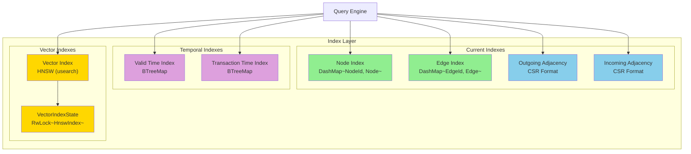
```mermaid
graph TB
    subgraph "Index Layer"
        subgraph "Current Indexes"
            CI_N["Node Index<br/>DashMap~NodeId, Node~"]
            CI_E["Edge Index<br/>DashMap~EdgeId, Edge~"]
            CI_OUT["Outgoing Adjacency<br/>CSR Format"]
            CI_IN["Incoming Adjacency<br/>CSR Format"]
        end

        subgraph "Temporal Indexes"
            TI_VT["Valid Time Index<br/>BTreeMap"]
            TI_TT["Transaction Time Index<br/>BTreeMap"]
        end

        subgraph "Vector Indexes"
            VI["Vector Index<br/>HNSW (usearch)"]
            VIS["VectorIndexState<br/>RwLock~HnswIndex~"]
        end
    end

    QE["Query Engine"] --> CI_N
    QE --> CI_E
    QE --> CI_OUT
    QE --> CI_IN
    QE --> TI_VT
    QE --> TI_TT
    QE --> VI

    VI --> VIS

    style CI_N fill:#90EE90
    style CI_E fill:#90EE90
    style CI_OUT fill:#87CEEB
    style CI_IN fill:#87CEEB
    style TI_VT fill:#DDA0DD
    style TI_TT fill:#DDA0DD
    style VI fill:#FFD700
    style VIS fill:#FFD700
```

## Current Indexes (DashMap)

### Purpose

O(1) lookup for nodes and edges with lock-free reads.

### Structure

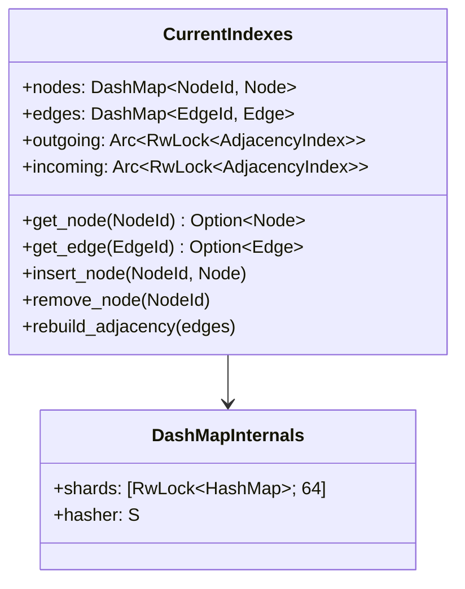
```mermaid
classDiagram
    class CurrentIndexes {
        +nodes: DashMap~NodeId, Node~
        +edges: DashMap~EdgeId, Edge~
        +outgoing: Arc~RwLock~AdjacencyIndex~~
        +incoming: Arc~RwLock~AdjacencyIndex~~
        +get_node(NodeId) Option~Node~
        +get_edge(EdgeId) Option~Edge~
        +insert_node(NodeId, Node)
        +remove_node(NodeId)
        +rebuild_adjacency(edges)
    }

    class DashMapInternals {
        +shards: [RwLock~HashMap~; 64]
        +hasher: S
    }

    CurrentIndexes --> DashMapInternals
```

### Sharding Strategy

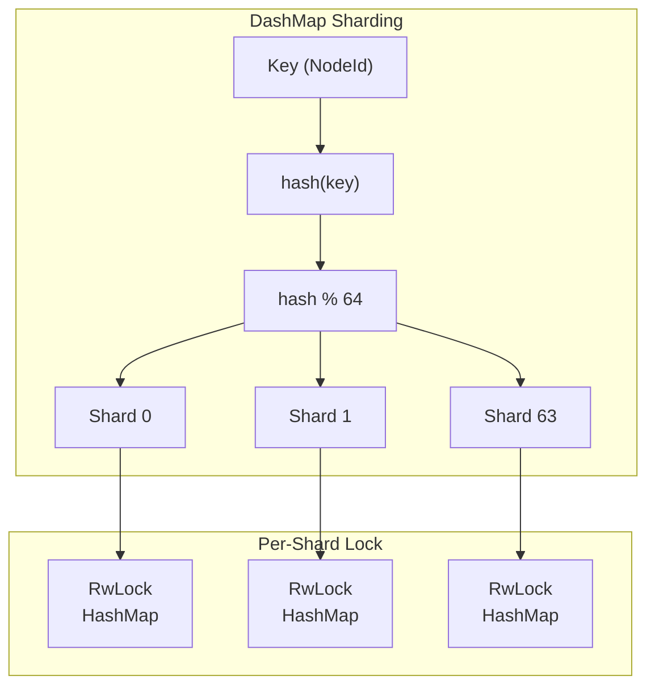
```mermaid
graph TB
    subgraph "DashMap Sharding"
        KEY["Key (NodeId)"] --> HASH["hash(key)"]
        HASH --> MOD["hash % 64"]
        MOD --> S0["Shard 0"]
        MOD --> S1["Shard 1"]
        MOD --> SN["Shard 63"]
    end

    subgraph "Per-Shard Lock"
        S0 --> RW0["RwLock<br/>HashMap"]
        S1 --> RW1["RwLock<br/>HashMap"]
        SN --> RWN["RwLock<br/>HashMap"]
    end
```

### Concurrency Characteristics

| Operation | Lock Type | Contention |
|-----------|-----------|------------|
| `get()` | Read (shard) | Very low |
| `insert()` | Write (shard) | Low (1/64) |
| `remove()` | Write (shard) | Low (1/64) |
| `iter()` | Read (all) | Higher |
| `len()` | Read (all) | Higher |

### Performance

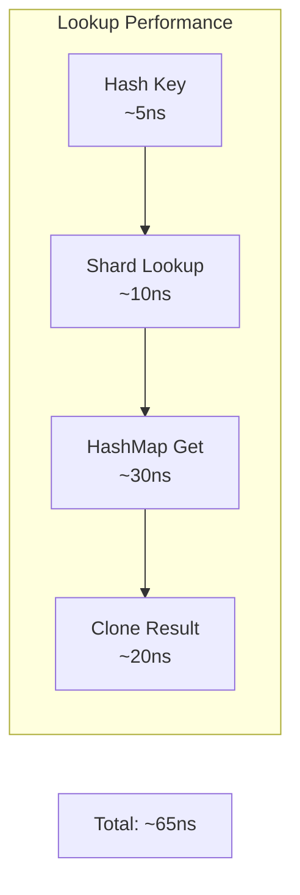
```mermaid
graph LR
    subgraph "Lookup Performance"
        L1["Hash Key<br/>~5ns"]
        L2["Shard Lookup<br/>~10ns"]
        L3["HashMap Get<br/>~30ns"]
        L4["Clone Result<br/>~20ns"]
    end

    L1 --> L2 --> L3 --> L4

    TOTAL["Total: ~65ns"]
```

## Adjacency Index (CSR Format)

### Purpose

Cache-friendly graph traversal with O(k) edge retrieval.

### CSR Structure

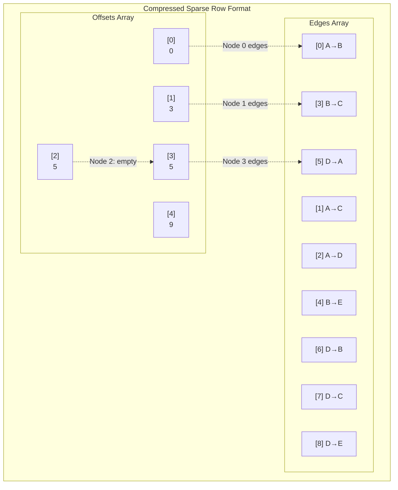
```mermaid
graph TB
    subgraph "Compressed Sparse Row Format"
        subgraph "Offsets Array"
            O0["[0]<br/>0"]
            O1["[1]<br/>3"]
            O2["[2]<br/>5"]
            O3["[3]<br/>5"]
            O4["[4]<br/>9"]
        end

        subgraph "Edges Array"
            E0["[0] A→B"]
            E1["[1] A→C"]
            E2["[2] A→D"]
            E3["[3] B→C"]
            E4["[4] B→E"]
            E5["[5] D→A"]
            E6["[6] D→B"]
            E7["[7] D→C"]
            E8["[8] D→E"]
        end

        O0 -.->|"Node 0 edges"| E0
        O1 -.->|"Node 1 edges"| E3
        O2 -.->|"Node 2: empty"| O3
        O3 -.->|"Node 3 edges"| E5
    end
```

### Data Structures

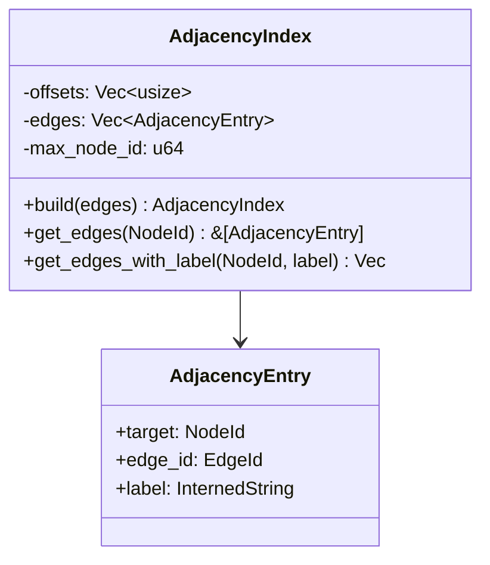
```mermaid
classDiagram
    class AdjacencyIndex {
        -offsets: Vec~usize~
        -edges: Vec~AdjacencyEntry~
        -max_node_id: u64
        +build(edges) AdjacencyIndex
        +get_edges(NodeId) &[AdjacencyEntry]
        +get_edges_with_label(NodeId, label) Vec
    }

    class AdjacencyEntry {
        +target: NodeId
        +edge_id: EdgeId
        +label: InternedString
    }

    AdjacencyIndex --> AdjacencyEntry
```

### Lookup Algorithm

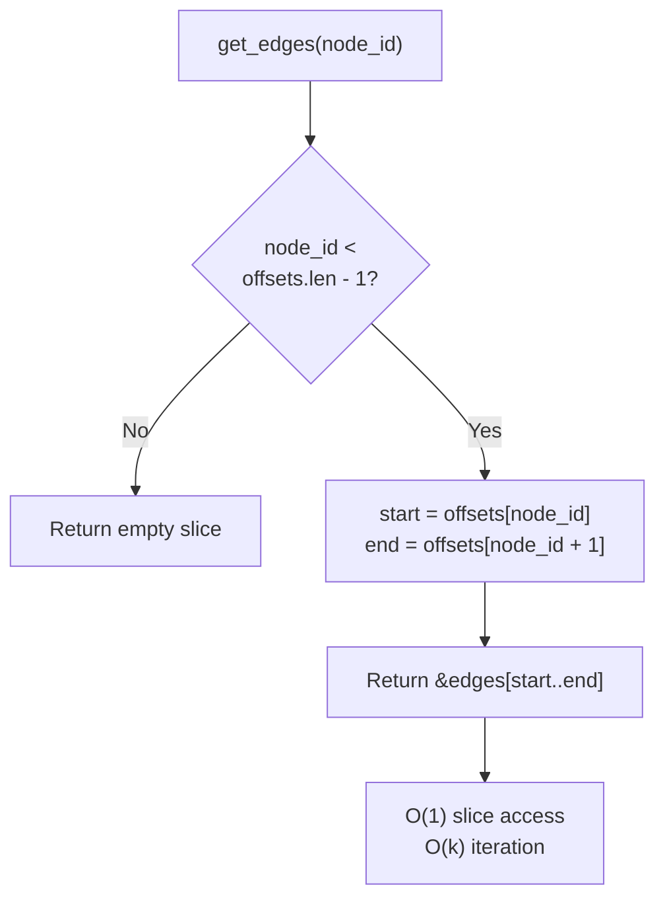
```mermaid
flowchart TD
    START["get_edges(node_id)"] --> CHECK{"node_id <<br/>offsets.len - 1?"}

    CHECK -->|No| EMPTY["Return empty slice"]
    CHECK -->|Yes| CALC["start = offsets[node_id]<br/>end = offsets[node_id + 1]"]

    CALC --> SLICE["Return &edges[start..end]"]

    SLICE --> RESULT["O(1) slice access<br/>O(k) iteration"]
```

### Build Process

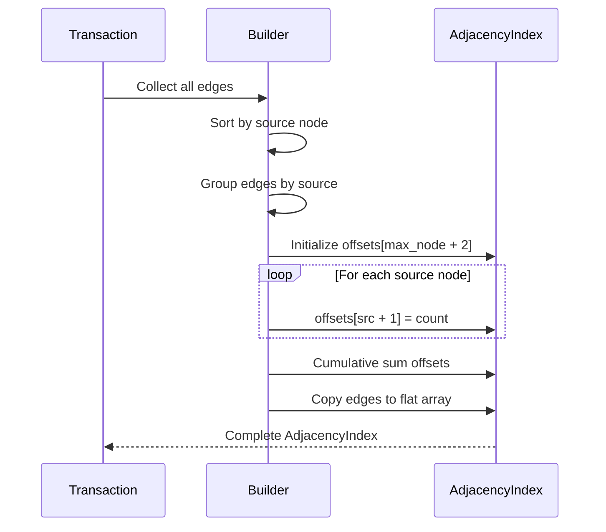
```mermaid
sequenceDiagram
    participant TX as Transaction
    participant BUILD as Builder
    participant CSR as AdjacencyIndex

    TX->>BUILD: Collect all edges
    BUILD->>BUILD: Sort by source node
    BUILD->>BUILD: Group edges by source

    BUILD->>CSR: Initialize offsets[max_node + 2]

    loop For each source node
        BUILD->>CSR: offsets[src + 1] = count
    end

    BUILD->>CSR: Cumulative sum offsets
    BUILD->>CSR: Copy edges to flat array

    CSR-->>TX: Complete AdjacencyIndex
```

### Memory Layout

```
Sequential Memory Access Pattern:

Node 42 edges lookup:
  1. Read offsets[42] = 1000     (8 bytes)
  2. Read offsets[43] = 1005     (8 bytes)
  3. Read edges[1000..1005]      (5 × 20 bytes = 100 bytes)

Cache Line: 64 bytes
  → 3 entries per cache line
  → Minimal cache misses for traversal
```

### Dual Indexes

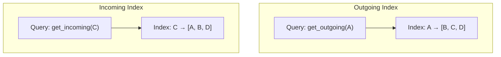
```mermaid
graph TB
    subgraph "Outgoing Index"
        OUT_Q["Query: get_outgoing(A)"]
        OUT_I["Index: A → [B, C, D]"]
    end

    subgraph "Incoming Index"
        IN_Q["Query: get_incoming(C)"]
        IN_I["Index: C → [A, B, D]"]
    end

    OUT_Q --> OUT_I
    IN_Q --> IN_I
```

## Temporal Indexes (DashMap + Sorted Vectors)

### Purpose

Efficient range queries for time-travel operations with built-in DoS protection through per-entity version limits.

### Structure

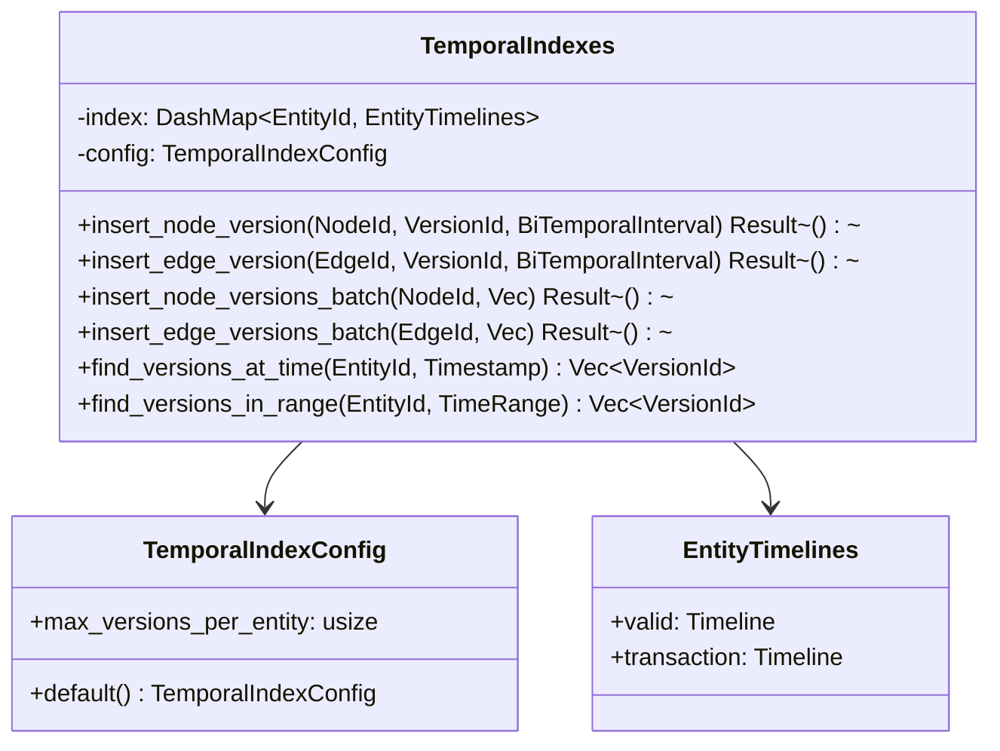
```mermaid
classDiagram
    class TemporalIndexes {
        -index: DashMap~EntityId, EntityTimelines~
        -config: TemporalIndexConfig
        +insert_node_version(NodeId, VersionId, BiTemporalInterval) Result~()~
        +insert_edge_version(EdgeId, VersionId, BiTemporalInterval) Result~()~
        +insert_node_versions_batch(NodeId, Vec) Result~()~
        +insert_edge_versions_batch(EdgeId, Vec) Result~()~
        +find_versions_at_time(EntityId, Timestamp) Vec~VersionId~
        +find_versions_in_range(EntityId, TimeRange) Vec~VersionId~
    }

    class TemporalIndexConfig {
        +max_versions_per_entity: usize
        +default() TemporalIndexConfig
    }

    class EntityTimelines {
        +valid: Timeline
        +transaction: Timeline
    }

    TemporalIndexes --> TemporalIndexConfig
    TemporalIndexes --> EntityTimelines
```

### Index Organization

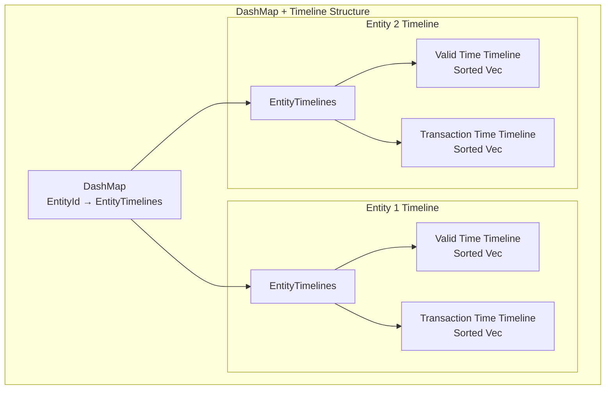
```mermaid
graph TB
    subgraph "DashMap + Timeline Structure"
        DM["DashMap<br/>EntityId → EntityTimelines"]

        subgraph "Entity 1 Timeline"
            ET1["EntityTimelines"]
            VT1["Valid Time Timeline<br/>Sorted Vec<TimelineEntry>"]
            TT1["Transaction Time Timeline<br/>Sorted Vec<TimelineEntry>"]
            ET1 --> VT1
            ET1 --> TT1
        end

        subgraph "Entity 2 Timeline"
            ET2["EntityTimelines"]
            VT2["Valid Time Timeline<br/>Sorted Vec<TimelineEntry>"]
            TT2["Transaction Time Timeline<br/>Sorted Vec<TimelineEntry>"]
            ET2 --> VT2
            ET2 --> TT2
        end

        DM --> ET1
        DM --> ET2
    end
```

**Key Features:**
- **DashMap**: Fine-grained locking per entity (parallel writes to different entities)
- **Sorted Vectors**: Binary search + cache-friendly scanning within entity
- **DoS Protection**: `TemporalIndexConfig.max_versions_per_entity` (default: 1M)

### Query Patterns

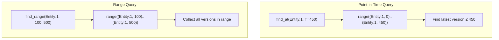
```mermaid
flowchart TD
    subgraph "Point-in-Time Query"
        Q1["find_at(Entity:1, T=450)"]
        S1["range((Entity:1, 0)..(Entity:1, 450))"]
        R1["Find latest version ≤ 450"]
    end

    subgraph "Range Query"
        Q2["find_range(Entity:1, 100..500)"]
        S2["range((Entity:1, 100)..(Entity:1, 500))"]
        R2["Collect all versions in range"]
    end

    Q1 --> S1 --> R1
    Q2 --> S2 --> R2
```

### Dual Time Dimensions

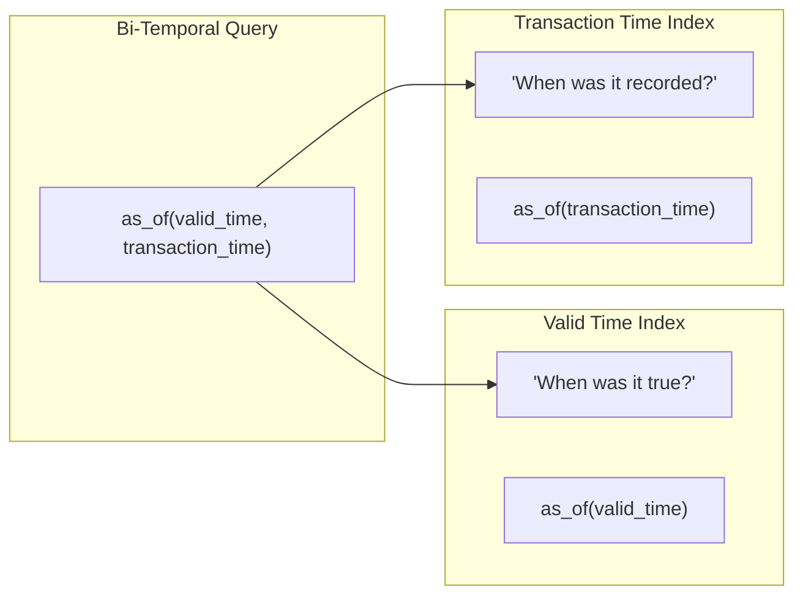
```mermaid
graph LR
    subgraph "Valid Time Index"
        VT["'When was it true?'"]
        VT_Q["as_of(valid_time)"]
    end

    subgraph "Transaction Time Index"
        TT["'When was it recorded?'"]
        TT_Q["as_of(transaction_time)"]
    end

    subgraph "Bi-Temporal Query"
        BT["as_of(valid_time, transaction_time)"]
        BT --> VT
        BT --> TT
    end
```

### Performance Characteristics

| Operation | Complexity | Typical Use | Notes |
|-----------|------------|-------------|-------|
| Insert (chronological) | O(1) amortized | Version creation | Append to sorted vector |
| Insert (retroactive) | O(N) | WAL replay | Binary search + shift |
| Batch insert | O(M log M + N) | Bulk operations | M = batch size, N = total versions |
| Point lookup | O(log N + K) | Time-travel query | Binary search + scan K overlaps |
| Range scan | O(log N + K) | History query | Binary search + linear scan |
| Version limit check | O(1) | Every insert | DoS protection |

**N** = versions per entity, **K** = overlapping versions (typically 1-2)

## Index Synchronization

### Transaction Commit Flow

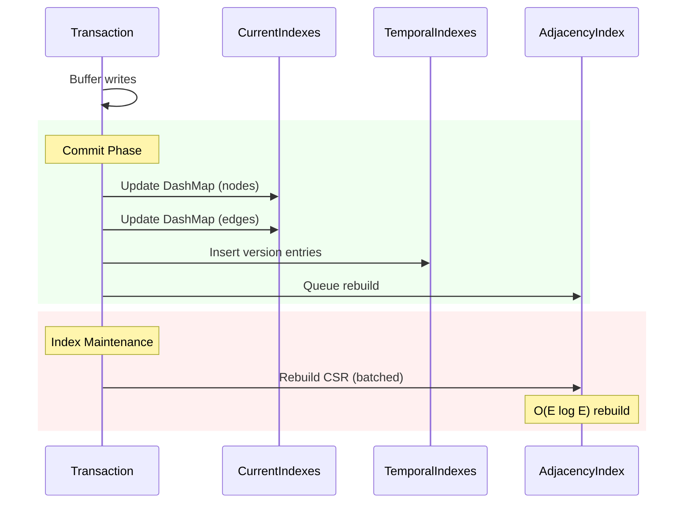
```mermaid
sequenceDiagram
    participant TX as Transaction
    participant CI as CurrentIndexes
    participant TI as TemporalIndexes
    participant ADJ as AdjacencyIndex

    TX->>TX: Buffer writes

    rect rgb(240, 255, 240)
        Note over TX: Commit Phase
        TX->>CI: Update DashMap (nodes)
        TX->>CI: Update DashMap (edges)
        TX->>TI: Insert version entries
        TX->>ADJ: Queue rebuild
    end

    rect rgb(255, 240, 240)
        Note over TX: Index Maintenance
        TX->>ADJ: Rebuild CSR (batched)
        Note over ADJ: O(E log E) rebuild
    end
```

### Batched Adjacency Rebuild

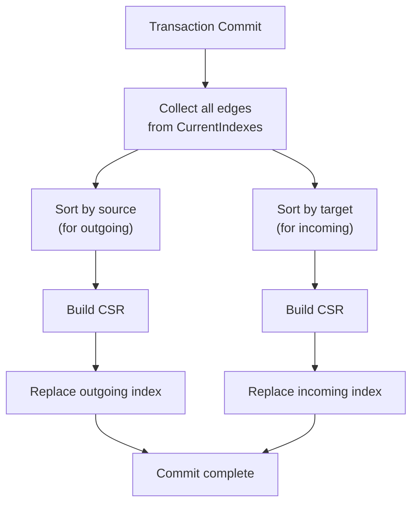
```mermaid
flowchart TD
    START["Transaction Commit"] --> COLLECT["Collect all edges<br/>from CurrentIndexes"]

    COLLECT --> SORT_OUT["Sort by source<br/>(for outgoing)"]
    COLLECT --> SORT_IN["Sort by target<br/>(for incoming)"]

    SORT_OUT --> BUILD_OUT["Build CSR"]
    SORT_IN --> BUILD_IN["Build CSR"]

    BUILD_OUT --> REPLACE_OUT["Replace outgoing index"]
    BUILD_IN --> REPLACE_IN["Replace incoming index"]

    REPLACE_OUT --> DONE["Commit complete"]
    REPLACE_IN --> DONE
```

## Vector Index (HNSW) ✅ Implemented

### Purpose

Semantic similarity search for LLM-integrated queries. Enables k-nearest-neighbor search on vector embeddings stored as node properties.

### Implementation

The vector index is integrated into `CurrentStorage` via `VectorIndexState`:

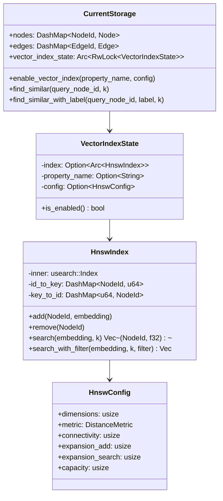
```mermaid
classDiagram
    class CurrentStorage {
        +nodes: DashMap~NodeId, Node~
        +edges: DashMap~EdgeId, Edge~
        +vector_index_state: Arc~RwLock~VectorIndexState~~
        +enable_vector_index(property_name, config)
        +find_similar(query_node_id, k)
        +find_similar_with_label(query_node_id, label, k)
    }

    class VectorIndexState {
        -index: Option~Arc~HnswIndex~~
        -property_name: Option~String~
        -config: Option~HnswConfig~
        +is_enabled() bool
    }

    class HnswIndex {
        -inner: usearch::Index
        -id_to_key: DashMap~NodeId, u64~
        -key_to_id: DashMap~u64, NodeId~
        +add(NodeId, embedding)
        +remove(NodeId)
        +search(embedding, k) Vec~(NodeId, f32)~
        +search_with_filter(embedding, k, filter) Vec
    }

    class HnswConfig {
        +dimensions: usize
        +metric: DistanceMetric
        +connectivity: usize
        +expansion_add: usize
        +expansion_search: usize
        +capacity: usize
    }

    CurrentStorage --> VectorIndexState
    VectorIndexState --> HnswIndex
    HnswIndex --> HnswConfig
```

### HNSW Layers

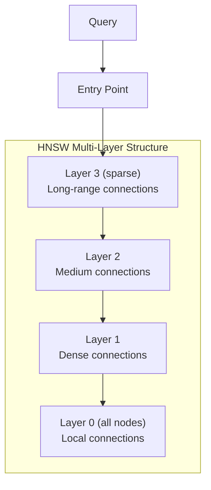
```mermaid
graph TB
    subgraph "HNSW Multi-Layer Structure"
        L3["Layer 3 (sparse)<br/>Long-range connections"]
        L2["Layer 2<br/>Medium connections"]
        L1["Layer 1<br/>Dense connections"]
        L0["Layer 0 (all nodes)<br/>Local connections"]
    end

    L3 --> L2 --> L1 --> L0

    EP["Entry Point"] --> L3
    Q["Query"] --> EP
```

### Query Flow

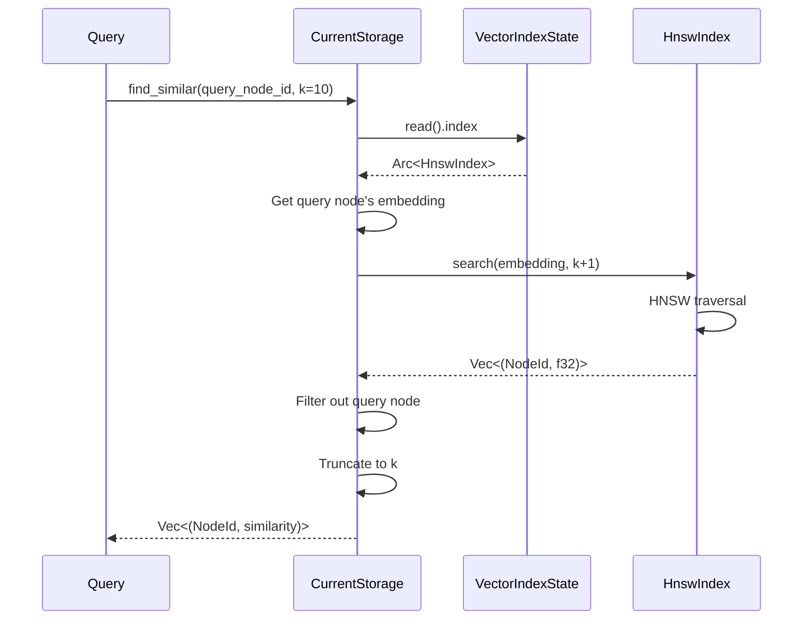
```mermaid
sequenceDiagram
    participant Q as Query
    participant CS as CurrentStorage
    participant VIS as VectorIndexState
    participant HNSW as HnswIndex

    Q->>CS: find_similar(query_node_id, k=10)
    CS->>VIS: read().index
    VIS-->>CS: Arc<HnswIndex>
    CS->>CS: Get query node's embedding
    CS->>HNSW: search(embedding, k+1)
    HNSW->>HNSW: HNSW traversal
    HNSW-->>CS: Vec<(NodeId, f32)>
    CS->>CS: Filter out query node
    CS->>CS: Truncate to k
    CS-->>Q: Vec<(NodeId, similarity)>
```

### Auto-Indexing on CRUD Operations

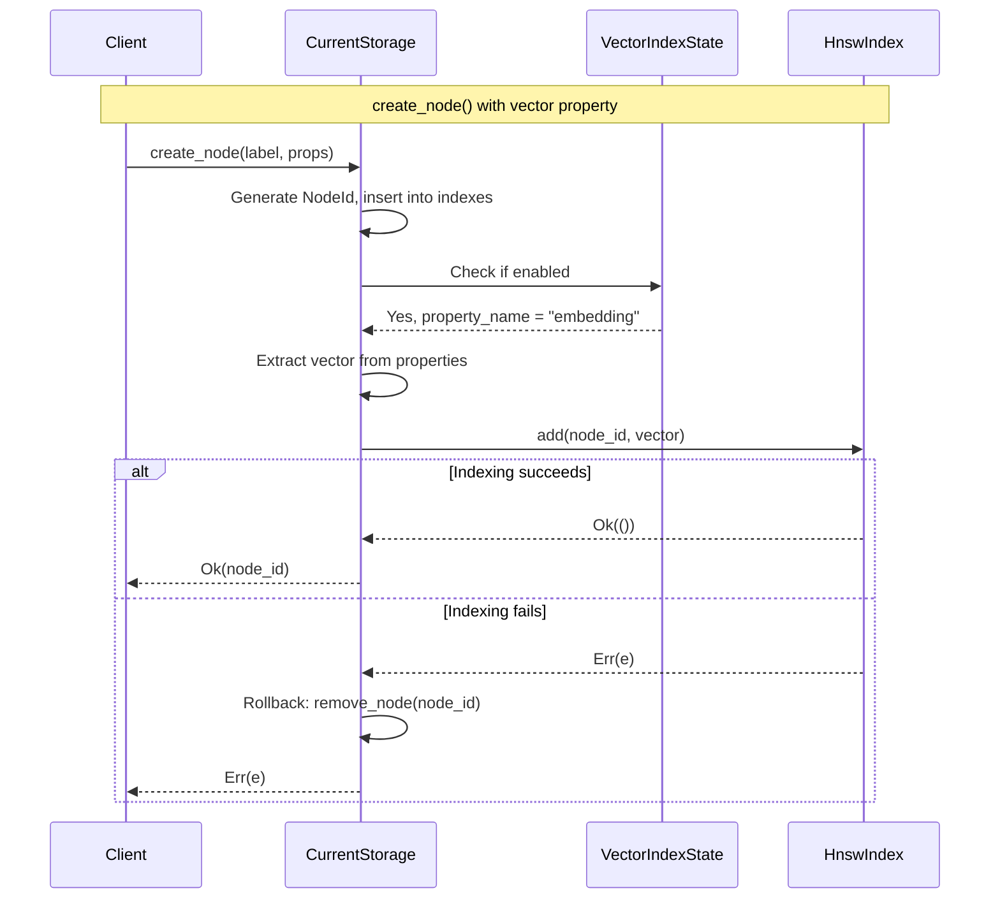
```mermaid
sequenceDiagram
    participant C as Client
    participant CS as CurrentStorage
    participant VIS as VectorIndexState
    participant HNSW as HnswIndex

    Note over C,HNSW: create_node() with vector property

    C->>CS: create_node(label, props)
    CS->>CS: Generate NodeId, insert into indexes
    CS->>VIS: Check if enabled
    VIS-->>CS: Yes, property_name = "embedding"
    CS->>CS: Extract vector from properties
    CS->>HNSW: add(node_id, vector)

    alt Indexing succeeds
        HNSW-->>CS: Ok(())
        CS-->>C: Ok(node_id)
    else Indexing fails
        HNSW-->>CS: Err(e)
        CS->>CS: Rollback: remove_node(node_id)
        CS-->>C: Err(e)
    end
```

## Index Selection

### Query Routing

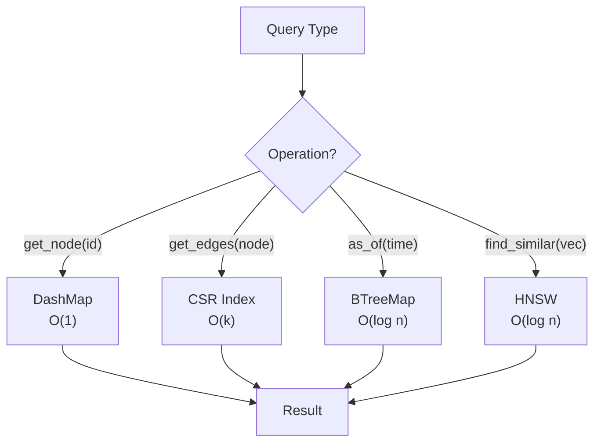
```mermaid
flowchart TD
    QUERY["Query Type"] --> TYPE{"Operation?"}

    TYPE -->|"get_node(id)"| DM["DashMap<br/>O(1)"]
    TYPE -->|"get_edges(node)"| CSR["CSR Index<br/>O(k)"]
    TYPE -->|"as_of(time)"| BT["BTreeMap<br/>O(log n)"]
    TYPE -->|"find_similar(vec)"| HNSW["HNSW<br/>O(log n)"]

    DM --> RESULT["Result"]
    CSR --> RESULT
    BT --> RESULT
    HNSW --> RESULT
```

### Performance Summary

| Index | Structure | Insert | Lookup | Range | Use Case | Status |
|-------|-----------|--------|--------|-------|----------|--------|
| Current (nodes) | DashMap | O(1) | O(1) | - | Entity access | ✅ |
| Current (edges) | DashMap | O(1) | O(1) | - | Entity access | ✅ |
| Adjacency | CSR | O(E log E)* | O(1) | O(k) | Traversal | ✅ |
| Temporal | BTreeMap | O(log n) | O(log n) | O(log n + k) | Time-travel | ✅ |
| Vector | HNSW | O(log n) | O(log n) | - | Similarity | ✅ |

*Adjacency is rebuilt, not incrementally updated.

### Vector Index Performance Characteristics

| Operation | Complexity | Notes |
|-----------|------------|-------|
| `enable_vector_index()` | O(1) | One-time setup |
| `add()` (on create_node) | O(log n) | Auto-indexed if enabled |
| `remove()` (on delete_node) | O(log n) | Best-effort removal |
| `find_similar(k)` | O(log n) | HNSW search + k+1 query |
| `find_similar_with_label(k)` | O(n) | Full scan with label filter |

**Note**: Label filtering currently uses post-filter approach (search all, then filter). Future optimization could use HNSW's native filtering for better performance.

## Related Documentation

- [ADR-0005: CSR Adjacency Format](../adr/0005-csr-adjacency-format.md)
- [ADR-0010: DashMap for Current Indexes](../adr/0010-dashmap-current-indexes.md)
- [ADR-0011: Vector Search Integration](../adr/0011-vector-search-integration.md)
