# Scalability Architecture

This document describes AletheiaDB's scalability architecture, including tiered storage for datasets larger than RAM and horizontal sharding for distributed deployments.

## Scalability Strategy Overview

AletheiaDB uses a two-phase scalability approach:

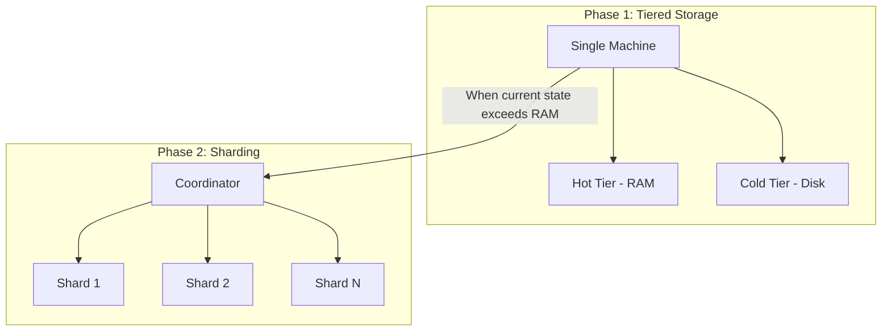

| Phase | When to Use | Capacity |
|-------|-------------|----------|
| **Tiered Storage** | Historical data exceeds RAM | Unlimited history on disk |
| **Sharding** | Current state exceeds single-machine RAM | Unlimited horizontal scale |

---

## Phase 1: Tiered Storage

### Architecture

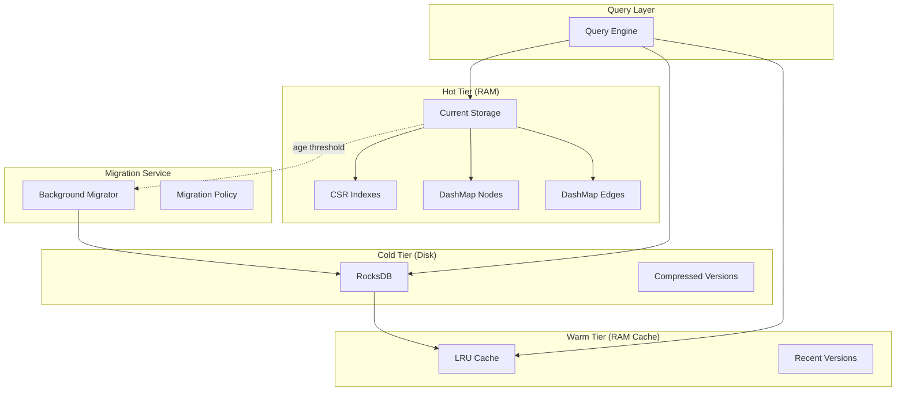

### Query Routing

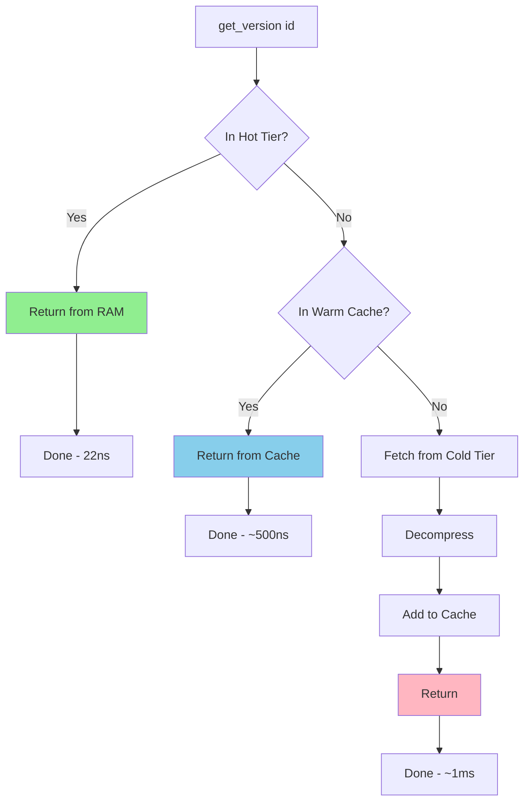

### Version Migration Flow

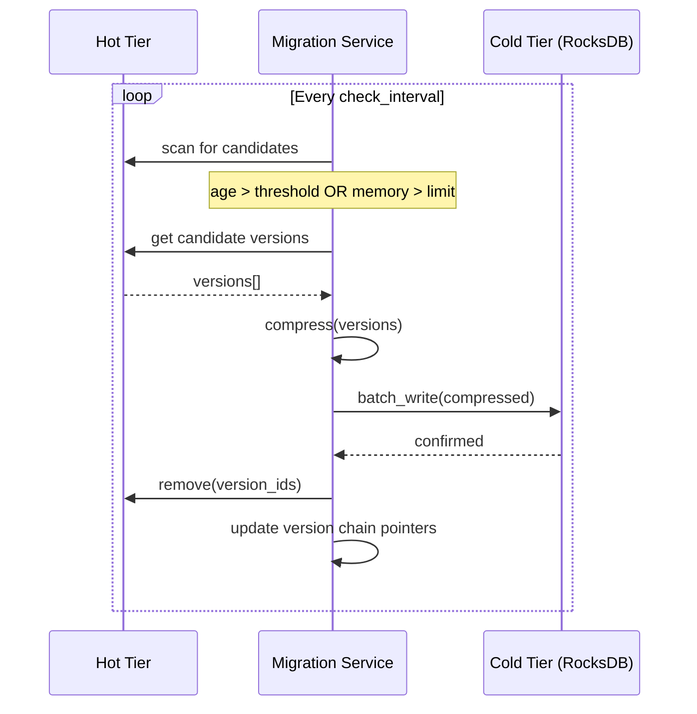

### Storage Tiers Detail

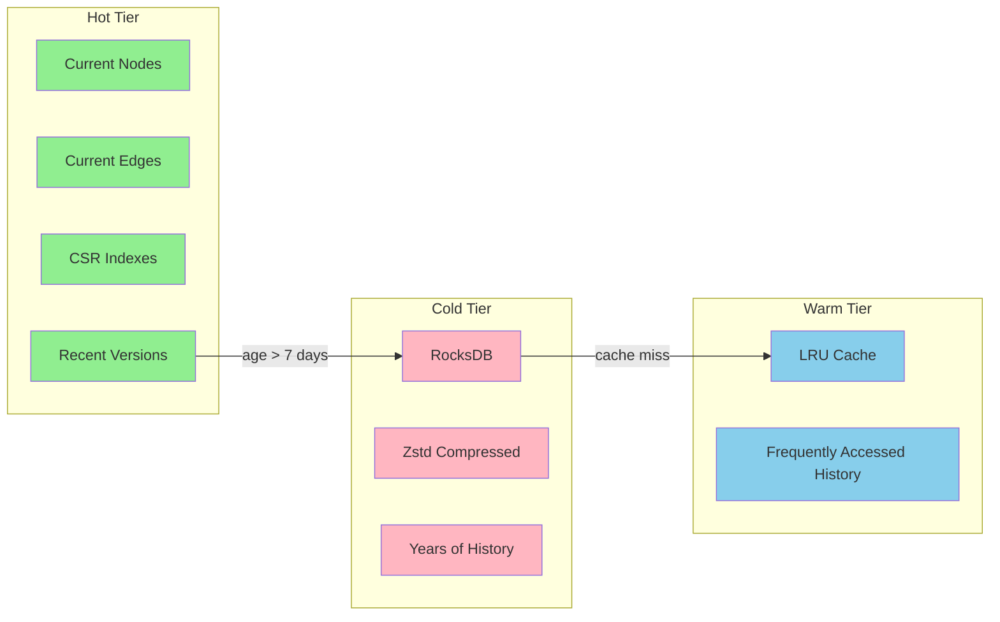

### Performance by Tier

| Tier | Storage | Capacity | Read Latency | Use Case |
|------|---------|----------|--------------|----------|
| **Hot** | RAM | ~256GB | 22-70ns | Current state, live queries |
| **Warm** | RAM | ~1-10GB | 100ns-1µs | Repeated time-travel |
| **Cold** | SSD | Unlimited | 100µs-1ms | Deep history, audits |

---

## Phase 2: Horizontal Sharding

### Sharding Architecture

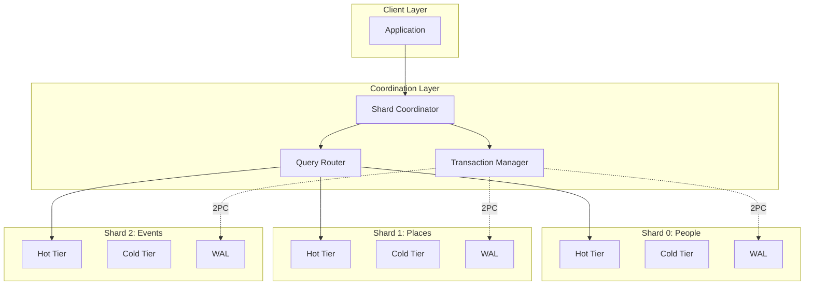

### Domain-Based Partitioning

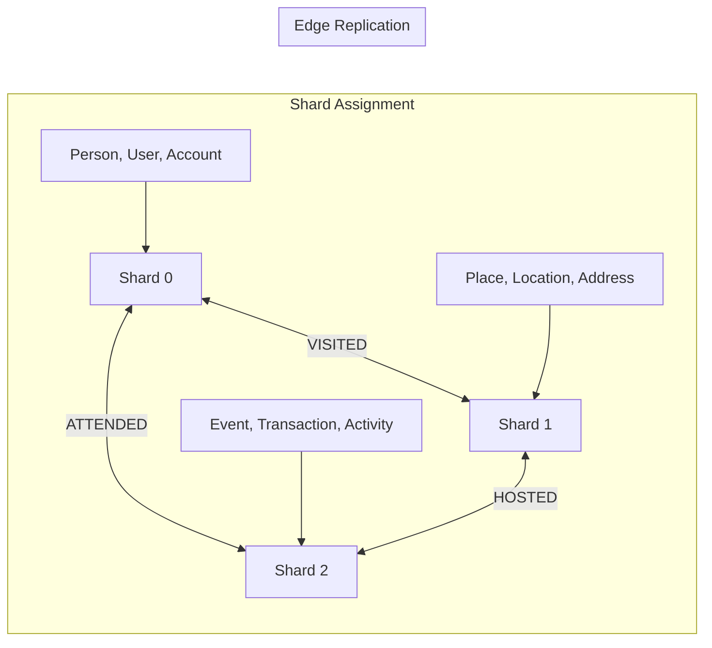

### Query Routing Decision Tree

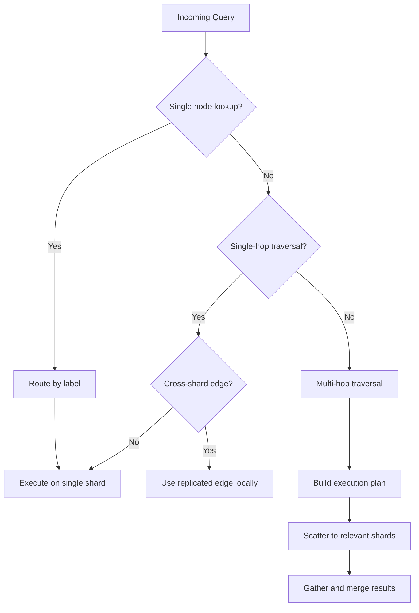

### Edge Replication Detail

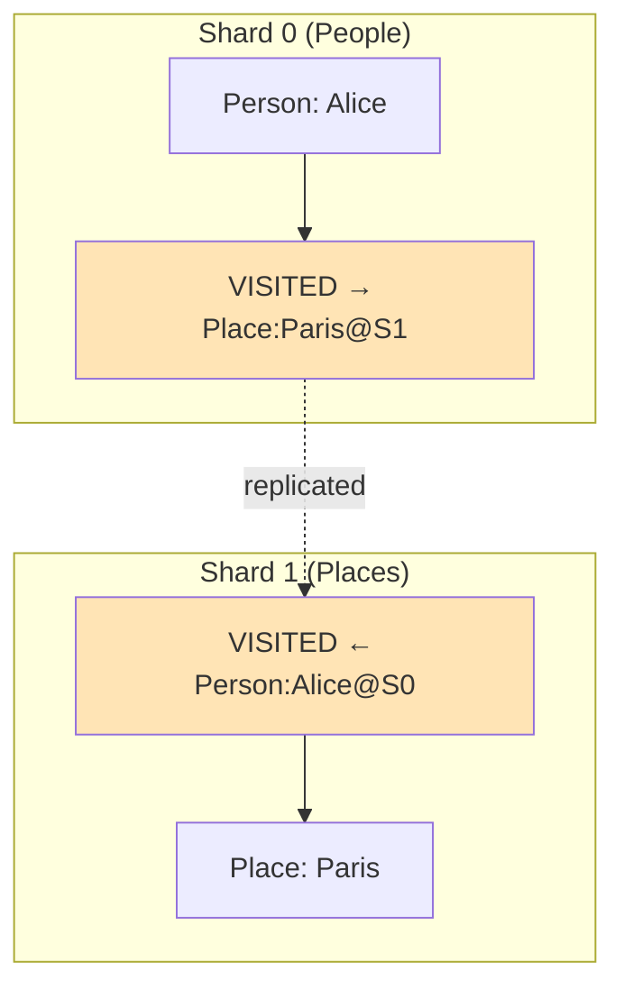

**Benefits:**
- Outgoing traversal from Alice: local on Shard 0
- Incoming traversal to Paris: local on Shard 1
- Single-hop traversal never crosses network

### Distributed Transaction (2PC)

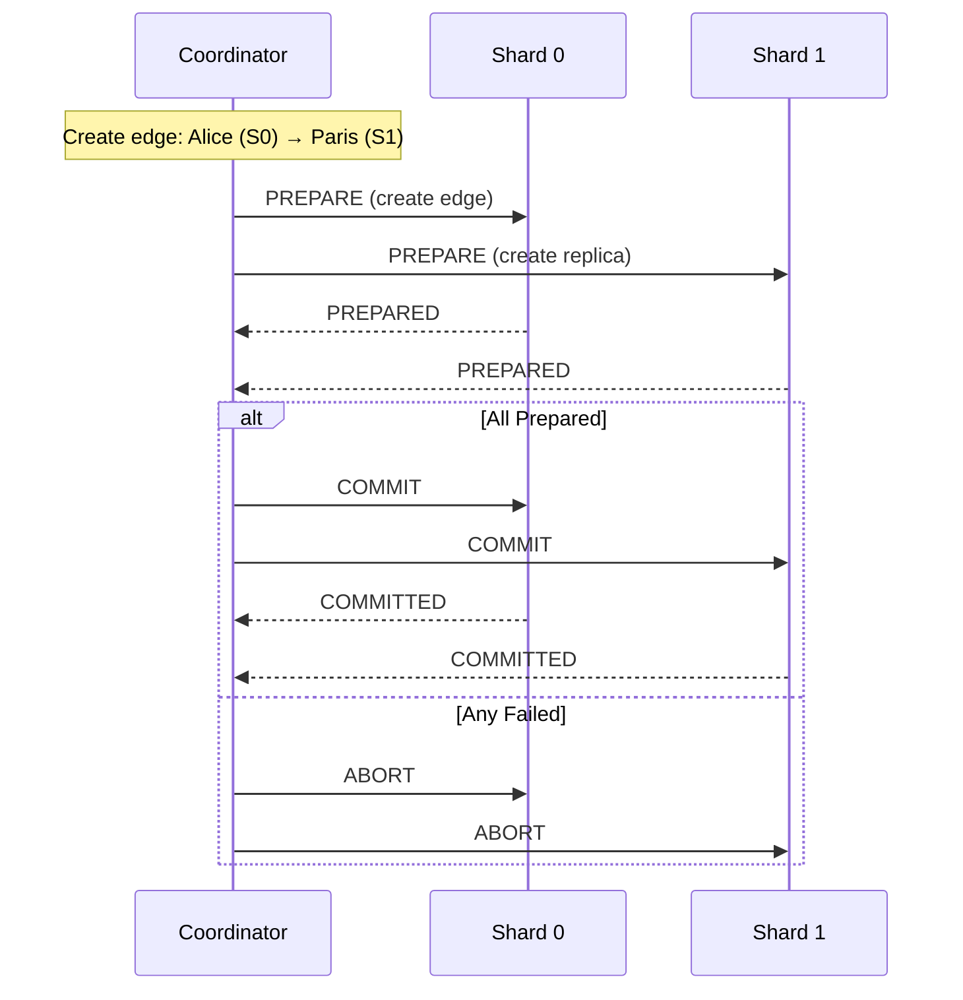

### Rebalancing Flow

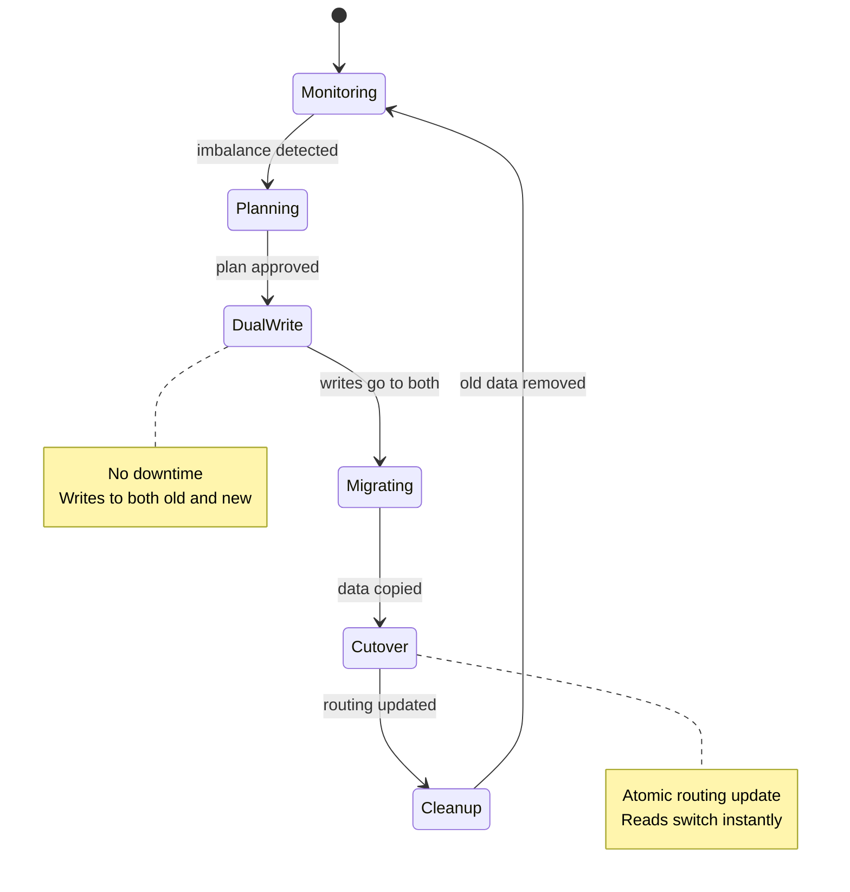

### Shard Topology Example

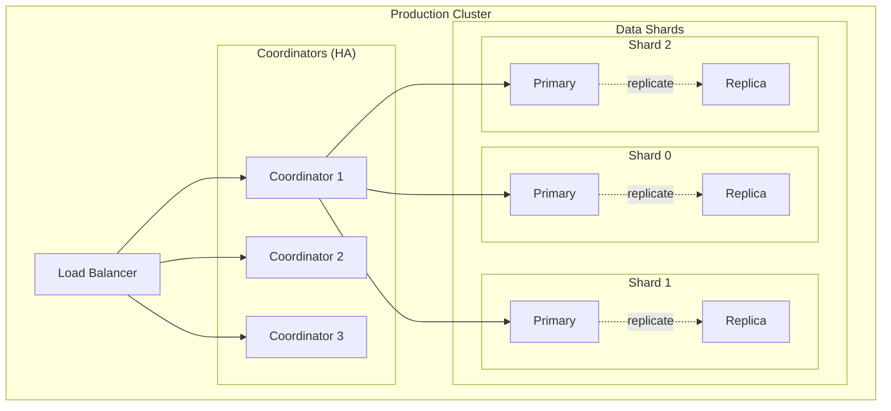

---

## Capacity Planning

### Single Machine (Tiered Storage)

| RAM | Current Nodes | Historical Depth | SSD Required |
|-----|---------------|------------------|--------------|
| 64GB | ~300M | Unlimited | 500GB-2TB |
| 128GB | ~600M | Unlimited | 1-4TB |
| 256GB | ~1.2B | Unlimited | 2-8TB |

### Sharded Cluster

| Nodes | RAM/Node | Total Current Nodes | Throughput |
|-------|----------|---------------------|------------|
| 3 | 256GB | ~3.6B | ~300K reads/sec |
| 10 | 256GB | ~12B | ~1M reads/sec |
| 50 | 256GB | ~60B | ~5M reads/sec |

---

## Related Documentation

- [ADR-0013: Tiered Storage Architecture](../adr/0013-tiered-storage-architecture.md)
- [ADR-0014: Graph Sharding Strategy](../adr/0014-graph-sharding-strategy.md)
- [ADR-0001: Hybrid Storage Architecture](../adr/0001-hybrid-storage-architecture.md)
- [Storage Layer](./storage-layer.md)
