# Storage Layer Architecture

The storage layer is responsible for persisting graph data with full bi-temporal tracking while maintaining high performance for current-state queries.

## Overview

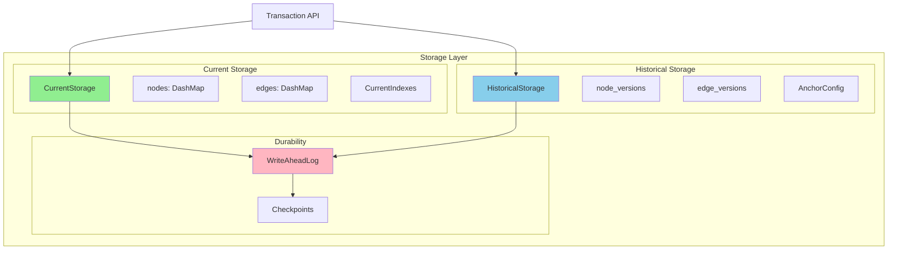

## Current Storage

### Purpose

Optimized for fast current-state queries with zero temporal overhead.

### Structure

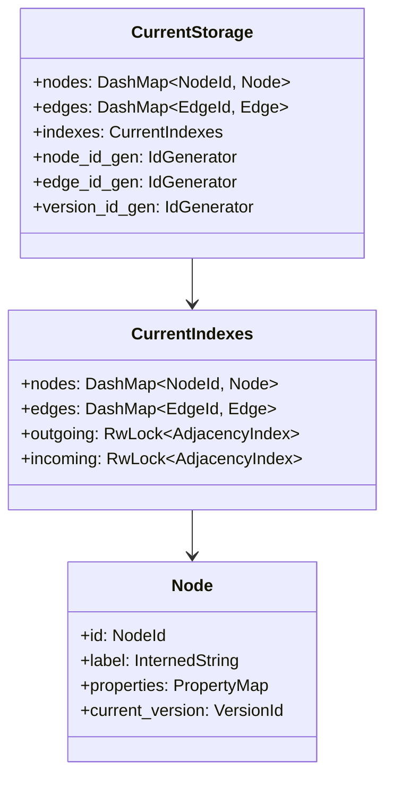

### Operations

| Operation | Complexity | Lock Type |
|-----------|------------|-----------|
| `get_node(id)` | O(1) | Lock-free |
| `get_edge(id)` | O(1) | Lock-free |
| `insert_node(node)` | O(1) | Shard lock |
| `get_outgoing_edges(node)` | O(k) | Read lock |
| `rebuild_adjacency()` | O(E log E) | Write lock |

### Memory Layout

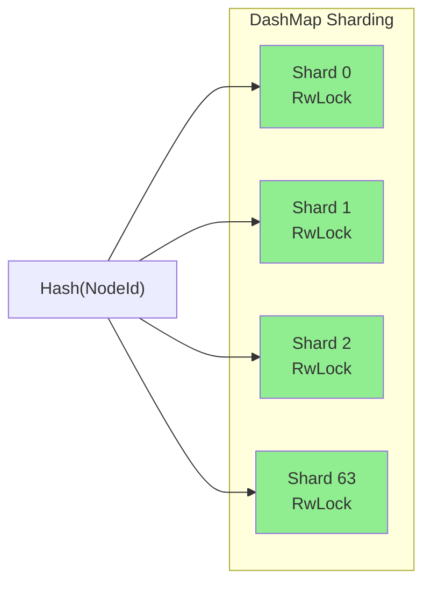

## Historical Storage

### Purpose

Maintains version chains with anchor+delta compression for storage efficiency.

### Version Chain Structure

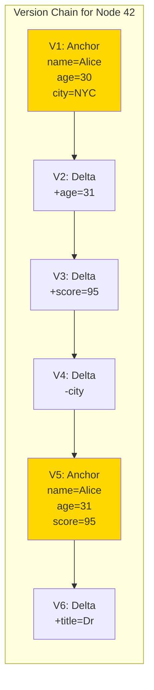

### Anchor Decision Logic

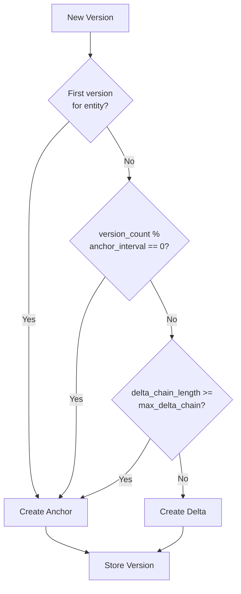

### Configuration

```rust
pub struct AnchorConfig {
    /// Create anchor every N versions (default: 10)
    pub anchor_interval: usize,

    /// Force anchor if chain exceeds this (default: 20)
    pub max_delta_chain: usize,
}
```

### Reconstruction Algorithm

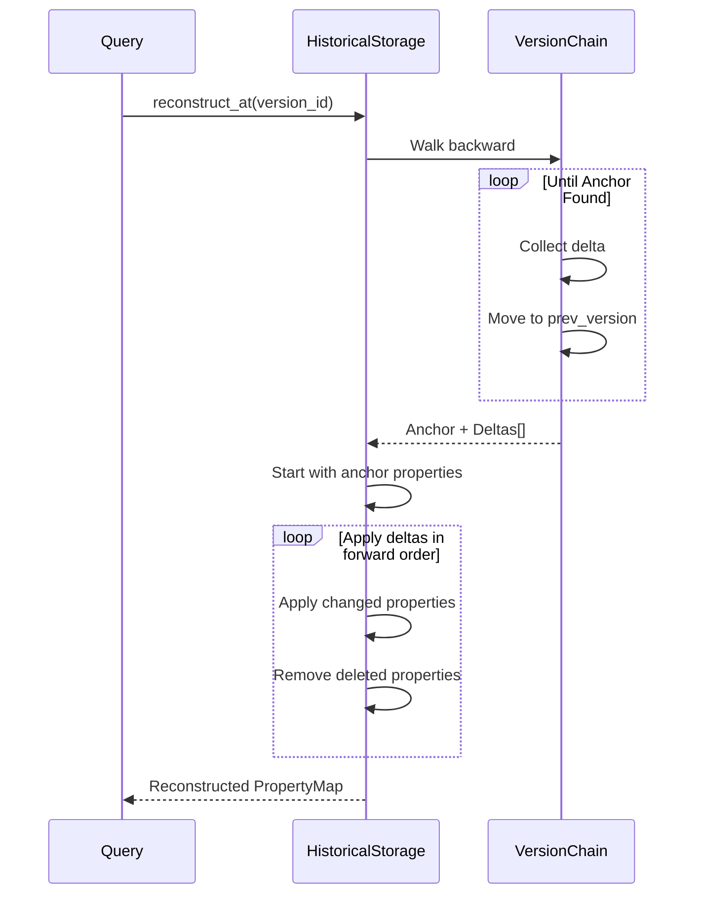

### Storage Efficiency

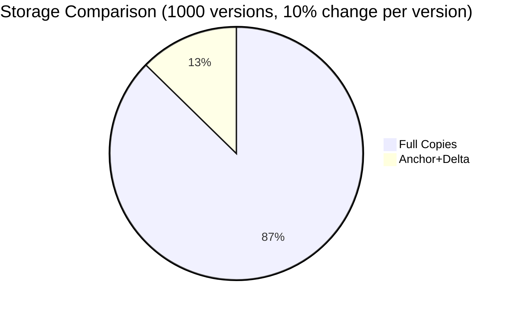

| Scenario | Full Copies | Anchor+Delta | Savings |
|----------|-------------|--------------|---------|
| 100 versions, 10% change | 100x | ~19x | 81% |
| 1000 versions, 5% change | 1000x | ~145x | 85% |

## Write-Ahead Log

### Purpose

Ensures durability by logging operations before applying them.

### Entry Format

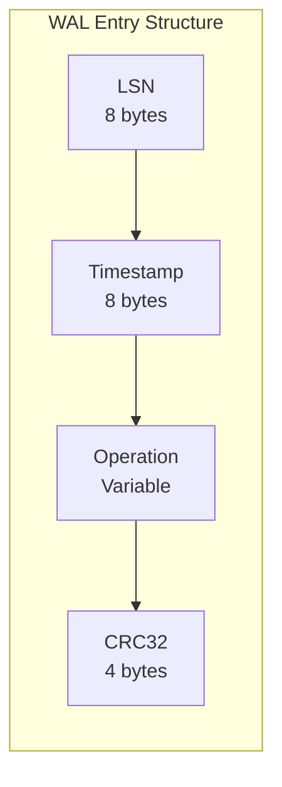

### Operations Logged

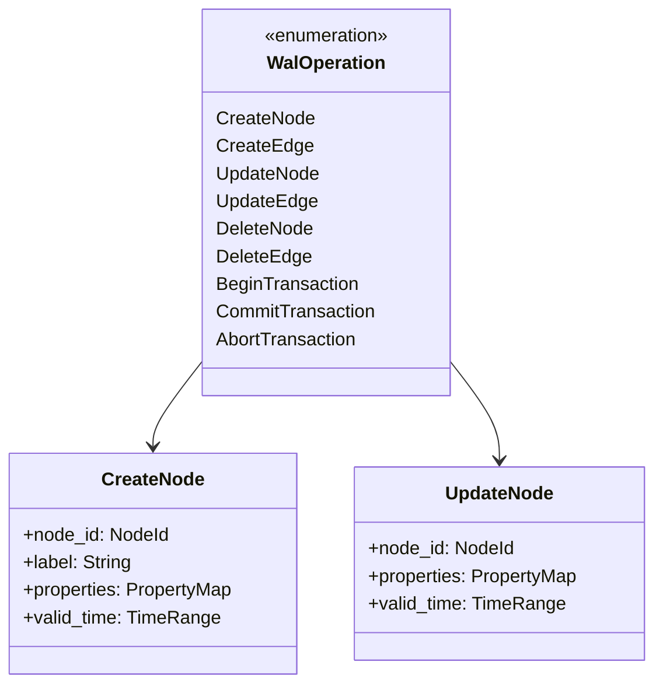

### Write Path

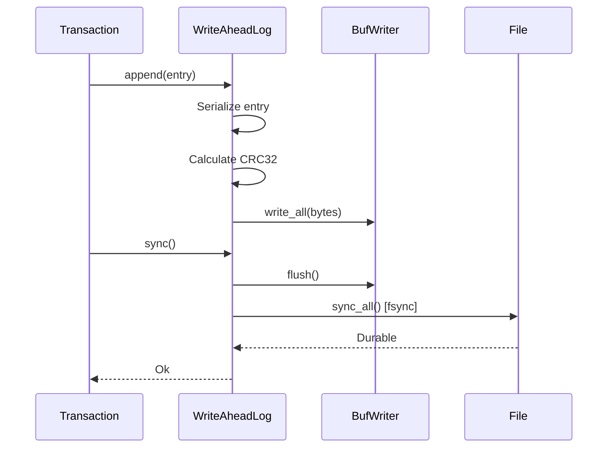

### Recovery Process

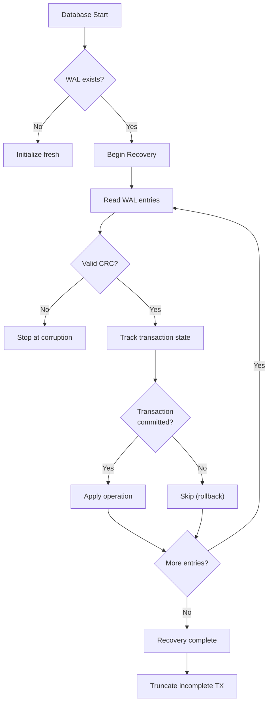

## Checkpointing

### Purpose

Reduce recovery time by creating periodic snapshots.

### Checkpoint Structure

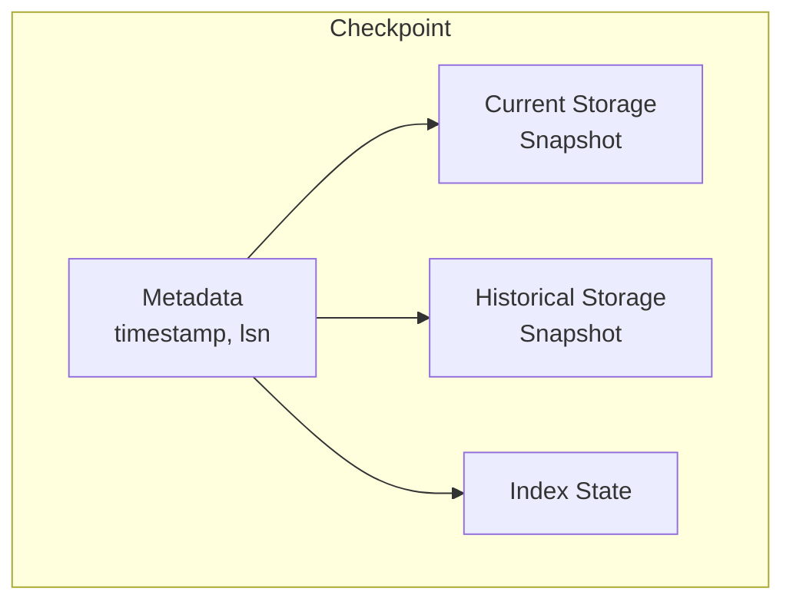

### Recovery with Checkpoint

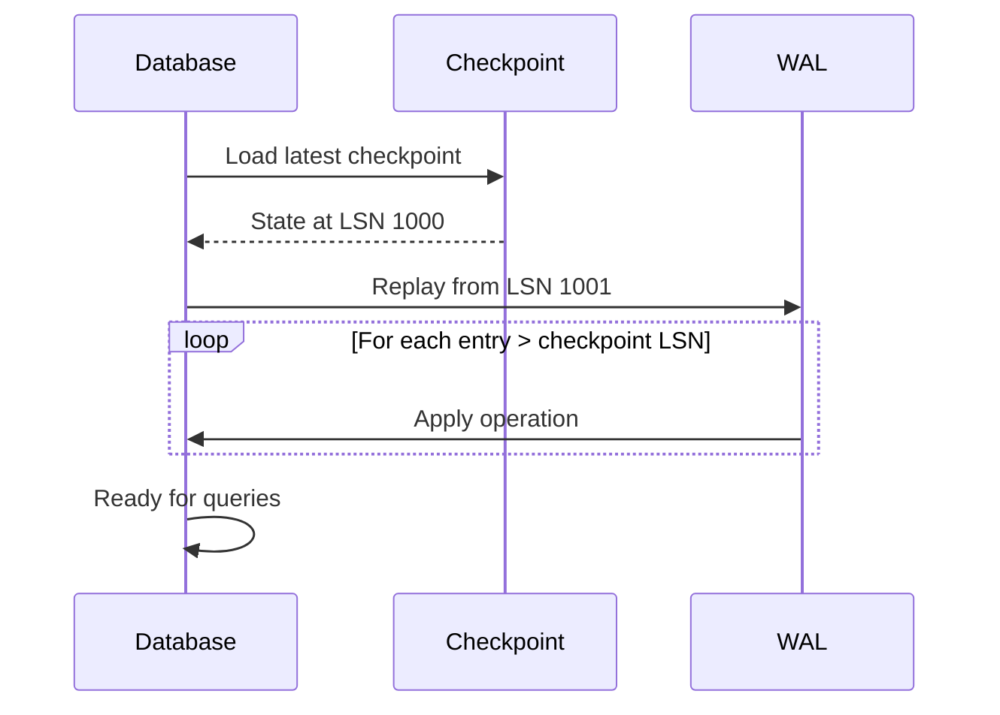

## Data Flow Summary

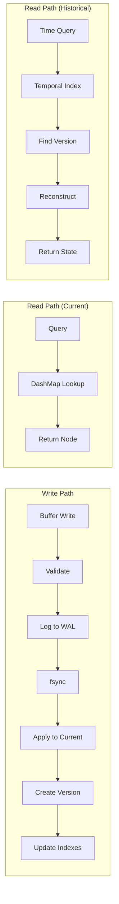

## Related Documentation

- [ADR-0001: Hybrid Storage Architecture](../adr/0001-hybrid-storage-architecture.md)
- [ADR-0004: Anchor+Delta Compression](../adr/0004-anchor-delta-compression.md)
- [ADR-0007: Write-Ahead Log](../adr/0007-wal-durability.md)
