# Transaction System Architecture

AletheiaDB implements ACID transactions with Multi-Version Concurrency Control (MVCC) and Snapshot Isolation.

## Overview

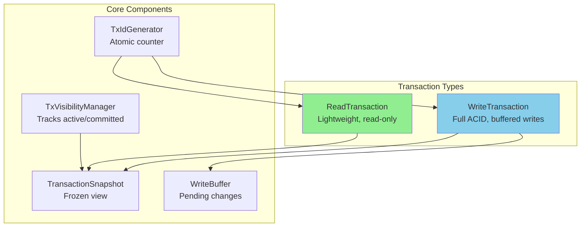
```mermaid
graph TB
    subgraph "Transaction Types"
        RTX["ReadTransaction<br/>Lightweight, read-only"]
        WTX["WriteTransaction<br/>Full ACID, buffered writes"]
    end

    subgraph "Core Components"
        TXID["TxIdGenerator<br/>Atomic counter"]
        VIS["TxVisibilityManager<br/>Tracks active/committed"]
        SNAP["TransactionSnapshot<br/>Frozen view"]
        BUF["WriteBuffer<br/>Pending changes"]
    end

    RTX --> SNAP
    WTX --> SNAP
    WTX --> BUF
    TXID --> RTX
    TXID --> WTX
    VIS --> SNAP

    style RTX fill:#90EE90
    style WTX fill:#87CEEB
```

## Transaction Lifecycle

### State Machine

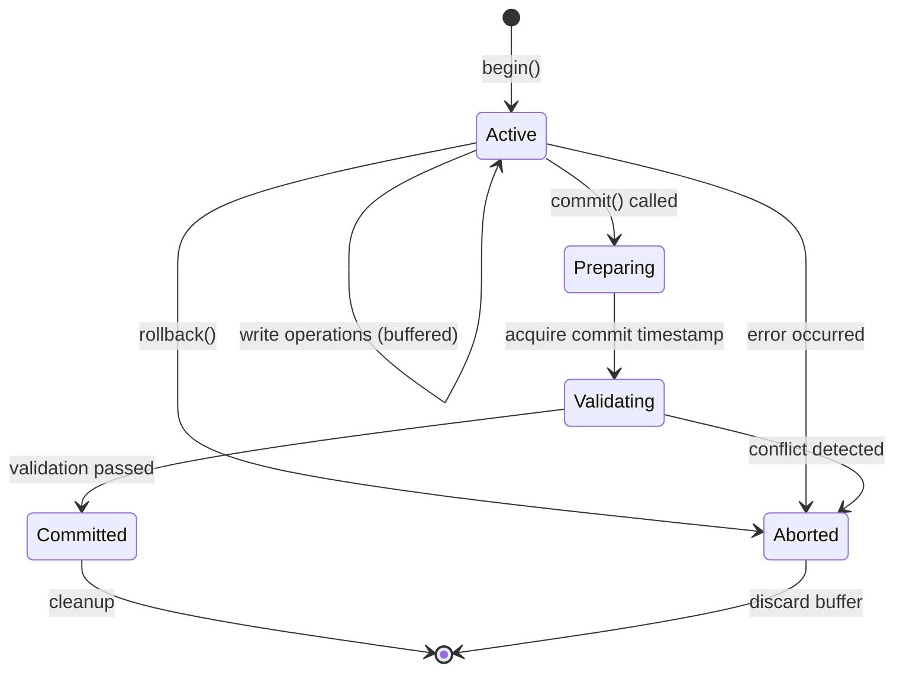
```mermaid
stateDiagram-v2
    [*] --> Active: begin()

    Active --> Active: read operations
    Active --> Active: write operations (buffered)

    Active --> Preparing: commit() called
    Active --> Aborted: rollback()
    Active --> Aborted: error occurred

    Preparing --> Validating: acquire commit timestamp
    Validating --> Committed: validation passed
    Validating --> Aborted: conflict detected

    Committed --> [*]: cleanup
    Aborted --> [*]: discard buffer
```

### State Transitions

```rust
pub enum TxState {
    Active,     // Transaction running
    Preparing,  // Commit initiated
    Committed,  // Successfully committed
    Aborted,    // Rolled back
}
```

## Read Transactions

### Purpose

Lightweight, read-only access with snapshot consistency.

### Structure

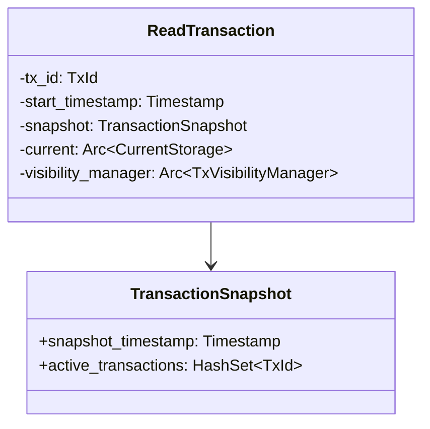
```mermaid
classDiagram
    class ReadTransaction {
        -tx_id: TxId
        -start_timestamp: Timestamp
        -snapshot: TransactionSnapshot
        -current: Arc~CurrentStorage~
        -visibility_manager: Arc~TxVisibilityManager~
    }

    class TransactionSnapshot {
        +snapshot_timestamp: Timestamp
        +active_transactions: HashSet~TxId~
    }

    ReadTransaction --> TransactionSnapshot
```

### Read Path

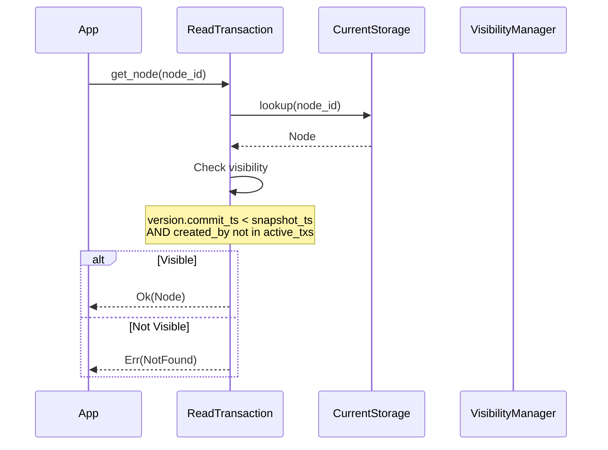
```mermaid
sequenceDiagram
    participant App
    participant RTX as ReadTransaction
    participant CS as CurrentStorage
    participant VIS as VisibilityManager

    App->>RTX: get_node(node_id)
    RTX->>CS: lookup(node_id)
    CS-->>RTX: Node

    RTX->>RTX: Check visibility
    Note over RTX: version.commit_ts < snapshot_ts<br/>AND created_by not in active_txs

    alt Visible
        RTX-->>App: Ok(Node)
    else Not Visible
        RTX-->>App: Err(NotFound)
    end
```

### API

```rust
pub trait ReadOps {
    fn get_node(&self, id: NodeId) -> Result<Node>;
    fn get_edge(&self, id: EdgeId) -> Result<Edge>;
    fn get_outgoing_edges(&self, node_id: NodeId) -> Vec<EdgeId>;
    fn get_incoming_edges(&self, node_id: NodeId) -> Vec<EdgeId>;
    fn get_outgoing_edges_with_label(&self, node_id: NodeId, label: &str) -> Vec<EdgeId>;
    fn node_count(&self) -> usize;
    fn edge_count(&self) -> usize;
}
```

## Write Transactions

### Purpose

Full ACID transactions with write buffering and conflict detection.

### Structure

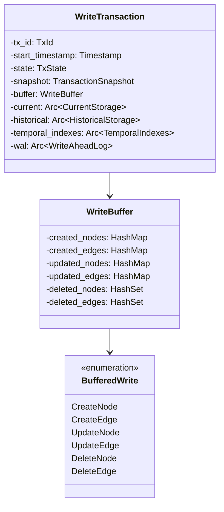
```mermaid
classDiagram
    class WriteTransaction {
        -tx_id: TxId
        -start_timestamp: Timestamp
        -state: TxState
        -snapshot: TransactionSnapshot
        -buffer: WriteBuffer
        -current: Arc~CurrentStorage~
        -historical: Arc~HistoricalStorage~
        -temporal_indexes: Arc~TemporalIndexes~
        -wal: Arc~WriteAheadLog~
    }

    class WriteBuffer {
        -created_nodes: HashMap
        -created_edges: HashMap
        -updated_nodes: HashMap
        -updated_edges: HashMap
        -deleted_nodes: HashSet
        -deleted_edges: HashSet
    }

    class BufferedWrite {
        <<enumeration>>
        CreateNode
        CreateEdge
        UpdateNode
        UpdateEdge
        DeleteNode
        DeleteEdge
    }

    WriteTransaction --> WriteBuffer
    WriteBuffer --> BufferedWrite
```

### Write Buffering

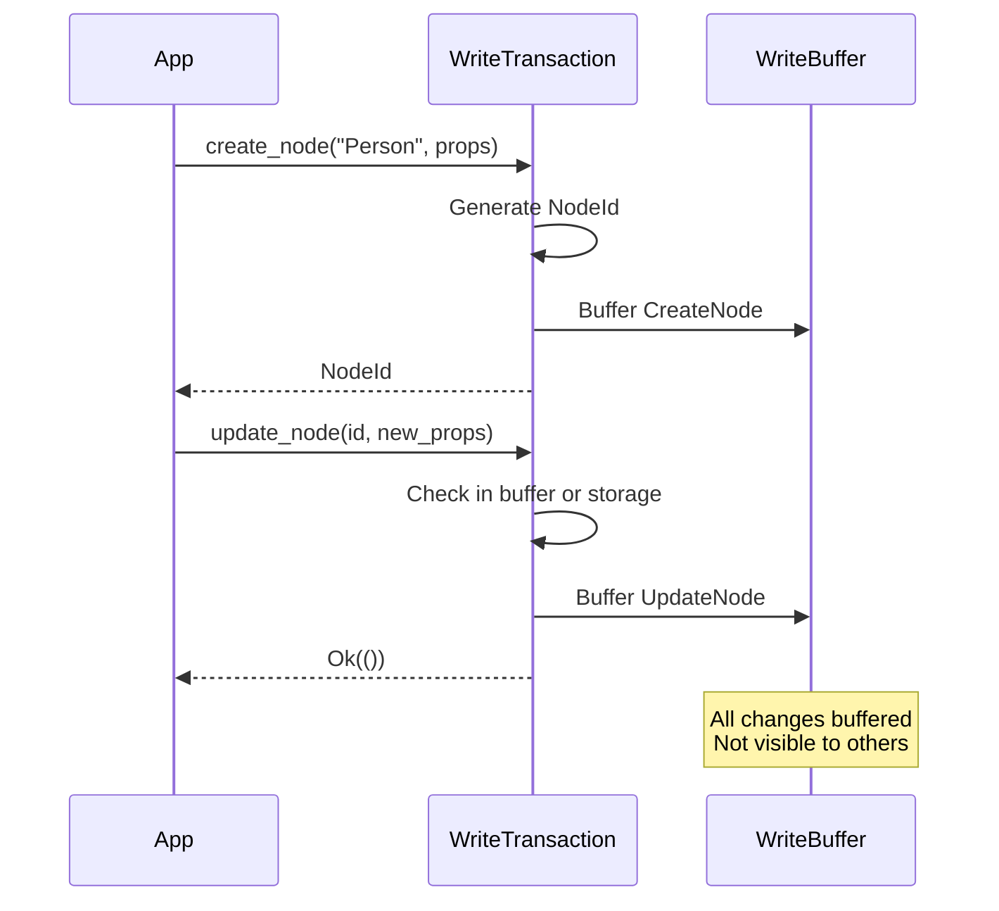
```mermaid
sequenceDiagram
    participant App
    participant WTX as WriteTransaction
    participant BUF as WriteBuffer

    App->>WTX: create_node("Person", props)
    WTX->>WTX: Generate NodeId
    WTX->>BUF: Buffer CreateNode
    WTX-->>App: NodeId

    App->>WTX: update_node(id, new_props)
    WTX->>WTX: Check in buffer or storage
    WTX->>BUF: Buffer UpdateNode
    WTX-->>App: Ok(())

    Note over BUF: All changes buffered<br/>Not visible to others
```

### Read-Your-Writes

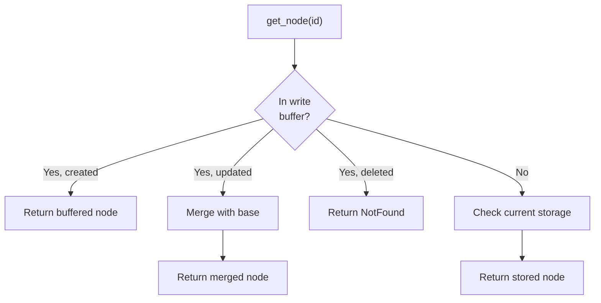
```mermaid
flowchart TD
    GET["get_node(id)"] --> CHECK_BUF{"In write<br/>buffer?"}

    CHECK_BUF -->|Yes, created| RET_BUF["Return buffered node"]
    CHECK_BUF -->|Yes, updated| MERGE["Merge with base"]
    CHECK_BUF -->|Yes, deleted| RET_DELETED["Return NotFound"]
    CHECK_BUF -->|No| CHECK_STORAGE["Check current storage"]

    MERGE --> RET_MERGED["Return merged node"]
    CHECK_STORAGE --> RET_STORAGE["Return stored node"]
```

### Commit Process

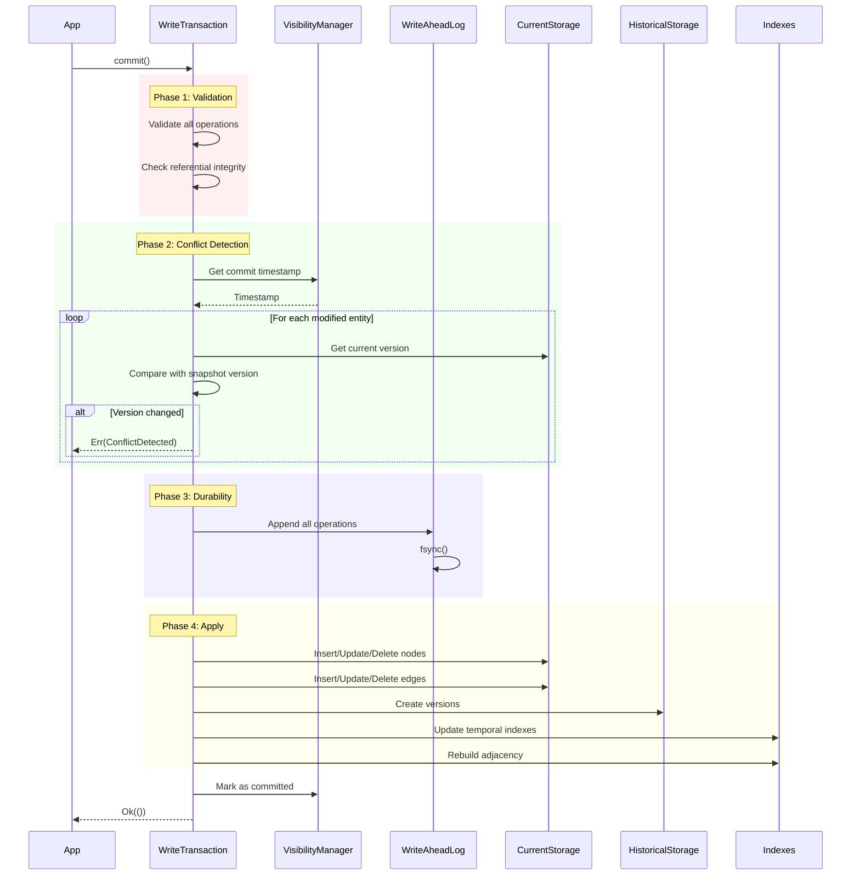
```mermaid
sequenceDiagram
    participant App
    participant WTX as WriteTransaction
    participant VIS as VisibilityManager
    participant WAL as WriteAheadLog
    participant CS as CurrentStorage
    participant HS as HistoricalStorage
    participant IDX as Indexes

    App->>WTX: commit()

    rect rgb(255, 240, 240)
        Note over WTX: Phase 1: Validation
        WTX->>WTX: Validate all operations
        WTX->>WTX: Check referential integrity
    end

    rect rgb(240, 255, 240)
        Note over WTX: Phase 2: Conflict Detection
        WTX->>VIS: Get commit timestamp
        VIS-->>WTX: Timestamp

        loop For each modified entity
            WTX->>CS: Get current version
            WTX->>WTX: Compare with snapshot version
            alt Version changed
                WTX-->>App: Err(ConflictDetected)
            end
        end
    end

    rect rgb(240, 240, 255)
        Note over WTX: Phase 3: Durability
        WTX->>WAL: Append all operations
        WAL->>WAL: fsync()
    end

    rect rgb(255, 255, 240)
        Note over WTX: Phase 4: Apply
        WTX->>CS: Insert/Update/Delete nodes
        WTX->>CS: Insert/Update/Delete edges
        WTX->>HS: Create versions
        WTX->>IDX: Update temporal indexes
        WTX->>IDX: Rebuild adjacency
    end

    WTX->>VIS: Mark as committed
    WTX-->>App: Ok(())
```

## Snapshot Isolation

### Visibility Rules

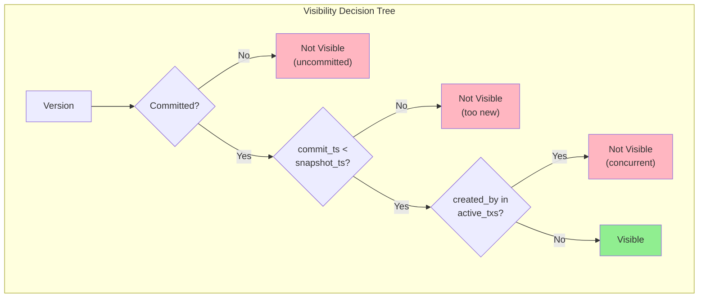
```mermaid
graph TB
    subgraph "Visibility Decision Tree"
        V["Version"] --> COMMITTED{"Committed?"}
        COMMITTED -->|No| NOT_VISIBLE["Not Visible<br/>(uncommitted)"]
        COMMITTED -->|Yes| CHECK_TS{"commit_ts <<br/>snapshot_ts?"}
        CHECK_TS -->|No| NOT_VISIBLE2["Not Visible<br/>(too new)"]
        CHECK_TS -->|Yes| CHECK_ACTIVE{"created_by in<br/>active_txs?"}
        CHECK_ACTIVE -->|Yes| NOT_VISIBLE3["Not Visible<br/>(concurrent)"]
        CHECK_ACTIVE -->|No| VISIBLE["Visible"]
    end

    style VISIBLE fill:#90EE90
    style NOT_VISIBLE fill:#FFB6C1
    style NOT_VISIBLE2 fill:#FFB6C1
    style NOT_VISIBLE3 fill:#FFB6C1
```

### Snapshot Capture

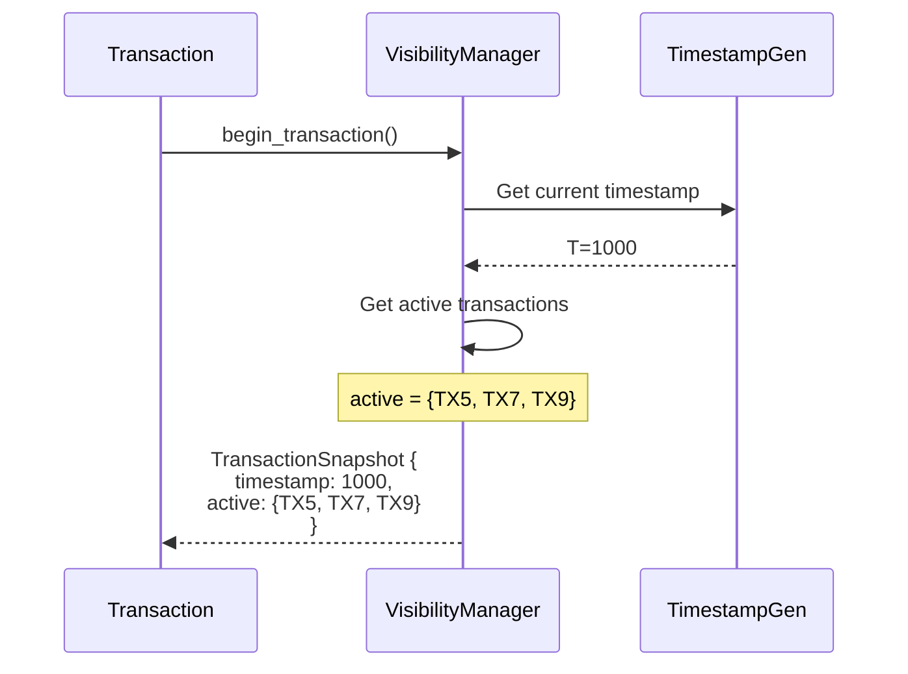
```mermaid
sequenceDiagram
    participant TX as Transaction
    participant VIS as VisibilityManager
    participant TS as TimestampGen

    TX->>VIS: begin_transaction()
    VIS->>TS: Get current timestamp
    TS-->>VIS: T=1000

    VIS->>VIS: Get active transactions
    Note over VIS: active = {TX5, TX7, TX9}

    VIS-->>TX: TransactionSnapshot {<br/>  timestamp: 1000,<br/>  active: {TX5, TX7, TX9}<br/>}
```

### Write-Write Conflict Detection

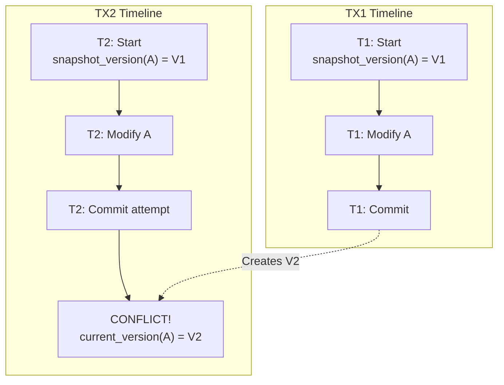
```mermaid
flowchart TD
    subgraph "TX1 Timeline"
        T1_START["T1: Start<br/>snapshot_version(A) = V1"]
        T1_MODIFY["T1: Modify A"]
        T1_COMMIT["T1: Commit"]
    end

    subgraph "TX2 Timeline"
        T2_START["T2: Start<br/>snapshot_version(A) = V1"]
        T2_MODIFY["T2: Modify A"]
        T2_COMMIT["T2: Commit attempt"]
        T2_CONFLICT["CONFLICT!<br/>current_version(A) = V2"]
    end

    T1_START --> T1_MODIFY --> T1_COMMIT
    T2_START --> T2_MODIFY --> T2_COMMIT --> T2_CONFLICT

    T1_COMMIT -.->|Creates V2| T2_CONFLICT
```

### Isolation Guarantees

| Anomaly | Description | Prevented? |
|---------|-------------|------------|
| Dirty Read | Read uncommitted data | Yes |
| Non-Repeatable Read | Same query, different results | Yes |
| Phantom Read | New rows appear in query | Yes |
| Lost Update | Concurrent writes lose data | Yes |
| Write Skew | Concurrent writes to different rows | No* |

*Write skew is acceptable for most graph operations.

## Visibility Manager

### Structure

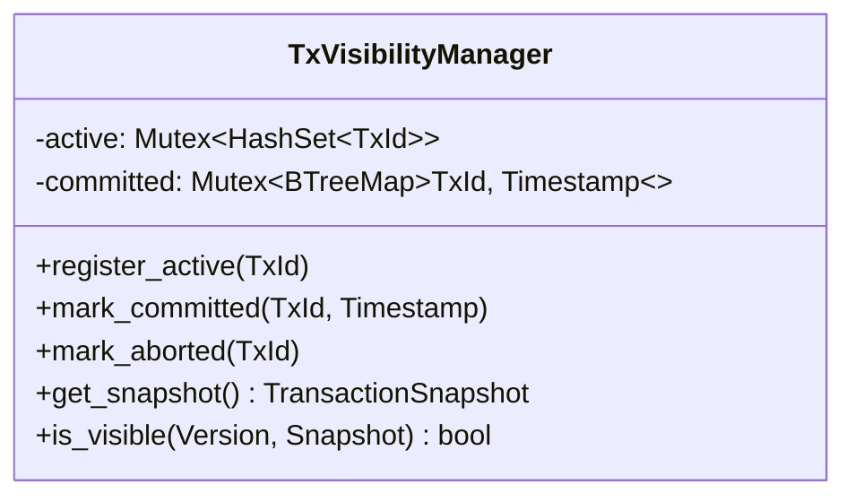
```mermaid
classDiagram
    class TxVisibilityManager {
        -active: Mutex~HashSet~TxId~~
        -committed: Mutex~BTreeMap~TxId, Timestamp~~
        +register_active(TxId)
        +mark_committed(TxId, Timestamp)
        +mark_aborted(TxId)
        +get_snapshot() TransactionSnapshot
        +is_visible(Version, Snapshot) bool
    }
```

### Thread Safety

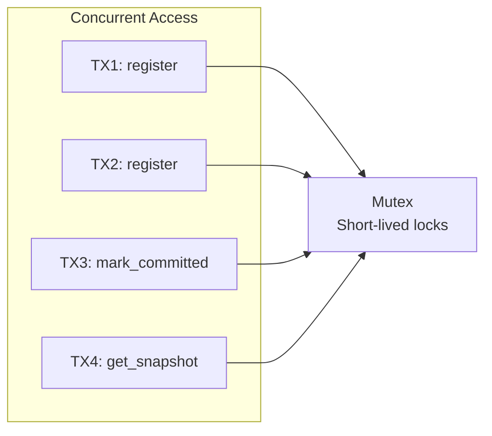
```mermaid
graph LR
    subgraph "Concurrent Access"
        TX1["TX1: register"]
        TX2["TX2: register"]
        TX3["TX3: mark_committed"]
        TX4["TX4: get_snapshot"]
    end

    MUTEX["Mutex<br/>Short-lived locks"]

    TX1 --> MUTEX
    TX2 --> MUTEX
    TX3 --> MUTEX
    TX4 --> MUTEX
```

## Transaction ID Generation

### Requirements

- Globally unique
- Monotonically increasing
- Thread-safe
- Lock-free

### Implementation

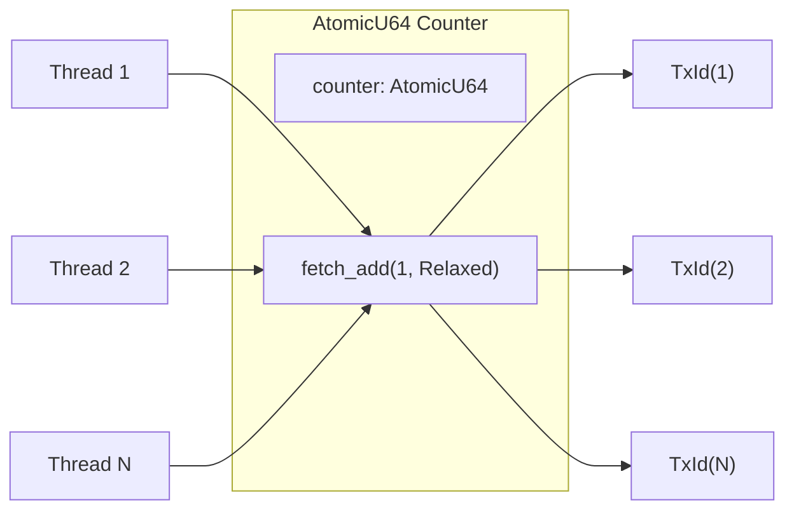
```mermaid
graph LR
    subgraph "AtomicU64 Counter"
        COUNTER["counter: AtomicU64"]
        FETCH["fetch_add(1, Relaxed)"]
    end

    TX1["Thread 1"] --> FETCH
    TX2["Thread 2"] --> FETCH
    TX3["Thread N"] --> FETCH

    FETCH --> ID1["TxId(1)"]
    FETCH --> ID2["TxId(2)"]
    FETCH --> IDN["TxId(N)"]
```

## Error Handling

### Transaction Errors

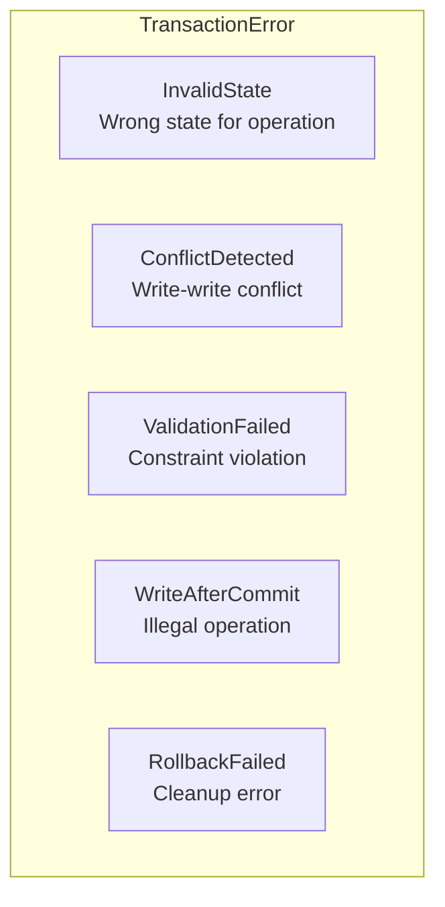
```mermaid
graph TB
    subgraph "TransactionError"
        E1["InvalidState<br/>Wrong state for operation"]
        E2["ConflictDetected<br/>Write-write conflict"]
        E3["ValidationFailed<br/>Constraint violation"]
        E4["WriteAfterCommit<br/>Illegal operation"]
        E5["RollbackFailed<br/>Cleanup error"]
    end
```

### Error Recovery

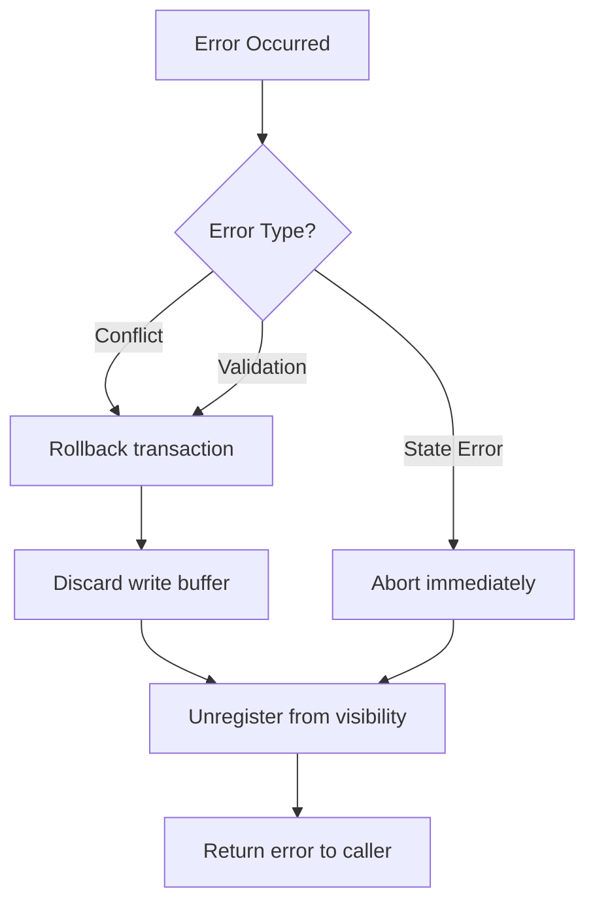
```mermaid
flowchart TD
    ERROR["Error Occurred"] --> CHECK{"Error Type?"}

    CHECK -->|Conflict| ROLLBACK["Rollback transaction"]
    CHECK -->|Validation| ROLLBACK
    CHECK -->|State Error| ABORT["Abort immediately"]

    ROLLBACK --> DISCARD["Discard write buffer"]
    DISCARD --> UNREGISTER["Unregister from visibility"]
    ABORT --> UNREGISTER

    UNREGISTER --> NOTIFY["Return error to caller"]
```

## Usage Patterns

### Closure-Based (Recommended)

```rust
// Auto-commits on Ok, auto-rollbacks on Err
let node_id = db.write(|tx| {
    let alice = tx.create_node("Person", props)?;
    tx.create_edge(alice, bob, "KNOWS", edge_props)?;
    Ok(alice)
})?;
```

### Explicit Transaction

```rust
let mut tx = db.write_transaction();

let alice = tx.create_node("Person", props)?;
tx.create_edge(alice, bob, "KNOWS", edge_props)?;

// Must explicitly commit or rollback
tx.commit()?;
// tx.rollback();  // Alternative
```

## Related Documentation

- [ADR-0003: MVCC with Snapshot Isolation](../adr/0003-mvcc-snapshot-isolation.md)
- [ADR-0007: Write-Ahead Log](../adr/0007-wal-durability.md)
- [Storage Layer](storage-layer.md)
