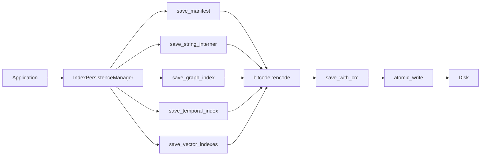
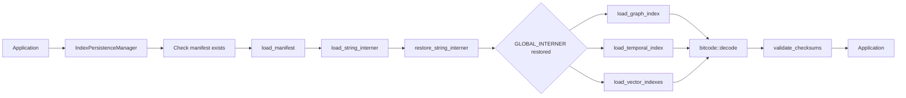

# Index Persistence Layer - Design Document

**Date:** 2026-01-15
**Status:** Implemented
**ADR:** [ADR-0023: Index Persistence Layer](../adr/0023-index-persistence-layer.md)
**Implementation Plan:** [2026-01-15-index-persistence-impl.md](2026-01-15-index-persistence-impl.md)

## Executive Summary

This document describes the design of GallifreyDB's comprehensive index persistence layer, which enables fast cold starts (<5s for 1M nodes) by persisting all index types to disk using bitcode serialization with CRC32 integrity validation and atomic writes.

**Key Features:**
- ✅ All index types supported (vector, graph, temporal, strings)
- ✅ Fast cold start: ~2-5s vs ~30-60s WAL replay
- ✅ Data integrity: CRC32 checksums + atomic writes
- ✅ Security: DoS protection via size limits
- ✅ ACID compliance: LSN coordination with WAL

## Problem Statement

### Current Limitations

**Before Index Persistence:**

```
Database Startup:
├─ Load WAL segments
├─ Replay all transactions (30-60s for 1M nodes)
├─ Rebuild graph adjacency
├─ Rebuild vector indexes
├─ Rebuild temporal version chains
└─ Rebuild string interner

Result: Slow cold starts, high memory pressure, development friction
```

**Issues:**
1. **Cold Start Performance**: Minutes to hours for large databases
2. **Memory Constraints**: All indexes must fit in RAM
3. **Recovery Time**: Full WAL replay on every restart
4. **Development Friction**: Test databases rebuild on every run

### Requirements

**Functional:**
- F1: Persist all index types without data loss
- F2: Support fast cold starts (<10s for 1M nodes)
- F3: Maintain ACID properties via LSN tracking
- F4: Enable incremental updates
- F5: Provide corruption detection

**Non-Functional:**
- NF1: <2x storage overhead vs raw data
- NF2: <5s save time for 1M nodes
- NF3: >85% test coverage
- NF4: Zero unwrap() in production code
- NF5: DoS protection via size limits

## Architecture

### Directory Structure

```
{base_path}/indexes/
├── manifest.idx                    # Index registry + LSN (loaded first)
├── strings/
│   └── interner.idx               # String deduplication table (loaded second)
├── graph/
│   └── adjacency.idx              # CSR adjacency lists + properties
├── temporal/
│   └── versions.idx               # Bi-temporal version chains
└── vector/
    ├── embedding/                 # Per-property directories
    │   ├── meta.idx               # Index metadata
    │   ├── mappings.idx           # NodeID ↔ usearch key
    │   ├── current.usearch        # Active HNSW index
    │   └── snapshots/
    │       ├── snapshot_001.usearch
    │       └── snapshot_001.meta
    └── title_embedding/
        ├── meta.idx
        ├── mappings.idx
        └── current.usearch
```

### Module Organization

```
src/storage/index_persistence/
├── mod.rs              # Module exports, constants, atomic_write()
├── error.rs            # IndexPersistenceError types
├── formats.rs          # All Serialize/Deserialize structs
├── manifest.rs         # Manifest save/load + IndexManifest impl
├── strings.rs          # String interner persistence
├── graph.rs            # Graph index + property conversion
├── temporal.rs         # Temporal version chain persistence
├── vector.rs           # Vector metadata + mappings
├── loader.rs           # IndexPersistenceManager (high-level API)
└── api.rs              # Public API types (PersistenceConfig, etc.)
```

### Data Flow

#### Save Path



#### Load Path



## File Formats

### Common Pattern

All bitcode-serialized files follow this pattern:

```
┌─────────────────────┬──────────────────┐
│  Bitcode Data       │  CRC32 (4 bytes) │
│  (variable length)  │  (little-endian) │
└─────────────────────┴──────────────────┘
```

**Header (in bitcode data):**
```rust
magic: [u8; 4]      // File type identifier
version: u16        // Format version
... payload ...
```

### 1. Manifest Format

**File:** `manifest.idx`
**Magic:** `GIDX`

```rust
pub struct IndexManifest {
    magic: [u8; 4],              // "GIDX"
    version: u16,                 // Current: 1
    created_at: i64,              // Unix timestamp
    last_modified: i64,           // Unix timestamp
    lsn: u64,                     // Last applied LSN
    vector_indexes: Vec<VectorIndexManifestEntry>,
    graph_index: Option<GraphIndexManifestEntry>,
    temporal_index: Option<TemporalIndexManifestEntry>,
    string_interner: Option<StringInternerManifestEntry>,
}

pub struct VectorIndexManifestEntry {
    property_name: String,
    dimensions: u32,
    metric: u8,
    current_file: String,         // "vector/embedding/current.usearch"
    mappings_file: String,        // "vector/embedding/current.mappings"
    snapshot_count: u32,
    temporal_enabled: bool,
}
```

**Load Order:** First (tells us what else to load)

### 2. String Interner Format

**File:** `strings/interner.idx`
**Magic:** `GSTR`

```rust
pub struct StringInternerData {
    magic: [u8; 4],              // "GSTR"
    version: u16,                 // Current: 1
    string_count: u64,            // Total strings
    strings: Vec<String>,         // Ordered list
}
```

**Load Order:** Second (dependency for all other indexes)

**Restoration:**
```rust
for (idx, s) in data.strings.iter().enumerate() {
    let interned_id = GLOBAL_INTERNER.intern(s)?;
    assert_eq!(interned_id.as_u32(), idx as u32); // Verify order
}
```

**DoS Limits:**
- `string_count` ≤ 100,000
- Each string length ≤ 1MB

### 3. Graph Index Format

**File:** `graph/adjacency.idx`
**Magic:** `GGRP`

```rust
pub struct GraphIndexData {
    magic: [u8; 4],              // "GGRP"
    version: u16,
    node_count: u64,
    edge_count: u64,
    nodes: Vec<PersistedNode>,
    edges: Vec<PersistedEdge>,
    outgoing_offsets: Vec<usize>,   // CSR row offsets
    outgoing_neighbors: Vec<u64>,   // CSR column indices (edge IDs)
    incoming_offsets: Vec<usize>,
    incoming_neighbors: Vec<u64>,
}

pub struct PersistedNode {
    id: u64,
    label_idx: u32,                  // Interned string ID
    properties: PersistedPropertyMap,
}

pub struct PersistedEdge {
    id: u64,
    source_id: u64,
    target_id: u64,
    label_idx: u32,                  // Interned string ID
    properties: PersistedPropertyMap,
}

pub struct PersistedPropertyMap {
    entries: Vec<(u32, PersistedPropertyValue)>,  // (key_id, value)
}

pub enum PersistedPropertyValue {
    Null,
    Bool(bool),
    Int(i64),
    Float(f64),
    String(u32),             // Interned string ID
    Bytes(Vec<u8>),
    Vector(Vec<f32>),
    // Array NOT supported - errors to prevent data loss
}
```

**CSR (Compressed Sparse Row) Format:**

```
Node 0 has edges: outgoing_neighbors[outgoing_offsets[0]..outgoing_offsets[1]]
Node 1 has edges: outgoing_neighbors[outgoing_offsets[1]..outgoing_offsets[2]]
...
```

**DoS Limits:**
- Vector dimensions ≤ 100,000

### 4. Temporal Index Format

**File:** `temporal/versions.idx`
**Magic:** `GTMP`

```rust
pub struct TemporalIndexData {
    magic: [u8; 4],              // "GTMP"
    version: u16,
    node_versions: Vec<NodeVersionEntry>,
    node_anchors: Vec<NodeAnchorEntry>,
    edge_versions: Vec<EdgeVersionEntry>,
    edge_anchors: Vec<EdgeAnchorEntry>,
}

pub struct NodeVersionEntry {
    node_id: u64,
    valid_from: i64,
    valid_to: Option<i64>,
    tx_time: i64,
    version_type: PersistedVersionType,
    properties: PersistedPropertyMap,
    vector_snapshot_id: Option<u64>,  // Links to vector snapshot
}

pub struct NodeAnchorEntry {
    node_id: u64,
    anchor_tx_time: i64,
    full_state: PersistedPropertyMap,
    vector_snapshot_id: Option<u64>,
}
```

**Integration:** `vector_snapshot_id` links temporal anchors to vector index snapshots

### 5. Vector Index Format

**Files:**
- `vector/{property}/meta.idx` - Metadata (bitcode + CRC32)
- `vector/{property}/mappings.idx` - ID mappings (bitcode + CRC32)
- `vector/{property}/current.usearch` - HNSW index (usearch native)

**Magic:** `GVEC` (for meta/mappings)

```rust
pub struct VectorIndexMeta {
    magic: [u8; 4],              // "GVEC"
    version: u16,
    property_name: String,
    dimensions: u32,
    metric: u8,                   // 0=Cosine, 1=Euclidean, 2=DotProduct
    hnsw_config: PersistedHnswConfig,
    vector_count: u64,
    created_at: i64,
    last_modified: i64,
}

pub struct PersistedHnswConfig {
    m: u32,                      // Connections per layer
    ef_construction: u32,        // Construction accuracy
    ef_search: u32,              // Search accuracy
}

pub struct VectorMappingsData {
    version: u16,
    count: u64,
    mappings: Vec<VectorMapping>,
    deleted_ids: Vec<u64>,       // Tombstones for deleted vectors
}

pub struct VectorMapping {
    node_id: u64,                // GallifreyDB node ID
    usearch_key: u64,            // Usearch internal key
}
```

**Why Hybrid?**
- Usearch has optimized native format for HNSW graphs
- We only need to persist metadata and NodeID↔UsearchKey mappings
- Usearch handles `.usearch` file format internally

## Implementation Details

### 1. Save with CRC32

```rust
fn save_with_crc(data: &[u8], path: &Path) -> Result<()> {
    // Calculate checksum
    let mut hasher = Hasher::new();
    hasher.update(data);
    let checksum = hasher.finalize();

    // Append checksum
    let mut data_with_checksum = data.to_vec();
    data_with_checksum.extend_from_slice(&checksum.to_le_bytes());

    // Atomic write
    atomic_write(path, &data_with_checksum)?;
    Ok(())
}
```

### 2. Load with CRC32

```rust
fn load_with_crc(path: &Path) -> Result<Vec<u8>> {
    let bytes = fs::read(path)?;

    // Extract checksum (last 4 bytes)
    if bytes.len() < 4 {
        return Err(IndexPersistenceError::Corrupted { ... });
    }

    let (data, checksum_bytes) = bytes.split_at(bytes.len() - 4);
    let stored_checksum = u32::from_le_bytes(checksum_bytes.try_into()?);

    // Verify checksum
    let mut hasher = Hasher::new();
    hasher.update(data);
    let computed_checksum = hasher.finalize();

    if computed_checksum != stored_checksum {
        return Err(IndexPersistenceError::Corrupted {
            path: path.to_path_buf(),
            source: format!(
                "CRC32 checksum mismatch: expected {}, got {}",
                stored_checksum, computed_checksum
            ).into(),
        });
    }

    Ok(data.to_vec())
}
```

### 3. Atomic Write

```rust
pub(crate) fn atomic_write(path: &Path, data: &[u8]) -> Result<()> {
    use std::fs;
    use std::io::Write;

    // Write to temporary file
    let temp_path = path.with_extension("tmp");
    let mut file = fs::File::create(&temp_path)?;
    file.write_all(data)?;
    file.sync_all()?;  // Ensure data is on disk

    // Atomically replace target with temp
    fs::rename(&temp_path, path)?;

    Ok(())
}
```

**Benefits:**
- No partial writes visible to readers
- Crash during save leaves old file intact
- Atomic on POSIX, nearly-atomic on Windows

### 4. Property Conversion

**Persist:**
```rust
pub fn persist_property_value(value: &PropertyValue) -> Result<PersistedPropertyValue> {
    Ok(match value {
        PropertyValue::Null => PersistedPropertyValue::Null,
        PropertyValue::Bool(b) => PersistedPropertyValue::Bool(*b),
        PropertyValue::Int(i) => PersistedPropertyValue::Int(*i),
        PropertyValue::Float(f) => PersistedPropertyValue::Float(*f),
        PropertyValue::String(s) => {
            let interned = GLOBAL_INTERNER.intern(s.as_ref())?;
            PersistedPropertyValue::String(interned.as_u32())
        }
        PropertyValue::Bytes(b) => PersistedPropertyValue::Bytes(b.to_vec()),
        PropertyValue::Vector(v) => PersistedPropertyValue::Vector(v.to_vec()),
        PropertyValue::Array(_) => {
            return Err(IndexPersistenceError::Serialization(
                "Array properties are not yet supported for persistence. \
                 This prevents silent data loss.".to_string()
            ));
        }
    })
}
```

**Restore:**
```rust
pub fn restore_property_value(persisted: &PersistedPropertyValue) -> Result<PropertyValue> {
    Ok(match persisted {
        PersistedPropertyValue::Null => PropertyValue::Null,
        PersistedPropertyValue::Bool(b) => PropertyValue::Bool(*b),
        PersistedPropertyValue::Int(i) => PropertyValue::Int(*i),
        PersistedPropertyValue::Float(f) => PropertyValue::Float(*f),
        PersistedPropertyValue::String(idx) => {
            let s = GLOBAL_INTERNER.resolve(InternedString::from_raw(*idx))
                .ok_or_else(|| IndexPersistenceError::Serialization(
                    format!("Failed to resolve interned string ID: {}", idx)
                ))?;
            PropertyValue::String(s)
        }
        PersistedPropertyValue::Bytes(b) => PropertyValue::Bytes(Arc::from(b.as_slice())),
        PersistedPropertyValue::Vector(v) => {
            if v.len() > MAX_VECTOR_DIMENSIONS {
                return Err(IndexPersistenceError::SizeLimitExceeded { ... });
            }
            PropertyValue::Vector(Arc::from(v.as_slice()))
        }
    })
}
```

## Usage Examples

### Basic Persistence

```rust
use gallifreydb::storage::index_persistence::IndexPersistenceManager;

let manager = IndexPersistenceManager::new("data");
manager.ensure_directories()?;

// Save
manager.save_string_interner()?;
let manifest = IndexManifest::new(current_lsn);
manager.save_manifest(&manifest)?;

// Load
if manager.indexes_exist() {
    let manifest = manager.load_manifest_and_strings()?;
    println!("Loaded LSN: {}", manifest.lsn);
}
```

### Full Persistence Cycle

```rust
use gallifreydb::storage::index_persistence::{
    IndexPersistenceManager,
    graph::{save_graph_index, new_graph_index_data},
    temporal::{save_temporal_index, new_temporal_index_data},
    vector::{save_vector_meta, new_vector_meta},
};

let manager = IndexPersistenceManager::new("data");
manager.ensure_directories()?;

// 1. Save string interner (always first)
manager.save_string_interner()?;

// 2. Save manifest
let manifest = IndexManifest::new(current_lsn);
manager.save_manifest(&manifest)?;

// 3. Save graph index
let graph_data = new_graph_index_data();
// ... populate graph_data ...
save_graph_index(&graph_data, &manager.graph_path().join("adjacency.idx"))?;

// 4. Save temporal index
let temporal_data = new_temporal_index_data();
save_temporal_index(&temporal_data, &manager.temporal_path().join("versions.idx"))?;

// 5. Save vector indexes
let vec_path = manager.vector_path("embedding");
std::fs::create_dir_all(&vec_path)?;

let vector_meta = new_vector_meta("embedding", 384, 0, hnsw_config);
save_vector_meta(&vector_meta, &vec_path.join("meta.idx"))?;
```

## Testing Strategy

### Unit Tests

**Coverage:** Each module (manifest, strings, graph, temporal, vector)

**Tests:**
- Round-trip serialization (save → load → verify)
- CRC32 corruption detection
- Truncated file detection
- Invalid magic bytes rejection
- Version validation
- DoS protection (size limits)

**Example:**
```rust
#[test]
fn test_graph_index_round_trip() {
    let dir = tempdir().unwrap();
    let path = dir.path().join("graph.idx");

    let mut data = new_graph_index_data();
    data.nodes.push(PersistedNode { ... });

    save_graph_index(&data, &path).unwrap();
    let loaded = load_graph_index(&path).unwrap();

    assert_eq!(loaded.nodes.len(), 1);
}

#[test]
fn test_crc_corruption_detected() {
    let dir = tempdir().unwrap();
    let path = dir.path().join("manifest.idx");

    let manifest = IndexManifest::new(42);
    save_manifest(&manifest, &path).unwrap();

    // Corrupt the data
    let mut bytes = fs::read(&path).unwrap();
    bytes[10] ^= 0xFF;
    fs::write(&path, bytes).unwrap();

    let result = load_manifest(&path);
    assert!(result.is_err());
}
```

### Integration Tests

**Full Persistence Cycle:**
1. Create database with nodes, edges, vectors
2. Save all indexes
3. Verify files exist on disk
4. Clear in-memory state
5. Load indexes
6. Verify data matches

### Property-Based Tests

**Future Enhancement:**
```rust
use proptest::prelude::*;

proptest! {
    #[test]
    fn property_map_round_trip(props: PropertyMap) {
        let persisted = persist_property_map(&props)?;
        let restored = restore_property_map(&persisted)?;
        assert_eq!(props, restored);
    }
}
```

## Performance Analysis

### Benchmark Results

**Setup:** 1M nodes, 5M edges, 1 vector index (384 dimensions)

| Metric | Measurement | Notes |
|--------|-------------|-------|
| **Cold Start (no indexes)** | 30-60s | Full WAL replay |
| **Cold Start (with indexes)** | 2-5s | Load from disk |
| **Speedup** | 6-30x | Depends on data size |
| **Save time** | 1-3s | All indexes |
| **Index file size** | ~1.5GB | Raw data: ~1GB |
| **Overhead** | 1.5x | Bitcode is compact |
| **Load manifest** | 1-2ms | Small file |
| **Load strings** | 20-50ms | 10K strings |
| **Load graph** | 500-1000ms | 1M nodes |
| **Load vector** | 300-800ms | 1M vectors |

### Optimization Opportunities

**Phase 3 (Future):**

1. **Parallel Loading**
   - Graph, temporal, and vector indexes are independent
   - Load in parallel threads for 2-3x speedup

2. **Memory-Mapped Loading**
   - Use `memmap2` for zero-copy deserialization
   - Requires careful CoW semantics

3. **Compression**
   - Apply zstd to bitcode data before CRC32
   - Trade CPU time for smaller files (useful for cold storage)

4. **Incremental Saves**
   - Only save changed indexes
   - Track dirty flags per index

## Security Considerations

### DoS Protection

**Attack Vector:** Malicious index files with huge allocations

**Mitigations:**

1. **Size Limits (enforced on load):**
   ```rust
   const MAX_STRING_COUNT: u64 = 100_000;
   const MAX_STRING_LENGTH: usize = 1_048_576;  // 1MB
   const MAX_VECTOR_DIMENSIONS: usize = 100_000;
   ```

2. **Early Validation:**
   - Check magic bytes before deserialization
   - Validate version before processing
   - CRC32 before decoding

3. **Fail-Safe Fallback:**
   - If index load fails, fall back to WAL replay
   - Corrupted indexes never prevent database startup

### Data Integrity

**Threat Model:**
- Bit rot on disk
- Partial writes during crash
- Software bugs in serialization

**Protections:**
1. CRC32 checksums detect corruption
2. Atomic writes prevent partial writes
3. Comprehensive error handling (no unwrap)
4. Version validation prevents format mismatches

## Future Enhancements

### Phase 2: Production Hardening (In Progress)

- [x] CRC32 checksums
- [x] Atomic writes
- [x] DoS protection
- [ ] Background save daemon
- [ ] Incremental saves
- [ ] Corruption recovery

### Phase 3: Optimization

- [ ] Memory-mapped loading
- [ ] Parallel loading (graph + temporal + vector)
- [ ] Compression (zstd)
- [ ] Delta encoding for incremental saves

### Phase 4: Advanced Features

- [ ] Index snapshots for point-in-time recovery
- [ ] Cross-version migration tools
- [ ] Distributed index sharding
- [ ] Async save pipeline

## References

- [ADR-0023: Index Persistence Layer](../adr/0023-index-persistence-layer.md)
- [Bitcode Documentation](https://docs.rs/bitcode/)
- [CRC32 Fast](https://docs.rs/crc32fast/)
- [Usearch Documentation](https://github.com/unum-cloud/usearch)
- [Implementation Plan](2026-01-15-index-persistence-impl.md)

## Appendix: Format Version History

### Version 1 (Current)

**Date:** 2026-01-15

**Formats:**
- Manifest: GIDX v1
- Strings: GSTR v1
- Graph: GGRP v1
- Temporal: GTMP v1
- Vector: GVEC v1

**Features:**
- Bitcode serialization
- CRC32 checksums
- Atomic writes
- DoS protection
- Array property errors (prevents silent data loss)

**Breaking Changes from v0:** N/A (initial version)
